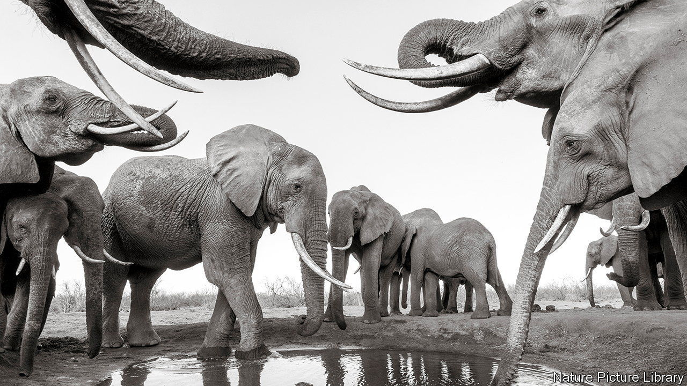

###### Protein shake-up

# Why elephants so rarely get cancer 

##### The diversity of foot soldiers in their cellular defences seems to play a role 

 

> Jul 13th 2022 

Elephants have always presented a paradox to biologists. They are much larger than humans and live for a similar length of time, yet they only rarely develop cancer. That is odd. Cancer, after all, is something of a numbers game: the more , the more replications. The more replications, the greater the likelihood of random dna damage and a cell going rogue, failing to be detected and ultimately starting the runaway process towards a tumour.

Work led by Konstantinos Karakostis of the Autonomous University of Barcelona and published in , points to an answer, for elephants at least, to . This absence of size-to-cancer correlation is named after Sir Richard Peto, a British epidemiologist who first noted it in 1977.

Their investigations began with p53, a transcription factor. These are the proteins that are in attendance as dna is transcribed into rna, controlling which genes are switched on and for how long. 

But p53 is also in the business of marshalling resources in the service of quality control. When it encounters damaged dna, it fails to bind to yet another protein called mdm2. That in turn sets off a chain of events that stimulates a cell to repair any damage. If that fails, p53 initiates a different chain that makes the cell destroy itself.

p53, then, is a potent anti-cancer agent in the body’s arsenal. But cancer, in many creatures, is a potent adversary. Cancer cells have damaged dna but have ways to ensure the binding to mdm2 happens without a hitch. The first step in quality control is evaded, and the last steps—repair or self-destruct—are never reached.

Most animals play host to but one type of p53. So the discovery last year that elephants have 20, each subtly different, drew the attention of Dr Karakostis and his colleagues. Maybe the p53s provide one another with anti-cancer backup. But how?

They suspected that mdm2 was involved. Perhaps all those slightly different p53s latch onto it in slightly different ways. It would be less likely, the idea goes, that cancer cells’ trickery could work in 20 altered arrangements. If any failed, the chain of repair would still be triggered.

First the team took to their computers. Extensive simulations of precisely how mdm2 binds at the molecular level to this plethora of p53s indicated their hunch might be right. A trip to the laboratory, to study that binding in a dish, only confirmed things further. Cancer cells might have defences clever enough to smooth the route to one kind of binding—but not, it is now assumed, 20 of them. 

Peto’s paradox lives on, however. Why have humans not evolved this variegated gang of anti-cancer proteins, or indeed the different suite of cellular protections enjoyed by blue whales, if they would confer such a clear-cut survival benefit?

Alas, a common refrain in matters scientific: more research is needed. But that is not to say this work is without potential relevance to humans. Work reported in 2016 revealed that genetically engineering mice to have a few extra copies of p53 enhanced their cells’ ability to detect and repair dna damage. This latest work suggests something many managers are belatedly finding out: success comes not just with a bigger team, but a more diverse one. ■


