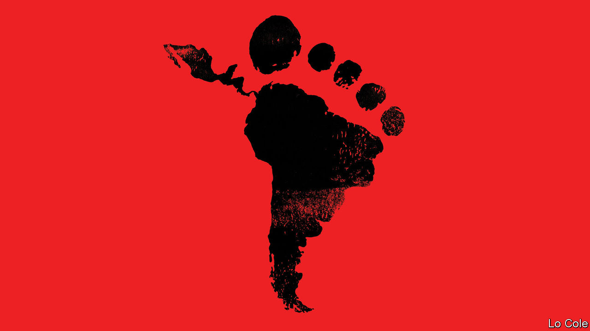

###### Bello

# Migrant flows are changing in the Americas 

##### A declaration signed last month may help manage them 

 

> Jul 14th 2022 

The deaths last month of 53 migrants from asphyxiation in a trailer outside San Antonio in Texas were a horrific reminder of the risks people take to enter the United States illicitly. All the dead were from places that have long supplied many migrants: 27 were Mexicans; the rest were from Central America. 

Yet across the Americas people are on the move in new ways as well as old. Groups of Haitians now congregate in cities from Mexico to Santiago. Venezuelans deliver meals on bikes in Lima and Bogotá. More than 150,000 Nicaraguans have sought refuge in Costa Rica. A similar number of Cubans have left their island in the past year. The trackless jungle of the Darien Gap was once an impassable barrier between South and Central America. Last year, says Panama’s government, more than 130,000 people trekked through it.

Blame, in part, the impact of the pandemic and a rise in the number of failing states. A falling birth rate and faster economic growth meant that for several years more Mexicans came home than moved north. Now the pandemic slump and criminal violence, as well as the booming labour market in the United States, are once again prompting many to emigrate. Much the same applies to Central America’s Northern Triangle of Guatemala, Honduras and El Salvador. 

The figures are distorted by Title 42, a public-health measure imposed during the pandemic by Donald Trump under which migrants are pushed back over the United States border, rather than processed or arrested. This has had the unintended consequence of encouraging Mexicans in particular to make repeated attempts to cross. Even so, roughly half of border “encounters” reported by us Customs and Border Protection in April and May involved people not from Mexico or the Northern Triangle.

Since 2015 some 6m Venezuelans have fled economic meltdown and dictatorship, mostly moving within South America. Some are starting to return, as Venezuela’s economy revives modestly. But now Cubans and Nicaraguans are fleeing their failed leftist dictatorships. And the pandemic seems to have prompted Haitians who had emigrated to South America a decade ago to head to the United States. 

All this adds up to a headache for governments. It is stimulating new thinking, as last month’s Summit of the Americas in Los Angeles showed. The gathering was marked by controversy: six leaders stayed away, including Mexico’s President Andrés Manuel López Obrador, because President Joe Biden did not invite the rulers of Cuba, Nicaragua and Venezuela. Yet more important was what was agreed. The Los Angeles declaration on migration, signed by 21 countries, is a first effort to set out some common approaches. These include promises to expand legal migration and to revamp asylum procedures.

Traditionally, debate about migration was polarised between sending and receiving countries. The declaration “created a common language” for the first time, says Andrew Selee of the Migration Policy Institute, a think-tank. It could mobilise additional funds from development banks to help countries like Colombia, Costa Rica and Ecuador which are regularising migrants. Many countries worry about what to do with people who cross several borders, says Mr Selee. New aid might help to screen refugees from economic migrants before they reach the Darien Gap, for example. Mr Biden’s people stress the importance of tackling “the root causes” of migration with development aid and by fighting corruption in Central America, though there is little to show for this so far.

Despite Mr López Obrador’s absence from Los Angeles, Mexican officials claim credit for the declaration as “co-architects”, as one puts it. Partly because of Mr Trump’s bullying, Mexico has adopted what its president’s critics see as the role of America’s gendarme, deploying its National Guard to deter migrants at its southern border. But the official says that Mexico is trying to apply its own laws and control who enters its territory, while maintaining a humanitarian policy. He points out that it has given visas to “hundreds of thousands” of Haitians and Central Americans.

That is why it wants other countries to take some of the strain. At a meeting in Washington this week, Mr López Obrador pledged $1.5bn in border infrastructure. He also urged Mr Biden to issue more visas for legal migrants. A big unknown is whether a future Republican administration would continue this approach, or go back to Mr Trump’s border wall. That might be a conversation-stopper.


