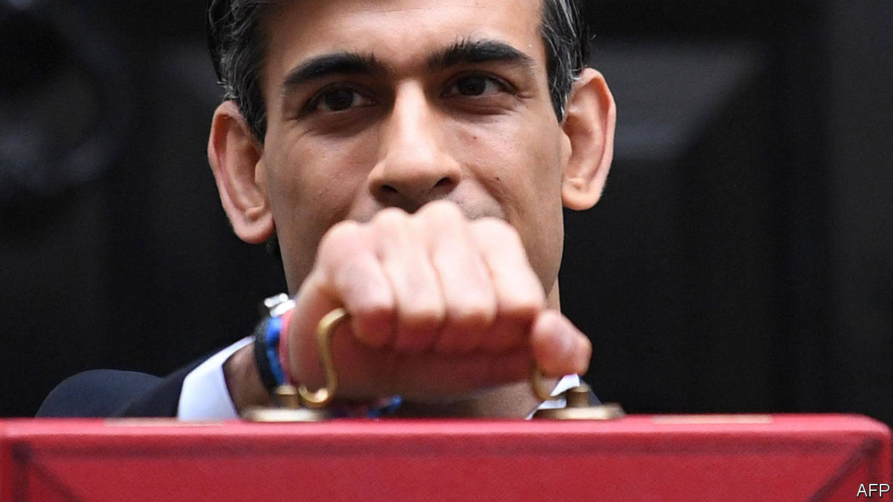

###### The Economist explains

# Can tax cuts boost Britain’s lacklustre economy? 

##### Conservative leadership hopefuls are one-upping each other with promises to slash taxes 

 

> Jul 12th 2022 


THE CANDIDATES TO  as leader of the Conservative Party, and Britain’s prime minister, are scrambling to one-up each other with promises of tax cuts. The exception is Rishi Sunak, the ex-chancellor. He says that now is not the time for “comforting fairytales” and that cutting tax must wait. But many of his opponents have pledged deep tax cuts, which they say will put money into people’s pockets and restore economic dynamism to a country whose growth has  its peers for over a decade. Are they right?

Thanks to Mr Sunak’s actions as chancellor, by 2026 taxation is forecast to reach over 36% of British national income, the highest level since the late 1940s. Higher spending on health and social care, in particular, has been financed through increases in taxation rather than spending cuts elsewhere. But Mr Sunak’s rivals have  the Tories’ reputation as tax-cutters and state-shrinkers. Penny Mordaunt, a trade minister and , wants to cut fuel duty by 50%, equivalent to around 20p per litre. Nadhim Zahawi, who replaced Mr Sunak at the Treasury, said he would lower the income-tax burden by one percentage point of national income every year he was in office. On Wednesday he was knocked out of the contest in the first round of voting among Conservative MPs. Before he dropped out of the contest Sajid Javid, another former chancellor, suggested a more modest 10p-per-litre cut in fuel duty, as well as scrapping planned rises in corporation tax and national insurance (a payroll tax). 

There are plenty of reasons to be sceptical that such cuts will lift Britain’s growth rate. In the short term unfunded tax cuts—those not accompanied by spending reductions—will provide some economic stimulus. But the state of Britain’s economy means they may do more harm than good.  is the highest it has been in decades, and any stimulus could boost prices rather than incomes:  will increase demand for scarce diesel, for instance. The Bank of England may decide to respond to looser fiscal policy by tightening monetary policy even faster than it already is. Higher interest rates would dampen spending elsewhere, offsetting the impact of lower taxes. It would also raise the government’s debt-servicing bill.

It is hard to spot a connection between the overall level of taxation and long-term prosperity. In America, the world’s richest country bar petro-states and tax havens, the government takes around 25% of national income in tax—much less than in Britain. On the other hand, many northern European countries levy much more than Britain and they too are richer. 

A better-designed tax system, rather than a less burdensome one, could do more to promote growth. All taxes are distortionary and can create inefficiencies in a market economy, but some are better than others. For example businesses in Britain are not obliged to charge and pay VAT until their turnover reaches £85,000. This encourages businesses to stay small; there is a cluster that earns just under the threshold. Tackling such problems, which would raise some voters’ tax bills while providing funds to slash others, is a less popular pitch for would-be Conservative leaders than promising across-the-board cuts. But it would do more to help Britain. ■


