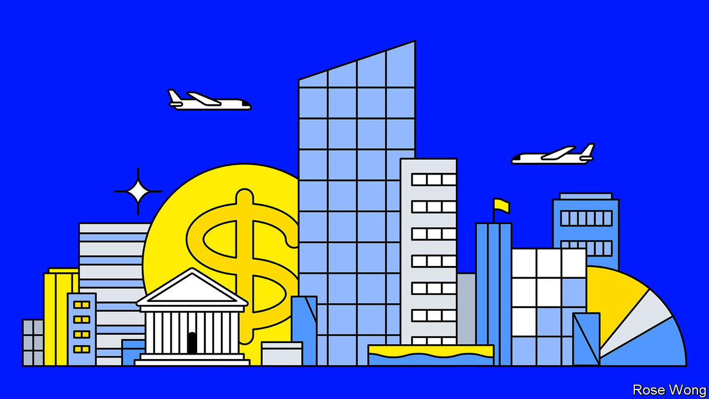
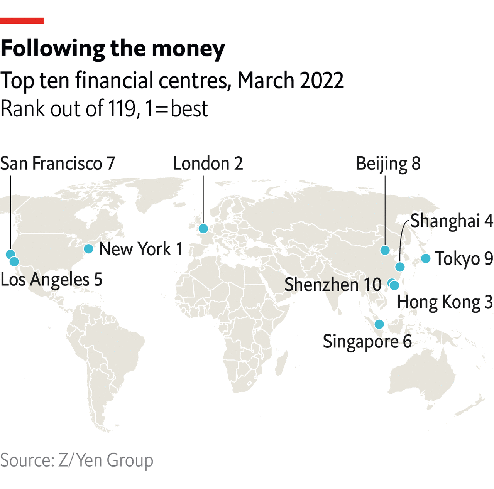

###### The Economist explains

# What makes a global financial centre? 

##### Three things: a base for business, a deep capital market and international wealth management 

 

> Jul 14th 2022 

SKYSCRAPERS, EYE-WATERING rents and (only sometimes) a functional airport are a few of the things that spring to mind when thinking about the hallmarks of a global financial centre. In recent years Britain’s exit from the European Union put  as a nexus of European dealmaking , and China’s creeping authoritarianism in Hong Kong has  of the city as a commercial hub. But what are the factors that separate mere bustling metropolises from international financial centres?

That particular cities are centres of international business and borrowing is not a new phenomenon. As far back as the 1600s, London and Amsterdam were recognised as hubs in a growing network of European commerce. In Asia, Calcutta () and Manila played important financial roles across the region, which have since faded. Even today, it is difficult or impossible to facilitate certain exports, lending, insurance and investment directly from some countries to others. That is where global financial centres step up: as places with the legal and regulatory frameworks to process such cross-border activities.

 


To identify an international financial centre, look for three important features. First, the city should be used as a base for regional or global businesses. Second, it needs a deep capital market, and banking services to go with it. And third, it should be a centre for wealth made elsewhere in the world to be managed and invested. There are deeper layers to determine which cities are on the rise or declining. Z/Yen partners, a consultancy which compiles an index of financial centres, looks at five areas of competitiveness: business environment, human capital, infrastructure, financial-sector development and reputation. Each segment is split into four underlying buckets, and each city given a score (see map).

Some cities double up their roles, serving both as international and domestic financial hubs. New York is the best example. Others play just one of the two parts. , a city-state with a population just shy of 6m, is not exactly a domestic giant, but plays a crucial part in Asia as a centre for wealth and businesses. Offshore sites such as Jersey and the Cayman Islands are all financial centres of a sort. The size of their capital markets is limited and their role as business hubs marginal—not many global firms will be setting up their European headquarters in the Channel Islands, no matter how attractive the tax regime—but they can be boltholes for global wealth management. There is a lot of inertia in the centres of global finance, too: London holds a colossal, outsized role even as Britain’s own economic rank in the world has . Hong Kong will continue to be a hub even though its judicial independence and pro-business policymaking are well past their best. The sands shift slowly over decades and even centuries, but they do shift. As financial centres gain or lose those crucial tenets, they will also climb or recede in importance. ■


