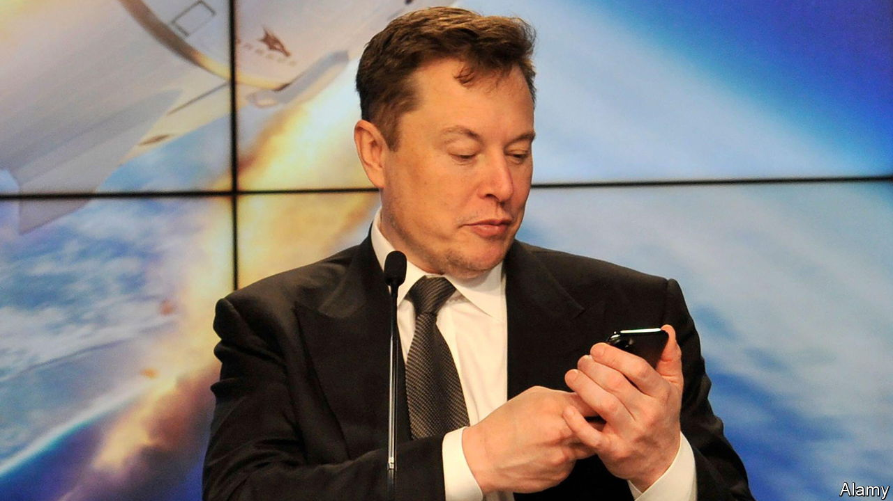

###### The world this week

# Business 

#####  

 

> Jul 14th 2022 

 lodged a lawsuit against  that seeks to force him to complete his takeover of the company for $44bn. Mr Musk has broken off the deal, accusing Twitter of breaching their agreement by not disclosing the number of fake and spam accounts on its platform, which he insists is much higher than the company’s estimate of 5%. In its suit Twitter described Mr Musk’s complaints as “imaginary conditions”, called his actions a mark of “disdain” and said that his “exit strategy is a model of hypocrisy”. It has asked a court in Delaware to hold a hearing in September. 

 


America’s annual  as measured by the consumer-price index leapt to 9.1% in June from 8.6% in May. The jump was bigger than had been expected by most economists and adds to pressure on the Federal Reserve to increase interest rates at a faster clip. The price of petrol rose by 11% in June over the previous month, but since then pump prices have reversed. 

 central bank lifted its main interest rate by half a percentage point, to 2.25%. It was the biggest rise under a policy regime that started in 1999. The country’s inflation rate is 6%.  central bank surprised markets when it increased its rate by a full percentage point, to 2.5%.

Andrew Bailey promised that the  would do whatever it takes to get inflation in Britain back to a target of 2% (the annual rate stands at 9.1%). The central bank’s governor suggested that this may well mean sharper increases to interest rates than the quarter of a percentage point rises that it has implemented recently. 

The  briefly hit parity with the , the first time the two currencies have been of equal value in two decades. The euro has fallen by 11% since the start of the year. The European Central Bank has been slower off the blocks than its counterparts in upping interest rates, but is expected to so do this month.

 raised its revenue forecast for the rest of the year. The maker of snacks and soft drinks has increased the retail price of some products and shrunk the size of others to cope with rising costs, and so far has seen no tail off in consumer demand. 

Stranger things 

 announced that it is working on a new lower-priced subscription plan that will include adverts among its content, and that it had chosen  to develop the technology. The company is trying to retain subscribers amid intense competition. Its rivals are also rolling out ad-supported plans, causing some to wonder if streaming platforms will come to resemble traditional tv more closely over the next decade.

 sales in the first half of the year dropped by 30% compared with the first six months of 2021. The French carmaker has pulled out of Russia, its second-biggest market, because of the war in Ukraine. Excluding the Russian business, sales still fell by 12%. Renault now sells half the vehicles it did four years ago. 

Companies that lease aeroplanes have also taken a hit over the war. smbc Aviation Capital, one of the world’s biggest , recorded a $1.6bn impairment to cover the loss of 34 jets stuck in Russia after sanctions were imposed on the country’s aviation industry. Russian carriers are still using the planes and smbc doubts it will get them back. Hundreds of leased planes remain in Russia, causing a legal headache for the firms that own them. 

In a sign of the chaos besetting airports that are struggling to cope with a rebound in travel,  introduced a cap on passenger numbers of 100,000 a day and asked airlines not to sell new tickets for departures from its terminals for the rest of the summer. London’s biggest airport is a connecting hub for many international flights, including Americans holidaying in Europe. 

Not OK computer

Worldwide shipments of  declined by 12.6% in the second quarter, year on year, the steepest fall in nine years, according to Gartner, a consulting firm. pc sales rose during covid-19 lockdowns, but now inflation and other factors are causing households to rein in their spending. Supply-chain disruptions were also a factor, but this has mainly shifted from component shortages to logistics disruptions.

What is in a  sandwich? That meaty question has been tackled by a judge in California, who ruled that the fast-food chain could be sued for allegedly deceiving customers about the “100% tuna” used in its products. Subway argues that employees might introduce other ingredients when they handle the tuna, but the judge decided that other types of fish, and beef, chicken and pork were items that a consumer “would not reasonably expect to find in a tuna product”. Subway described the lawsuit as reckless. 

