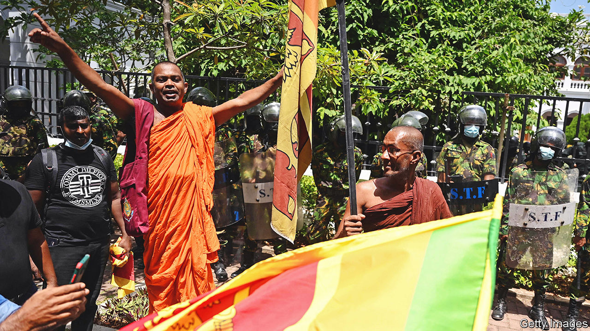
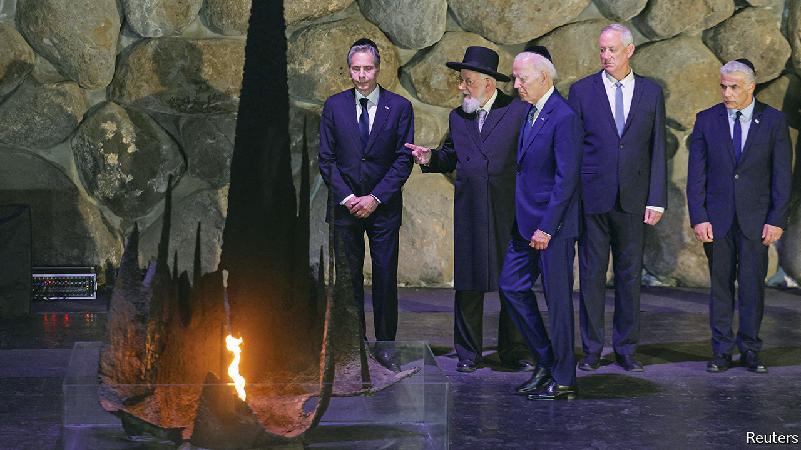

###### The world this week

# Politics 

#####  

 

> Jul 14th 2022 

’s President Gotabaya Rajapaksa fled the country after huge crowds stormed the presidential complex. Ranil Wickremesinghe, the prime minister and Mr Rajapaksa’s ally, took over as acting president. The protesters, who are furious about costly food, fuel shortages and their country’s economic collapse, were not appeased. A state of emergency was declared. 

Crowds thronged the streets of Tokyo to mourn , a Japanese former prime minister, who was murdered with a home-made gun on July 8th while campaigning for an upper-house election. The assassin reportedly held a grudge against the Unification Church, from which Mr Abe had sometimes received support. The election went ahead, and Mr Abe’s party won a large majority. Mr Abe had beefed up Japan’s defences to counter rising Chinese assertiveness. 

Pacific discord

The  held its first in-person meeting since 2019, with the leaders of several Pacific-island states, Australia and New Zealand gathering in Fiji to discuss economic and security issues. The regional body has taken on more importance given China’s recent security pact with the Solomon Islands and growing interest in the region. Kiribati withdrew from the forum, ostensibly in a row over its leadership. A former president of Kiribati said his successor was cooking up a deal with China.

 reopened some quarantine sites, as officials tried to contain a new outbreak of covid-19. Residents in some areas were told to stock up on food and medicine.  also moved to curb the virus. For the first time in two years, the world’s biggest gambling hub closed its casinos. 

 cranked up the pressure on European backers of Ukraine by stopping the  through the Nord Stream 1 pipeline to . Supposedly this is simply for ten days of essential maintenance, but Europeans fret that the pipeline might remain closed, or that Vladimir Putin might shut if off in the winter, when people need gas to heat their homes.

 claimed to have destroyed a Russian ammunition depot in the southern city of Nova Kakhovka, using its new  rocket system. It was the latest in a string of hits on Russian facilities in occupied territory; the new missiles are extremely accurate. Russian forces in eastern Ukraine “paused” their offensive to regroup. In the south, there are signs that a Ukrainian counter-offensive is making gains. 

Sepp Blatter, a former president of fifa,  world governing body, and Michel Platini, a former head of its European association, were found not guilty of fraud by a Swiss court. The case turned on a payment of SFr2m ($2.05m) by Mr Blatter to Mr Platini in 2011 for advisory work. The court decided this was credible. Both men were banned from football in 2015. 

 governing Conservative Party began the process of , and thus a new prime minister, after Boris Johnson’s resignation. Tory mps are whittling the field of candidates, the most diverse ever, down to two. Party members will select a winner, who will be announced on September 5th. The frontrunner is Penny Mordaunt, a socially liberal Brexiteer who once worked as a magician’s assistant.

, the holder of four Olympic gold medals for long-distance running, revealed that he had been trafficked to Britain as a child. He was taken from Djibouti by a female stranger when he was nine. She told him he was going to stay with relatives in London, but instead he was taken to a house and made to work as a domestic servant, he said. Sir Mo is a British citizen. 

Not such a tough act to follow

Sir Mark Rowley was appointed as the new commissioner of  Metropolitan Police. He was previously in charge of its counter-terrorism unit before retiring in 2018. Sir Mark takes over the Met following multiple scandals that led to the premature departure of Dame Cressida Dick as commissioner. Restoring public trust will be his priority. 

 


 visited  for the first time as America’s president. Unlike previous presidents, he did not offer a plan to forge peace between Israelis and Palestinians. He was due to fly to , where he will discuss oil prices, among other things, with the kingdom’s crown prince and de facto ruler, Muhammad bin Salman, whom he has hitherto spurned.

America said that  planned to send drones to Russia to bolster its war against Ukraine, and may also train Russians to use them. It was unclear whether any had yet been delivered.

,  president for 38 years until his ousting in 2017, died in Barcelona aged 79. He came to office at the head of a Marxist ruling party. He won a long civil war against unita, a rebel movement. He plundered his country’s oil wealth. Billions of dollars went missing. Half of Angolans still subsist on less than $2 a day.

In  a federal prison guard shot dead an official of the leftist Workers’ Party. Witnesses said the killer shouted statements in support of Jair Bolsonaro, the country’s populist president. s supporters in Congress passed a bill to let the government exceed previous limits on spending in an election year. Brazil will hold an election in October, which Mr Bolsonaro is expected to lose. Extra giveaways might help him keep his job.

Andrés Manuel López Obrador,  president, met Joe Biden in the White House. Mr López Obrador said his government would spend $1.5bn to modernise Mexico’s border wall with America. He also presented Mr Biden with a list of ideas for tackling inflation, one of which is to allow more legal immigration of workers. 

America’s health department issued guidance stipulating that federal law “pre-empts” state law when an  can save the life of a pregnant woman. Mr Biden had earlier signed an order to promote access to emergency contraception and protect the privacy of women who seek information about abortions. 

, a national security adviser under Donald Trump and former State Department official, admitted that he had been involved in efforts to oust foreign governments. Asked about the storming of Congress by Trump supporters on January 6th 2021, he said, “As somebody who has helped plan coups d’état, not here but you know other places, it takes a lot of work.” He suggested that Mr Trump was not up to the job of organising a putsch. 

