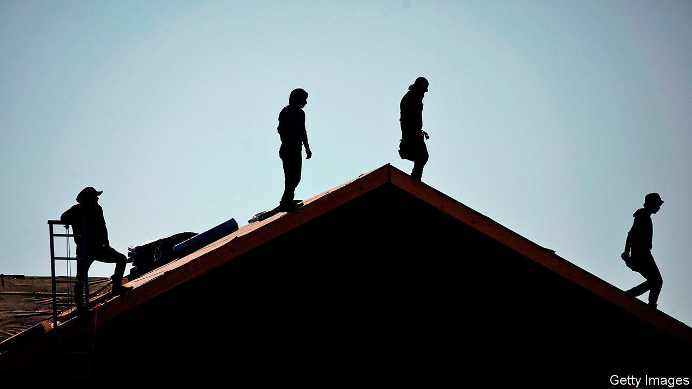
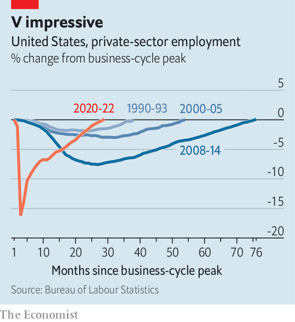

###### The department of economic terminology

# Even if GDP shrinks, America may officially avoid a downturn. For now 

##### Now you see recession, now you don’t 

 

> Jul 14th 2022 

Everyone knows that recessions are painful. But what exactly are they? It is an abstruse but important question that may crop up in the coming weeks in America because of the oddly lopsided state of its economy. The popular definition of recessions, often cited by journalists, is two consecutive quarters of negative growth. On that basis America finds itself on the brink of one today. In the first quarter of 2022 the economy shrunk slightly. Some indicators, such as declines in homebuilding and in factory output, suggest that a mild contraction might also have occurred in the second quarter. If that is the case when gdp is reported on July 28th, the conclusion would seem to be straightforward: America is in recession.

But things are not that simple. Officially, the decision about whether or not the American economy is in recession belongs to the business-cycle dating committee of the National Bureau of Economic Research (nber), a private, non-partisan research organisation. It is an eight-member group of macroeconomists including Robert Gordon of Northwestern University and Christina Romer of University of California, Berkeley. They consider a range of variables beyond gdp itself, from consumption to industrial production, with a view to identifying downturns that are truly spread across the economy.

This analysis has on occasion led them to declare that the economy is in recession even when gdp is growing. America managed to avoid two consecutive quarters of negative growth in 2001, but the nber boffins still deemed it to be a recession. What makes the present moment so unusual is that the nber may, for the first time, come to the opposite conclusion: that the economy has avoided a recession despite consistently negative growth.

 


Some sceptics might sniff a political conspiracy in this—say, an attempt to prop up Joe Biden’s beleaguered presidency. In fact, the reasoning is far more banal. When identifying business cycles in recent decades the nber has put most weight on real personal incomes and employment figures, and both of these are so far holding up better than gdp growth. Real incomes (that is, adjusted for inflation) have indeed started to fall as soaring prices eat into wages. But job growth has remained remarkably strong. The economy created 372,000 jobs in June, bringing private-sector payrolls beyond their pre-covid level. This rebound from the depths of the pandemic stands as America’s fastest labour-market recovery in more than three decades (see chart). An unemployment rate that is steady at about 3.6%, just shy of a seven-decade low, is simply not consistent with the notion that the economy is in recession. One possibility is that future revisions to data will show that gdp did actually expand in the first half of 2022.

All this may be cold comfort to Mr Biden. What matters most for voters is not a technical assessment of recession but their general perception of the economy. And that is rather poor. Consumer sentiment, as measured by surveys, has plunged. A poll in June from YouGov and  found that 56% of Americans believed the economy was already in recession. It is no coincidence that approval ratings for Mr Biden have also fallen, making him even more unpopular than Donald Trump at this point in his presidency. Hyper-partisanship explains much of the antipathy. Stubbornly high inflation is also a big factor, reducing what Americans can buy and making them feel poorer.

Some also dread what may lie around the corner. With inflation so persistent (and now at a 40-year high), the Fed has embarked on a course of monetary tightening that seems destined to be its sharpest since the early 1980s. Increases in interest rates do not always precede recessions. But it will be a small miracle if America can absorb tightening of this magnitude without suffering a pronounced rise in unemployment. At least one group can count on job security: the eight who must identify peaks and troughs in business cycles. Their expertise will be in high demand. ■

