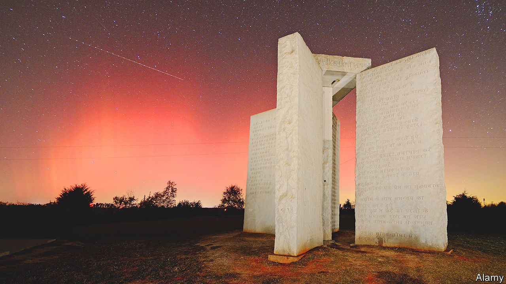

###### Rest in pieces

# Georgia loses a bizarre landmark 

##### Conspiracy theories about the Georgia Guidestones were common 

 

> Jul 14th 2022 

Georgia has its share of controversial monuments. They include Stone Mountain, which has America’s largest Confederate memorial carved into its side. And until last week the state was home to the Georgia Guidestones, often referred to as “America’s Stonehenge” (not to be confused with an attraction with that name in Salem, New Hampshire). Located about 100 miles (160km) north-east of Atlanta, the 19-foot (six-metre) landmark had messages sandblasted onto its granite surfaces in a dozen languages, including English and Babylonian cuneiform. It also served as a sundial and an astronomical calendar. 

In the pre-dawn hours of July 6th a shadowy figure, caught in a grainy image on camera, apparently planted an explosive device at the site of the Guidestones and damaged them. Authorities ordered the remnants destroyed, concerned that the unstable structure could collapse on investigators. They have yet to identify any suspects, but a local prosecutor described the attack as an “act of domestic terrorism”. The perpetrators face a minimum of 20 years in prison.

Although the latest mystery is finding out who bombed them, the Georgia Guidestones have been an enigma since their inception. In 1979 a man using the pseudonym Robert C. Christian commissioned the monument on behalf of a “small group of Americans who believe in God”. Many conspiracy theorists came to believe that the Guidestones were the work of an evil cabal bent on controlling the world: inscriptions on the stones included what seemed like commandments, such as “Maintain humanity under 500,000,000 in perpetual balance with nature”. 

Others simply saw the monument as a testament to the talents of the craftsmen of nearby Elberton, the self-proclaimed “granite capital of the world”. Still others saw the Guidestones as nothing more than a wacky roadside curiosity.

Those who subscribe to sinister notions about the stones were once largely confined to the fringes. Now they can be found among politicians (many of whom have also embraced other conspiracy theories, including the idea that the 2020 presidential election was stolen). Earlier this year one candidate for governor made it part of her platform to destroy the “satanic” stones; Kandiss Taylor ultimately lost the Georgia Republican primary in May with only 3.4% of the vote, but the recent events have pushed her into the spotlight again. 

In an interview with Alex Jones, a notorious conspiracy theorist, Marjorie Taylor Greene, a controversial Republican congresswoman from Georgia, said that the stones called for “population control”, a policy she linked to the “hard left”. Whether or not the bomber of the Guidestones bought into such fantasies, the impact of the monument’s destruction will be all too real. Elberton has lost its “Stonehenge”—and an eccentric tourist attraction that each year lured thousands of intrigued visitors from around the world.

