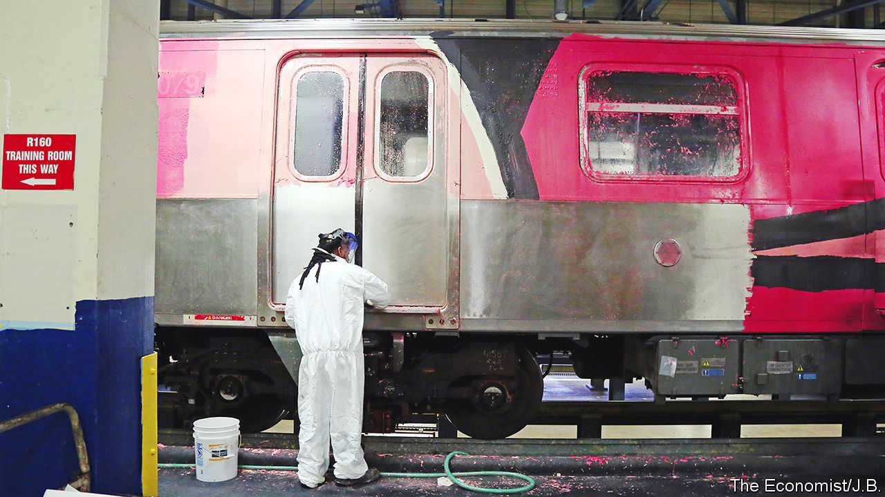
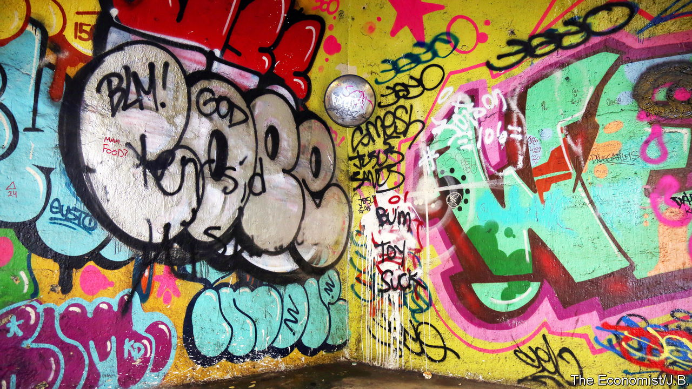

###### Writing on the wall

# New York City is a graffiti mecca for some tourists 

##### Tag time again in the Big Apple 

 

> Jul 14th 2022 

The ten-car subway train was adorned at the end of June in a tunnel in Queens. The artists appeared to use paint rollers to cover it along one side, from top to bottom, in an awful shade of pink (think Pepto-Bismol) with a brown line. “It was done quickly,” speculates John Chandy, who works in the train yard in Jamaica, Queens. Tagging a train is often less about the art and more about the prize of marking something that entails risk and echoes the original graffiti writers, who blanketed subway trains, including the windows and seats inside, in the 1970s and 1980s.

Modern graffiti began in Philadelphia in the 1960s. But it became an art form in New York City, says Eric Felisbret, author of “Graffiti New York”. “Graffiti benefited from the popularity of hip-hop globally,” says Mr Felisbret. “Out of all the elements of hip-hop, graffiti is by far the most rebellious…Back then, all graffiti was illegal.”

Many New York street artists have moved on to commissioned works—some younger ones have never created their murals illegally. Graffiti tourists are coming to New York for the bragging rights of tagging there. During the pandemic, some artists became brazen, painting buildings and walls even in the middle of the day. 

In 2020 the Metropolitan Transportation Authority (mta), which runs the subway, spent $1.2m on cleaning. By the end of May this year it had already spent $1.1m. In all of 2021, 681 subway cars were “vandalised”. This year more than 700 cars have been. More than one in ten subway cars had to be taken out of service for cleaning.

The recent spike in subway graffiti activity parallels the lifting of travel restrictions. The graffiti on trains usually gets cleaned or hidden quickly, so artists post images of their work on social media. Sharif Profit, who organises the annual Graffiti Hall of Fame in Harlem, says he can always tell when the work is by someone from another country: “It is not on the same level.”

 


Tagging on the subway is dangerous. The live third rail is lethal and the tunnels are dark. Trains can appear with little warning, so trespassers may have no way of avoiding them. Two French graffiti artists were killed by a train in Brooklyn in April. “As soon as I heard where the bodies were found, I knew they were taggers,” says Mr Felisbret. “It was just really incredibly heartbreaking.”

The mta removes any tagged train so as to avoid encouraging other people. Passengers then have to wait longer. That was the case recently, says Richard Davey, head of the mta’s New York City Transit system, when eight trains were vandalised. The resulting delays affected thousands of commuters. “It’s our goal to make sure we don’t return” to the 1970s, he says, “whether it’s in our stations, on our cars.” Graffiti on the subway began to die out in the late 1980s. One former graffiti writer said it is almost jarring to see tagging there now.

Passengers may not see much graffiti on the subway, but street art, murals and graffiti writing have become mainstream. Nike sells a graffiti trainer (no two shoes are alike). Museums and galleries hold street-art exhibitions. Some initially unauthorised street art is protected, such as the Banksy image on West 79th Street, which is covered in Plexiglass. Not all graffiti tourists want to break the law. Some sign up for graffiti walking tours or workshops. Lauren Beebe, of Like A Local Tours, pairs groups with Brooklyn graffiti artists for a lesson. She says these are especially popular with corporate groups from France.

Erica Lynch, a subway cleaner, is not a graffiti fan. She started cleaning the graffiti on the train from the Queens tunnel at 4am. Four and half hours later she had finished a segment of the car just ten feet wide and three feet nine inches high. It was tough going. The pink paint did not want to come off. Ms Lynch uses tsw (This Stuff Works!), a product designed to take off graffiti. It is extremely potent and can damage skin and eyes on contact, so she wears protective gear. “I’ve seen good graffiti,” says one of her colleagues, who grew up during its heyday in New York City, and here “you see a lot of bad.” ■

