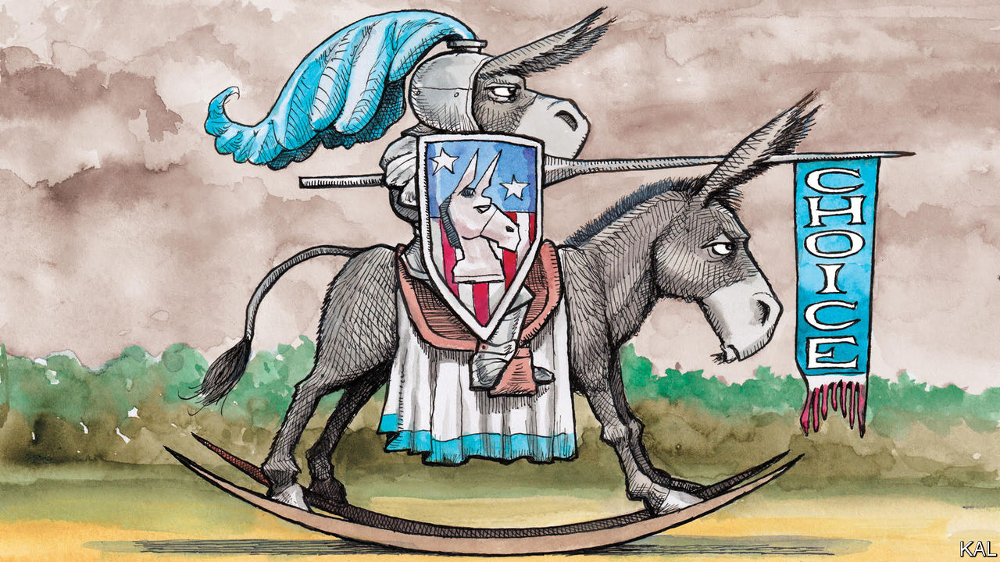

###### Lexington

# Why are the Democrats dithering on abortion rights? 

##### Three weeks after the Supreme Court struck down Roe v Wade, they still have no clear direction 

 

> Jul 14th 2022 

There is lofty talk these days, including by the Supreme Court majority that struck down the right to abortion, about how individual states, those laboratories of democracy, can now sort out the right answer to this vexing moral question. “I think the democratic process is going to work out at the state level,” said Mitch McConnell, the Senate Republican leader, recently. 

This is a feint, ahead of the mid-term elections, by Republicans who know they’ve been dealt a weak hand, given broad support for abortion rights. A national law protecting abortion or banning it may not be inevitable. But a struggle to achieve one or the other surely is. The moral logic of the contending abortion movements can’t just stop, with a resigned shrug, at state boundaries.

It is one thing to set the speed limit at 75mph in Wyoming but at 65mph in California. Americans do not generally think the constitution guarantees that they can drive very fast. But if they believe that a basic right is at stake, how can they put up with it being denied to a woman in Oklahoma, or to a fetus in New York? That would require a contemptible indifference to the liberties of fellow citizens (which is why Mr McConnell, back in May, acknowledged that a national ban was possible). And given the uncertainty created by the patchwork of state laws—can emergency-room doctors in a state with a ban save a woman’s life by performing an abortion?—Congress has every reason to step in.

But despite having the better hand, Democratic leaders have no strategy for playing it. Their confusion and hesitation are all the more astonishing because they had ample warning from the leak of the draft court decision in May. Joe Biden’s White House and abortion-rights activists have taken to publicly bickering over steps they could have planned months ago. 

Away from Washington, dc, some Democrats were better prepared. In Nevada, for example, Senator Catherine Cortez Masto was ready to roll out events to alert her constituents that they risked losing their abortion rights. Abortion in Nevada is protected up to 24 weeks of pregnancy by a referendum, passed in 1990, that the state legislature cannot touch. But Congress can. The Democrats’ majority in the Senate is just one vote, and Ms Cortez Masto is seen as the most vulnerable Senate Democrat this year. “This race itself is going to make the determination as to whether or not we have a federal abortion ban,” she says during a stop at a Las Vegas Teamsters hall. “There’s no doubt in my mind my opponent Adam Laxalt would support it.”

Like Ms Cortez Masto, Mr Laxalt is a former state attorney-general, albeit one who used his lawman credentials to back Donald Trump’s lies about the 2020 election. Mr Laxalt has said he is pro-life because he was born out of wedlock to a woman in her 20s. (The story gains some nuance from the disclosure, just before Mr Laxalt entered politics, that his father was then-Senator Pete Domenici of New Mexico, a Republican ally of his grandfather, Senator Paul Laxalt of Nevada. His mother, Michelle Laxalt, became a successful Washington lobbyist.) Mr Laxalt did not want to talk about abortion or anything else when Lexington approached him at the Independence Day parade in Boulder City. “I’m not going to do this right now,” he said. 

His campaign says Ms Cortez Masto is fearmongering. But one lesson of recent American political history is that fear is prudent. Mr Laxalt has called the state’s abortion protections “settled law”, language echoing that once used by certain conservative judges about  , the ruling they would go on to overturn. He has supported holding a new referendum to narrow the legal window for abortion to 13 weeks of pregnancy.

Local news outlets in Nevada are already reporting on women forced to travel there for abortions from states with bans or severe restrictions, and an abortion-rights group is pounding Mr Laxalt with advertisements (“He’s coming after our freedom”). But Mr Biden’s unpopularity, high prices for food and petrol, rising crime and turmoil at the southern border are all weighing on Ms Cortez Masto’s candidacy. Mr Laxalt is trying to keep the focus on those issues. Mr Trump came to Las Vegas on July 8th to make the case—with characteristic absurdity and, for Republicans, effectiveness—that Nevada is “a cesspool of crime” and that Ms Cortez Masto is “an open-borders fanatic”.

Even in a pro-choice state like Nevada, threats to abortion rights may not overcome the Republican advantage on pocketbook concerns. A more robust fight might be possible if the White House and Congress weighed in with more than Democratic oratory and dead-end ideas about the emergency created by the court. So far, Democrats in Congress are still debating what to do.

Progress v perfection

Instead they should be holding many more votes on bills like one proposed on July 12th by Ms Cortez Masto and some colleagues, to protect women who travel for an abortion from prosecution at home. They could also be holding votes on related matters like increasing funding for neonatal care and pre-school education, to demonstrate which party is really focused on the family.

A more controversial step would be to try to set a national floor, protecting abortion in cases of incest or rape or when a mother’s life is at risk. Some abortion activists are worried about giving moderate Republicans a chance to look reasonable by supporting such a bill. And they resist any abortion-rights measure that falls short of restoring the full protections of . But more incremental bills would save lives if they passed, and expose Republicans’ radicalism if they didn’t. The Democrats need to recapture the pragmatic, fighting spirit of Harry Reid, the former majority leader who once held Ms Cortez Masto’s seat. As Barack Obama put it while eulogising Reid in January: “In a battle between perfection and progress, Harry always chose progress.” Right now, Democrats are achieving neither. ■


