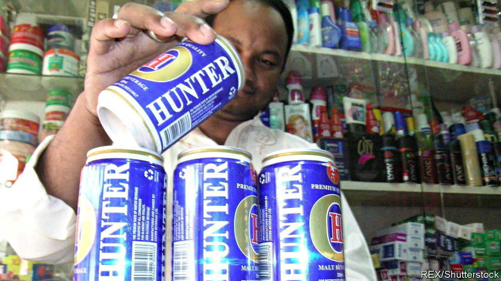

###### Cheers!

# Bangladesh loosens its booze laws 

##### Acquiring a licence to sell the stuff should become simpler 

 

> Jul 21st 2022 

Despite its location on one of the busiest streets in Dhaka, Bangladesh’s capital, Eram is almost impossible for newcomers to find. Only a black gate marks the entrance to the bar. Inside, it is no more inviting. Guests are greeted by a miasma of cigarette smoke, sweat, urine and liquor. Those who fail to tip the waiters risk being reported to the police for breaking the country’s strict alcohol laws. Yet dozens, if not hundreds, pass through the doors each day. The men—women are barred—go because the booze is cheap and the lights are low.

This is how much of the drinking in Bangladesh takes place. Consumption of alcohol has long been outlawed for Muslims, who today make up 90% of the population. Other religions are exempt but need a permit issued by the government. A loophole for Muslims was introduced in 1950, but it includes a requirement for a doctor’s certificate. The permit declares that the holder “requires liquor on medical grounds” and is “hereby permitted to possess and consume foreign liquor”. Few bother. Most drinking is illicit and feeds a lucrative black market for imported liquor. Cases of people dying after drinking dodgy home-brew are not uncommon. 

The government has acknowledged the problem. It is overhauling the rules in a simultaneous bid to boost domestic industry and bring boozing within the law. Individuals will still require permits, but the process for restaurants and bars to get liquor licences will be made less ambiguous. The new laws, which were introduced in February, also oblige establishments to buy 60% of their stock from the country’s two licensed producers: Jamuna Group, which makes Hunter, Bangladesh’s only home-grown beer, and Carew &amp; Co, a state-run distiller of such fine tipples as Gold Riband Gin, Old Rum and Imperial Whisky. 

The new rules were also designed with an eye on Bangladesh’s growing number of foreigners—from humanitarian workers to Chinese labourers toiling on infrastructure projects—and aim to lure in more. Even as domestic tourism has taken off, foreign tourists have remained elusive. Conservative alcohol laws and dress codes are often blamed.

Not that there is any shortage of Bangladeshis to consume the booze. During the pandemic, which hindered flows of foreign alcohol and prompted a police crackdown on the black market, Carew’s liquor revenues surged from 1.56bn taka ($16.6m) in 2019-2020 to 1.95bn taka the following fiscal year. Non-Muslims may have knocked it all back alone, but it seems likelier that some believers helped out.

The new laws should allow the government to make a little more money from selling alcohol. But legalising liquor sales to all, however lucrative, remains off the table. In April, lawyers with ties to the main opposition party challenged some of the new rules in the High Court. The government will want to keep the legal battle, assuming it engages in one, quiet. An election is coming next year, and the country’s powerful Islamic groups are riled by any whiff of the hard stuff—legal or not.

