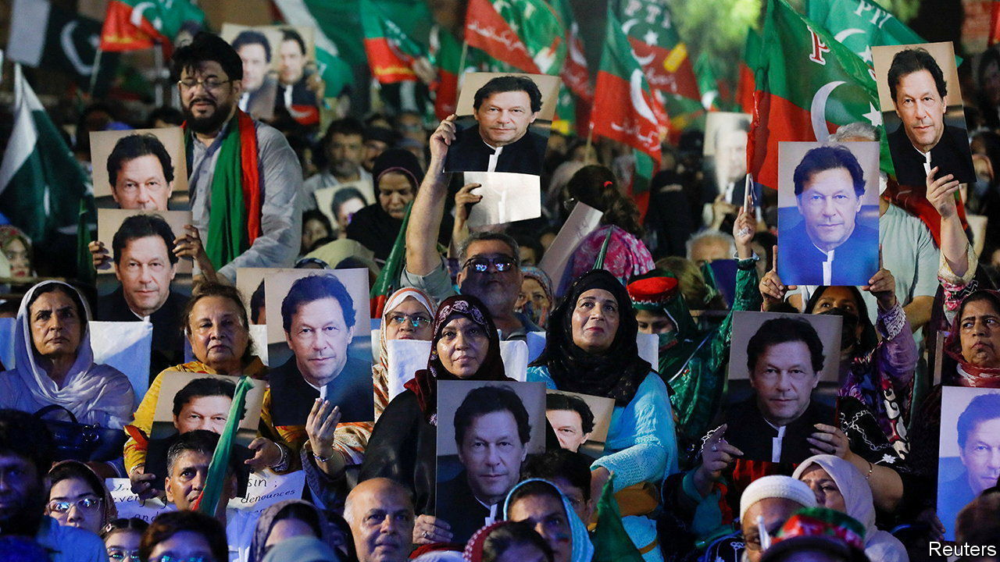

###### Pain in Punjab

# Imran Khan’s party wins a surprise victory against Pakistan’s government 

##### The former prime minister’s rallies have proved unexpectedly successful 

 

> Jul 21st 2022 

When pakistan’s Parliament sent Imran Khan  in a vote of no confidence in early April, the deposed prime minister said he would not go quietly. He has been true to his word. Night after night for the past few months he has held rallies to drum home his message that he was defenestrated in a nefarious plot orchestrated by America. From stages across the land, he has railed against the “imported government” that replaced him. Never mind that he offered no evidence for his theories; supporters lapped them up. The question for his opponents has always been whether Mr Khan could translate this fervour into electoral success.

By-elections in Punjab province on July 17th delivered the answer. Mr Khan’s Pakistan Tehreek-e-Insaf (pti) party won 15 of the 20 seats that were up for grabs, regaining control of the provincial assembly. That was unexpected. Punjab, Pakistan’s most populous province, is the country’s political centre of gravity. It is also the power base of Mr Khan’s successor, Shehbaz Sharif, and his Pakistan Muslim League (pml-n) party. Mr Khan has wasted no time in using the victory as a platform to demand early nationwide elections. 

The vote in Punjab suggests that  does indeed bring success at the ballot box. Some voters may have bought into Mr Khan’s theory of an international conspiracy against him, which America has said is nonsense. The vote also illustrates voters’ distrust of cynical politicians who flit from one party to another to maintain their power. Those now defeated in Punjab had left Mr Khan’s party in April to vote for Mr Sharif’s pml-n.

Yet the most compelling reason for Mr Khan’s success is the government’s weakness. It has failed to present an alternative story to Mr Khan’s conspiracy theories, leaving him to set the agenda. In the months before Mr Khan’s fall, the pml-n and its allies blamed him for high inflation and Pakistan’s . Mr Khan’s allies are now beating them with the same stick, even though the current government has inherited the mess. Inflation is painful. Mr Sharif’s reputation for hard-nosed economic-policymaking was damaged by his indecision over fulfilling the conditions imposed by the imf in negotiations for a bail-out. When Mr Sharif at last cut fuel subsidies, he had to take the blame for sudden, big price rises.

Polling shows that Mr Khan is a particular hit with Pakistan’s educated, digitally literate youth. For many of them, the pml-n represents a corrupt old guard who are holding the country back. Given that two-fifths of the electorate are between 18 and 30, this gives Mr Khan a huge advantage, says Bilal Ghani of Gallup, a pollster. 

Mr Sharif’s defeat in Punjab will increase tensions in his national coalition, which brings together an improbable range of politicians from the left to the religious right. They are likely to disagree over whether to hold an early election. Some in his own party are mumbling that only Mr Sharif’s elder brother, thrice-elected prime minister Nawaz Sharif, currently in exile in London, can save the day.

As is usual in Pakistan, the most intriguing question concerns the position of . Mr Khan won in 2018 as the generals’ favourite. His downfall coincided with his loss of their favour. Since then, he has been unusually outspoken in his criticism of the generals, mocking them as “neutrals” at rallies for failing to prevent his removal. The level of vitriol aimed at figures usually spoken of in respectful tones has been remarkable. Some commentators see Mr Khan’s victory in Punjab as a repudiation of military meddling.

The drubbing which the Sharif clan received in Punjab may not automatically translate into similar losses in a putative general election. Shaken out of its complacency, the pml-n may try to mobilise its vote more vigorously, especially if the stakes are higher. Mr Sharif, who clearly appreciates the seriousness of the threat, says he wants Mr Khan’s political finances investigated. The fight to shake off his persistent opponent will only get dirtier. ■

