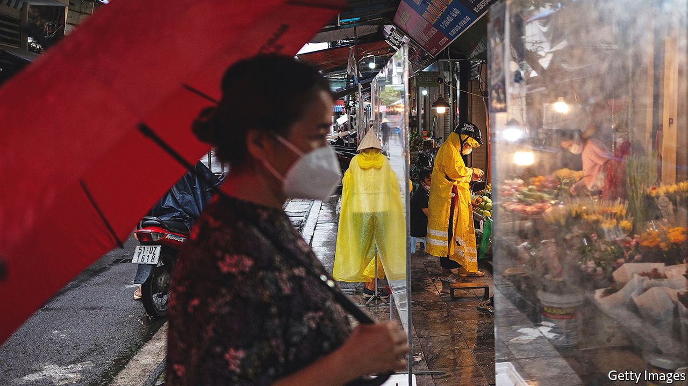
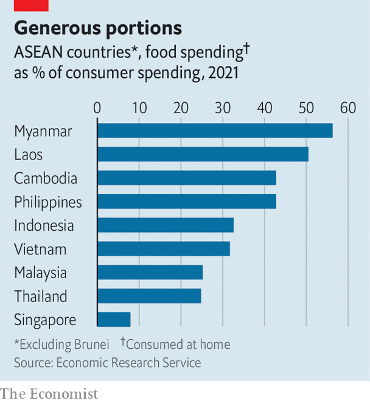

###### Feeling the pinch

# Soaring inflation is making South-East Asians hungrier and poorer 

##### Governments are hoping that expectations of rising prices do not become entrenched 

 

> Jul 21st 2022 

Nick ganzon is tinkering with the engine of his , a kind of elongated jeep that shuttles commuters around Manila, the capital of the Philippines. That his car has broken down is yet another stroke of bad luck, for Mr Ganzon’s fortunes have also ground to a halt. The price of diesel is painfully high. When it hit 40 pesos ($1.96) a litre two years ago, Mr Ganzon “panicked”. Now a litre costs 88 pesos. “All our income goes to diesel,” he says. The 67-year-old has tightened his belt: a self-described drinker, he has given up booze and cut back on food. His son, Mariel, also a jeepney driver, worries about being able to afford milk for his two young children. 

In fact, inflation in South-East Asia is relatively mild compared with many parts of the world. This month amro, an economic think-tank affiliated with the Association of South-East Asian Nations (asean), a regional club, forecast average inflation of 5.2% for its ten members this year. That is more than double last year’s rate, but half the level of Brazil and well below India or South Africa. Yet South-East Asia had thought itself insulated against big jumps in prices: over the past decade inflation has been relatively low by poor-country standards. Prices also initially remained stable in the region even after they began shooting up in the rich world. No longer: in , South-East Asia’s worst-hit country, they rose by 23.6% last month compared with a year earlier. 

The reasons for the surging cost of living are similar to those elsewhere. Snarled-up supply chains and Russia’s invasion of Ukraine have pushed up the . Countries that rely heavily on imported food and fuel, such as the Philippines, Singapore and Thailand, are also importing eye-popping prices. In May energy was nearly a fifth more expensive in Singapore compared with a year before, and more than a third pricier in Thailand, while in the Philippines diesel was 86% dearer. Global cereals shortages and higher local transport costs have made food much dearer, too.

The effects of these rising prices are felt acutely in regions such as South-East Asia, where food gobbles up a big share of spending. In 2020 food consumed at home accounted for between two-fifths and half of the expenditure of Burmese, Cambodians, Filipinos and Laotians, compared to about a tenth in rich countries, according to the Economic Research Service, an American government agency. Its ranking of such spending in more than 100 countries put that quartet among the top 15. 

 


Many South-East Asians are getting poorer. The World Bank calculates that a 10% increase in the global price of cereals or energy would raise the poverty rate in the Philippines, defined as living on less than $3.20 a day, by 1% and 0.3%, respectively. In fact, the price of cereals in June was up 27.6% on a year earlier, and the price of energy is projected to increase by 50% this year. This suggests that poverty in the Philippines will surge by at least 3.7 percentage points, impoverishing 3.85m people. A similar formula estimates that Thailand will add six percentage points this year to its poverty rate, defined as living on less than $5.50 a day. 

Last year, even before prices started rising in the region, one in five South-East Asians—or 139m people—either lacked consistent access to food or had run out of food and gone without eating long enough to put their health at risk. That is about three times the proportion in East Asia, according to the un. That number will inevitably increase this year. Preliminary data from household surveys being conducted by the World Bank in much of the region already show that “food insecurity is much more in evidence, especially at the lower ends” of the socioeconomic ladder, says Aaditya Mattoo, a senior economist at the bank. Inflation is exacerbating pandemic-inflicted woes.

Governments are racing to soften the blow for consumers. They have raised the minimum wage (in Laos and the Philippines), doled out cash to the poor (Singapore, Malaysia, Indonesia), and subsidised fuels or fertiliser (Indonesia, Malaysia, Philippines, Thailand). A couple have capped prices for essential goods (Malaysia, Thailand) or banned exports of some essentials, such as palm oil or chicken (Indonesia, Malaysia). 

Such measures have thus far been effective at controlling inflation in Indonesia and Malaysia. As net exporters, including of coal and natural gas, both countries have profited from the commodities boom. Flush with export earnings, these governments can better afford to subsidise imports than other countries in the region, notes Mr Mattoo. 

But not, perhaps, for long. Malaysia is expected to spend 78bn ringgit ($17.5bn, or 4.7% of gdp) on subsidies this year, the most ever. The costs of these subsidies already exceed the increase in revenue generated by commodity exports this year, according to Wellian Wiranto, an economist at Overseas Chinese Banking Corporation, a Singaporean bank. And inflation is already seeping into the Indonesian economy. In June prices were 4.3% higher than a year earlier, exceeding the government target of 4% for the first time this year.

Cash transfers to the poor are more efficient than export bans and price controls, which distort incentives and benefit the wealthy as much as the poor, notes Mr Mattoo. He points to fuel grants and cash transfers, which the Philippines put in place this year in response to the spike in the cost of living, as an example to follow. 

The tricky thing is calibrating support when it is unclear how long high inflation will last. There are reasons to be pessimistic. Since America’s Federal Reserve started raising interest rates earlier this year, South-East Asian currencies have depreciated against the dollar, making imports more expensive and fuelling inflation. The economic recovery from the pandemic may have the same effect. As South-East Asians resume spending at pre-pandemic levels, prices are likely to increase in response to invigorated demand, says Hongyan Zhao, an economist at amro. That is the case in Singapore, where employees have begun demanding wage rises in response to soaring prices, suggesting that they expect inflation to persist.

Yet there is also some good news. Aside from Singapore, there is so far little sign that inflation in other countries is becoming entrenched. Core inflation, which excludes volatile items like food and fuel, remains low in most economies, and surveys show that the public expect it to stay that way. Inflation in Asia may already have peaked, reckon analysts at Morgan Stanley, an investment bank, given that global commodity prices have begun to fall, as has demand for goods. Mr Ganzon the jeepney driver, and millions like him, will be praying that they are right. ■

