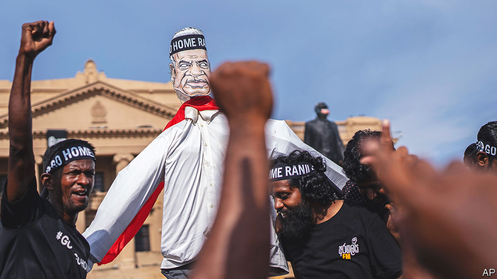

###### In with the old

# Sri Lanka picks a new president to replace the one that fled 

##### Ranil Wickremesinghe must fix a mess which many think is partly his fault 

 

> Jul 21st 2022 

Ranil wickremesinghe is a familiar sight to anyone who has taken even a passing interest in Sri Lankan politics in recent decades. First elected to Parliament in 1977, he has held a variety of cabinet jobs over the years, including, on six occasions, that of prime minister. His most recent stint was in the service of Gotabaya Rajapaksa, whose tenure as president came to an ignominious end on July 14th when he  by email from Singapore, having fled the country in the dead of night the day before. 

Fearing prosecution for alleged corruption and crimes committed during Sri Lanka’s civil war, the disgraced ex-president is expected to lay low abroad for the foreseeable future. But Mr Wickremesinghe (pictured in effigy) will remain a familiar face around Colombo, the capital. After taking over from his boss in an acting capacity the week before, he was officially elected president by a clear majority of 134 of the 225 members of Parliament on July 20th. He is expected to serve out the remainder of Mr Rajapaksa’s term, which ends in 2024.

His election raises hopes that Sri Lanka, which has been in  for months, will at last regain the political stability required to solve its economic problems. But Mr Wickremesinghe’s chances of success are complicated by his willingness to work with the Rajapaksas. The protesters who chased Mr Rajapaksa from office had also demanded Mr Wickremesinghe’s resignation as prime minister. Their idea of his stepping down hardly involved a promotion to the highest office in the land. That bodes ill for his chances of uniting Sri Lankans behind him in a time of crisis. 

There is some room for optimism. Mr Rajapaksa, for all his reluctance to relinquish the powers he enjoyed, eventually departed in the face of public pressure rather than call in the army to quash protests and rule by decree. Mr Wickremesinghe imposed a curfew, declared a state of emergency and described the largely peaceful protesters as “fascists”, suggesting a degree of personal anger which he will have to keep in check over the coming months. But he also submitted to the constitutional process rather than seek to prolong his interim stint in power. Security forces acted with restraint compared with past crises. Anarchy and large-scale violence were avoided. 

The new president is likely to stick to a programme of economic reforms which he had begun to implement as prime minister. The plan proposes increases in income and corporation tax, the privatisation of state-owned enterprises, a public-sector hiring freeze and a stronger social-safety net to cushion the blow of the other policies. It was drawn up by a diverse group of activists and policy wonks. Its direction enjoys broad support even among members of the opposition. Getting the country’s finances into a state that is sufficient to obtain a bail-out from the imf is widely seen as a priority. 

Politically, Mr Wickremesinghe has tried to sound conciliatory. In a speech to Parliament shortly after his election he acknowledged that Sri Lanka was in deep trouble and that young people in the country were demanding “systemic change”. He then announced talks with all parties represented in Parliament as soon as the following day. Before his election, he had begun work on curtailing some of the powers of Sri Lanka’s mighty executive presidency, though he had not committed to abolishing it, as protesters have demanded.

That may not be enough to convince the movement that drove out Mr Rajapaksa and whose aim is a wholesale change in the country’s politics. Given that Mr Wickremesinghe was prime minister, few expect major changes to the cabinet. He has been silent on the prospect of an early parliamentary election, another of the protesters’ demands. They see Mr Wickremesinghe’s ascendancy as a victory for the discredited  they blame for the country’s travails. They say they will continue to occupy the presidential secretariat, which they took over on July 9th. Even a powerful executive presidency is, in the end, not immune to the wrath of the people it serves.■

