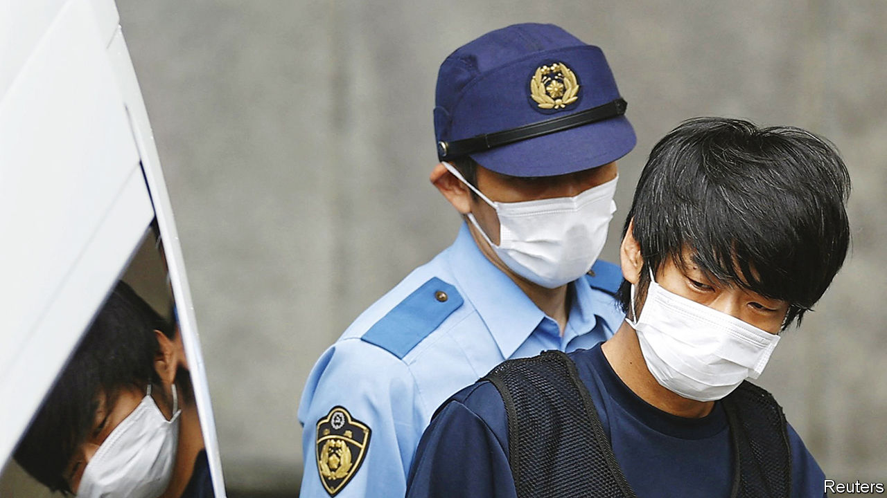

###### Whydunnit

# What drove Yamagami Tetsuya to kill Abe Shinzo? 

##### Japan searches for motives behind the senseless attack 

 

> Jul 19th 2022 

The omiyacho neighbourhood of Nara, an ancient capital in western Japan, is unremarkable. A tangle of quiet streets winds around boxy apartment blocks tightly packed together. Inside are standard-issue working-class Japanese flats: modest rectangular rooms with low ceilings, fluorescent lighting and the damp odour of a humid Japanese summer. In one such home, Yamagami Tetsuya (pictured) assembled the gun he used , a former prime minister, on July 8th.

Mr Yamagami’s target could hardly have been more political. Mr Abe was Japan’s longest-serving prime minister, and  inside the ruling Liberal Democratic Party (ldp) even after ill health forced him to step down in late 2020. He was campaigning for an ldp candidate in Nara when Mr Yamagami shot him. Mr Abe’s policies transformed his country, particularly on matters of defence and national security. What is more, the changes were controversial. When news of the shooting broke, many assumed that it was an ideologically driven assassination by someone opposed to Mr Abe’s ideas.

But Mr Yamagami’s motives instead seem to have been more personal. He told investigators that he killed Mr Abe to avenge a grudge against the Unification Church, a cult-like religious group to which neither he nor Mr Abe belonged. The connection requires a bit of unpacking. 

The sect was founded in South Korea in 1954 by the Reverend , a self-proclaimed messiah who was later imprisoned in America for tax fraud. (The group is sometimes known as the “Moonies”.) Moon, who died in 2012, found common cause with Kishi Nobusuke, Mr Abe’s grandfather and Japan’s prime minister from 1957 to 1960, in their shared repugnance of communism. Kishi helped the church gain a foothold in Japan: its local headquarters was “built on Tokyo land once owned by Kishi”, writes Richard Samuels, a scholar at mit, in his book . Moonies became reliable campaign volunteers for some right-wing members of the ldp, just as they supported conservatives in America, where the church also attracted followers. 

Mr Abe continued to nurse the relationship. He spoke at an online event for the sect as recently as last September, appearing alongside Donald Trump. Mr Yamagami’s mother belonged to the Unification Church, and in the early 2000s donated enough money to the group to leave her family bankrupt, according to Japanese media and a source close to the investigation. Mr Yamagami apparently blamed Mr Abe’s family for his own family’s travails. He planned the killing long in advance, and tested his homemade gun by shooting at the wall of a local branch of the church in Nara in the middle of the night. Prosecutors have ordered a psychological assessment to see if he is fit to stand trial. 

Security failures made it possible for Mr Yamagami to carry out his plan. “In Japan, the idea that such assassinations could not happen became very widespread,” says Fukuda Mitsuru, a crisis-management expert at Nihon University in Tokyo. Three big mistakes made Mr Abe’s killing possible, says a former senior security official. 

Failure has many fathers 

First, the branch of Tokyo’s police charged with protecting dignitaries does not have enough manpower to guard all of Japan’s many former prime ministers. Worse, local police in Nara failed to secure the vicinity around the campaign event where Mr Abe was speaking and did not notice as Mr Yamagami crept closer to Mr Abe from behind. Lastly, after Mr Yamagami fired his first shot, Mr Abe’s security detail failed to shield him or push him to the ground. Instead, Mr Abe turned towards the sound of the gun, giving the shooter the chance to get off a fatal second round. 

As Japan has sought to make sense of the killing, commentators have focused on Mr Yamagami’s psychology. Some argue that concentrating on ties between the ldp and the Unification Church or on police failures obscures deeper socioeconomic forces that may have unmoored Mr Yamagami from society. Reports in Japanese media paint him as a member of a precarious class that came of age in the 1990s and early 2000s, after the economic bubble of the 1980s burst. Mr Yamagami’s father and brother both committed suicide, and Mr Yamagami attempted suicide once himself, according to an uncle. The 41-year-old bounced between jobs and appears to have lived an isolated life. “I don’t think anybody knew him,” says one neighbour in Omiyacho. “There are a ton of big apartments here and people don’t interact with each other—there is no community.”

In those respects, Mr Yamagami bears a resemblance to the perpetrators of recent acts of indiscriminate mass violence in Japan. A man of a similar age and background set an animation studio in Kyoto on fire in 2019, killing 36. A younger socially isolated man dressed up as the Joker from the “Batman” films and stabbed passengers on a Tokyo subway on Halloween last year, injuring 17. Komiya Nobuo, a criminologist at Rissho University in Tokyo, likens such attacks to “suicide-bombings”, where the killers seek “symbols of happiness” to attack and do not even try to escape or evade punishment.

In short, it seems to have been a complex combination of factors that drew Mr Yamagami down the road to Mr Abe’s campaign event that day. As Mr Komiya points out, “It’s not a linear decision-making process—criminals themselves often don’t understand how they reached conclusions they did.” Japan will be left searching for answers long after Mr Yamagami’s trial comes to an end. ■

