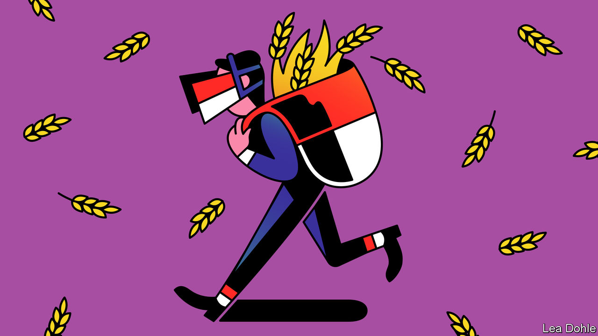

###### Banyan

# Why Indonesia punches below its weight in global affairs 

##### Joko Widodo, the president, views national interest in narrow economic terms 

 

> Jul 21st 2022 

For most of his eight years in power, Joko Widodo, or Jokowi, has evinced next to no interest in foreign affairs. Mention the geopolitics of the region in which Indonesia sits, and the president’s knee starts to bounce impatiently up and down while his eyes dart from left to right like a schoolchild desperate to escape detention. Bring the topic back to building , and you have his eager attention. So what to make of a recent burst of diplomacy, and especially of an unusual and high-profile visit as a peacemaker to the capitals of both Ukraine and Russia?

Admittedly, the foreign-policy stakes are higher for Jokowi than usual. In November Indonesia hosts this year’s g20 summit. Russia is a member of the group, but given Vladimir Putin’s invasion of Ukraine, Western members say they will boycott the summit if the Russian president shows up. That would be galling for Indonesia. The best that can be said about a meeting of g20 finance ministers which has just ended in Bali, and which was intended to lay the ground for the gathering in November, is that it did not collapse in acrimony. 

Jokowi’s plan to avoid a debacle in November is to have Volodymyr Zelensky, Ukraine’s president, show up too. Late last month the Indonesian president travelled to Kyiv with the first lady to deliver an invitation in person, while expressing a pious desire for an end to the war. Mr Zelensky also wants the war to end, but he may have felt that Jokowi was addressing the wrong man, particularly as his request for arms was rebuffed (Jokowi offered medical aid instead). Though Mr Zelensky received his guest with courtesy, the prolific social-media user failed to tweet about the visit.

In contrast, Mr Putin seemed pleased to see Jokowi, calling Indonesia one of Russia’s “friendly countries”. He promised to prioritise Indonesia in shipments of fertiliser. He proposed that Russia’s state railway invest in the grand scheme of , Nusantara, that Jokowi dreams of carving out of the jungle in Borneo. And as if to underscore Jokowi’s efforts as a go-between, Mr Putin even appeared to promise to lift Russia’s maritime blockade of Ukrainian wheat exports (he has yet to do so, though negotiations are continuing, mediated by Turkey).

If, as seems probable, Mr Putin fails to follow through on most of his promises, the trip to Moscow will represent more of a public-relations coup for the Russian president than for Jokowi. Yet, as well as calculations around a successful g20 summit, the Indonesian president’s recent travels highlight a Jokowi constant: when he does engage with the wider world, it is usually because he sees a possible benefit for the economy back home. 

In this, Jokowi is different from many leaders of countries of similar size and standing, who see national interest in broader terms of regional leadership and other measures of prestige. Indeed, when Jokowi came to office he promised a “down-to-earth diplomacy”, instructing officials to focus on the everyday needs of Indonesians ahead of abstract principles or even Indonesia’s international profile, points out Aaron Connelly of the International Institute for Strategic Studies in Singapore.

He certainly views Russia’s invasion through an economic lens. By messing with global food markets, it has caused headaches at home. One instance is cooking oil; its price has shot up so high, hurting tens of millions of Indonesian households, that Jokowi felt compelled to suspend exports of palm oil, of which Indonesia is the biggest producer.

Another is wheat, the main ingredient in the instant noodles which are an Indonesian staple. Before the war, Indonesia was the second-biggest importer of Ukrainian wheat. With the price of noodles rising fast and hurting the poorest, no wonder Jokowi wants to be seen to be doing something. 

Jokowi must worry that, by compounding the strain on the economy caused by the pandemic, the war imperils the economic gains of his presidency to date. It even throws the already uncertain future of Nusantara into doubt. That puts a premium on showing an audience back home that he is helping to resolve the crisis. Not that his recent diplomacy is conducted without regard to the wider global good that success as a peacemaker would bring. But with little evidence of much diplomatic follow-up by either him or his administration, the assumption is that Jokowi the newfound statesman is guided, as he always has been, chiefly by domestic calculations—and narrowly economic ones at that. 


 

