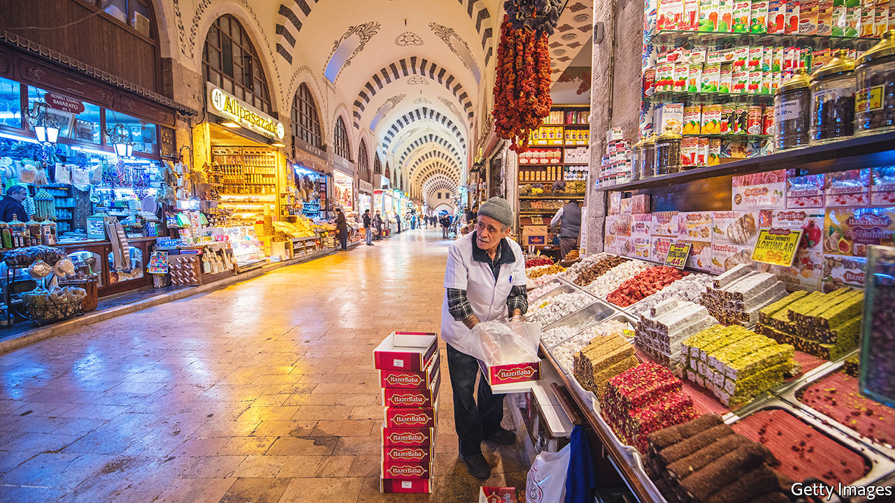
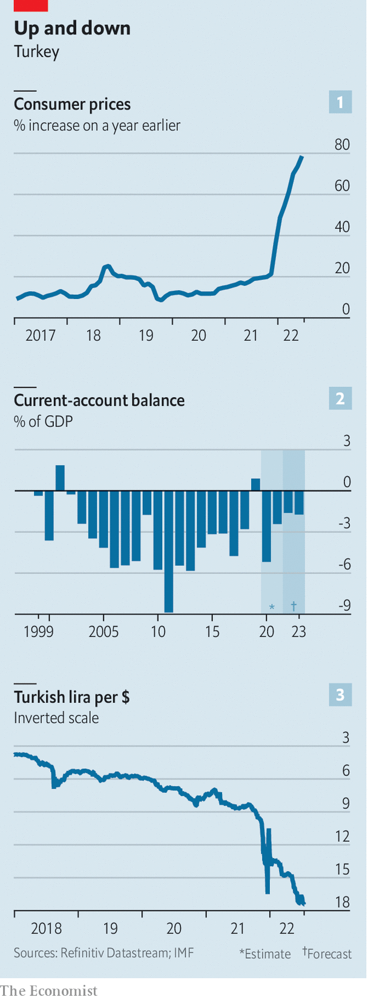
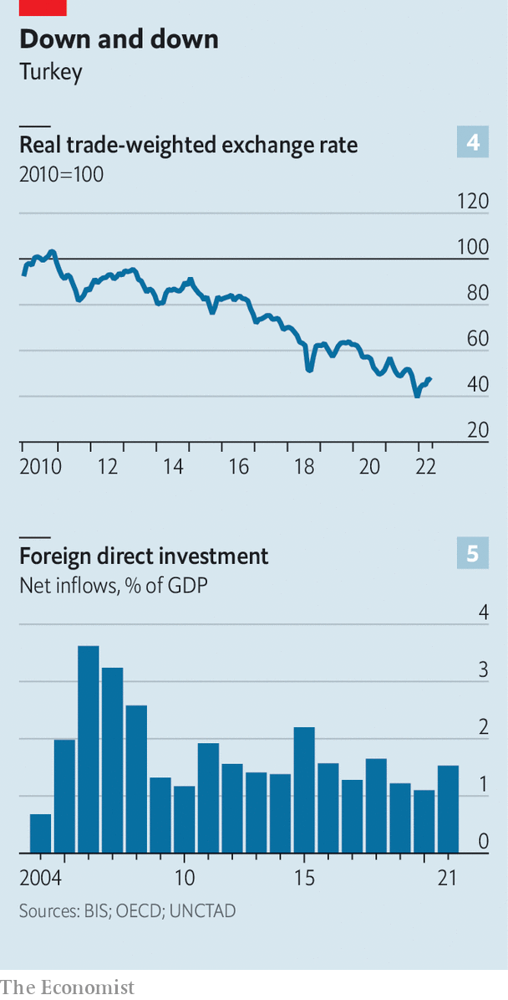
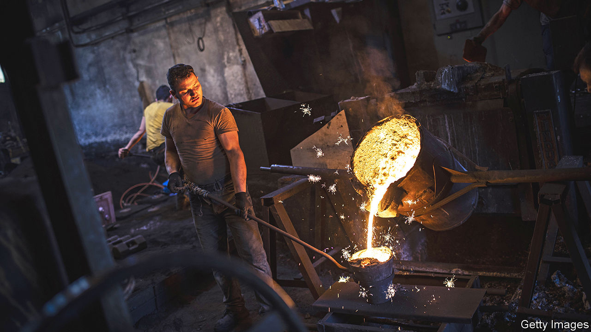

###### Industrial tension

# How has Turkey’s economy kept growing despite raging inflation? 

##### Many Turkish businesses are struggling to cope 

 

> Jul 21st 2022 

On the wall of Savas Mahsereci’s office is a black-and-white photograph of his father and grandfather making shoe soles from recycled tractor tyres. The room is upstairs from his factory on the outskirts of Gaziantep, a city of 2m people in south-eastern Turkey, close to the border with Syria. Like his forebears, Mr Mahsereci is in the recycling business. His family firm, mtm Plastik, makes refuse bags, disposable gloves and pellets for use in moulded products. The business has grown rapidly. It now occupies 20 times as much factory space as it did in 2004, and started exporting in 2016. Supply bottlenecks in China are “a big opportunity for us”, he says. Other industrial firms in Gaziantep are benefiting. The city enjoyed record exports last year, says Mr Mahsereci. 

Outside observers may find stories of thriving Turkish businesses hard to believe. Since 2018 the country has limped from one currency crisis to the next. Foreign investors have shed Turkish bonds and stocks. The lira has slumped. Inflation has jumped to almost 80% (see chart 1). Yet the economy has somehow kept going. In the swisher parts of Istanbul, 1,100km west of Gaziantep by road, all the signs of a thriving emerging-market mega-city are on display: bustling commuters, well-stocked shops, gridlocked traffic. 

 


The resilience of Turkey’s real economy is something of a puzzle. It was one of the few big economies that managed to grow at all in 2020. Last year gdp rose by a handsome 11%. Recent figures show that industrial production rose by 9.1% in the year to May. Even seasoned businessmen have been taken by surprise. 

At the centre of the mystery is a tug-of-war between two forces. On one side is a business dynamism that drives Turkey’s economy forward. On the other is the erratic policymaking that has undermined it. Under pressure from President Recep Tayyip Erdogan, the central bank has kept interest rates unduly low in the face of leaping inflation. That is especially unwise as Turkey is a low-saving country that needs to attract foreign capital to cover a persistent deficit on its current account, a broad measure of the balance of trade (see chart 2). It is an importer of energy, with much of its gas supplied by Russia and Iran. When energy prices rise, its trade deficit—and its need for foreign capital—tends to increase. 

Until now, dynamism has trumped fragility and bad policy. But beneath the surface, there are signs that Turkey’s monetary instability is catching up with it. The authorities have resorted to desperate measures to husband the country’s diminishing stock of foreign exchange and to prop up the lira. But credit is drying up and investments are being put on hold. Runaway inflation has left many people struggling to make ends meet. Mr Erdogan faces presidential and parliamentary elections in June 2023 at the latest and he trails in the polls. He has dominated Turkey’s politics for two decades and seems unlikely to go quietly. Economically and politically, the coming months are likely to be volatile.

Bazaar to bizarre

For a while, Turkey had the macro-economic stability that now eludes it. Reforms after a crisis in 2001 were transformative. One big change was the granting of greater independence to the central bank in pursuit of low inflation. New laws put constraints on public spending and opened up government procurement to competitive bidding. When Mr Erdogan came to power in 2003, he stuck to the new policies. Inflation dropped to single digits. gdp growth took off. Productivity picked up. 

But over time the impetus for economic reform faded. The central bank succumbed to political pressure and lost sight of its inflation goal. Mr Erdogan’s love for grand infrastructure projects was given free rein. The procurement law was gutted. Building contracts were handed out to cronies. A building boom displaced export-led manufacturing as the economy’s engine. Construction is a low-productivity industry, so the quality of gdp growth dropped. It is also notoriously sensitive to interest rates—perhaps one reason for Mr Erdogan’s insistence on keeping them low. 

Even so, a decade of easy money and surplus global savings after 2008 kept Turkey’s international credit line open. But there were balance-of-payment scares, such as during the “taper tantrum” of 2013, when the prospect of tighter monetary policy in America sparked an emerging-market mini-crisis. By the summer of 2018, Mr Erdogan’s belligerent insistence that high interest rates were a cause of high inflation, and not a cure for it, sparked a flight of foreign capital. The lira began a steep collapse in value (see chart 3). The last vestiges of central-bank independence were destroyed. Three governors were sacked by Mr Erdogan in as many years. 

In the closing months of 2021, interest rates were cut by five percentage points, to 14%. The lira came under renewed pressure. Inflation has since surged from about 20% to almost 80%. But Mr Erdogan is unmoved. Those who insist on a link between interest rates and inflation “are either illiterates or traitors”, he said recently. 

Amid such chaos, it is remarkable that the economy has kept going as well as it has. Much of that is the result of Turkey’s many commercial strengths. It has a large domestic market of 85m mostly young consumers, and has long been a staging post for trade between east and west. The country’s business culture has deep roots. The proportion of the population that aspires to be entrepreneurs is high by international standards. 

There are, broadly speaking, three kinds of Turkish business. The first is large firms, often conglomerates. These account for a quarter of employment and half of the business sector’s value-added. Some are joint ventures with European firms. The best manufacture high-quality capital goods, car parts and military hardware for export. They approach German levels of productivity. At the other end of the scale are small, unregistered firms, with low productivity. In between is a third group of medium-sized family firms, with some workers on the books and others not.

This structure helps explain the agility of Turkish business. Many large firms are conservatively run and diversified across industries and export markets, which gives them a built-in resilience. The largest conglomerate, Koc Holding, has four main divisions: vehicles and parts (in joint ventures with Ford and Fiat), white goods, oil refining and banking. Sabanci Holding, another conglomerate, has retail, energy, cement-making, banking and manufacturing businesses. 

The best mid-sized family firms share with them a nimbleness that comes from years of living with economic volatility. Turkey has a history of high inflation. Bosses have become experts at juggling finances. Companies have had time to adjust to a weak lira since 2018. Many have reduced their dollar debts. 

Smaller firms adjust by other means. The line between company and household is blurred. Risks are pooled among family members. Very often the response to adversity is to work harder. Four-fifths of the workforce put in more than 40 hours a week in their main job, one of the highest shares in the oecd—though long hours compensate for low labour productivity. Another strategy for small and mid-sized firms is to push business into the grey economy, where wages often do not keep up with inflation or minimum-wage laws. 

Istanbulls

Hard work and agility help businesses to keep going. But they also need demand. One of the big surprises in Turkey has been the strength of consumer spending. Inflation in the high single-digits has weighed on consumers in Europe and America. Yet, in Turkey, far higher inflation has not sapped demand. There are plenty of theories as to why. One is that consumers saw the fall of the lira, knew what that meant for future inflation, and splurged in anticipation of higher prices. Durable goods in particular are a hedge against inflation. New cars, white goods or imported luxuries hold their worth better than lira, even if they are not as liquid a store of value as, say, gold coins or dollar bills. With interest rates so low in real terms it is almost negligent not to borrow to spend. 

But credit is not the only fuel. Turkey’s young population has a high propensity to consume out of wealth gains, says one Istanbul-based economist. And well-off householders have much of their wealth tied up in foreign-currency deposits and property, which have held or increased their value. 

 


For companies that sell mainly in Turkey and for whom imported raw materials are a big part of total costs, the lira’s collapse is a headache. But it has been a big stimulus to exporters whose costs are mostly in lira and whose revenues are in hard currency. The real exchange rate (that is, adjusted for relative inflation in Turkey and its export markets) is what matters for export competitiveness. Turkey’s has fallen a long way (see chart 4). 

There are other factors that also favour Turkish exports. The cost of shipping from Turkey to Europe is far lower than from China. Goods can be shipped from Gaziantep via local ports in less than 72 hours, says Mr Mahsereci, compared with a minimum of a month from China. And supply is more reliable. Turkey can also export via the Aegean or the Black Sea. 

Yet accelerating inflation poses big challenges for even the most agile business. One is pricing strategy. It is tricky to judge where to pitch prices. Too high, and you risk losing market share to rivals; too low, and you may find you do not cover replacement cost. Hard decisions seem to multiply. “You have to be ready to negotiate with all of your customers and all of your suppliers all of the time,” says a businessman. “It is very, very tiring.” Some prices are slow to adjust. A large share of mobile-phone subscribers have 12-month contracts. Many are still on last year’s prices. 

Businesses must protect themselves from inflation to survive. This often means that the cost is pushed onto others. That creates tensions—between landlords and tenants, shops and customers, and firms and their suppliers. No business can afford to defer the settlement of its customers’ bills for very long. “Payment terms of three to six months are down to zero to three months,” says an Istanbul-based investor. And there are other pressure points. Turkey’s external deficit has not gone away. In principle, devaluation is a remedy. It works by stimulating exports and crushing demand for imports. The export fillip is working, but strong consumer demand has kept imports high. 

Against the flow

Turkey must either attract fresh foreign capital or draw on its existing reserves of foreign currency. Both are becoming harder. The quality of capital inflows to Turkey has steadily degraded over the past 20 years. Foreign direct investment (fdi), the “stickiest” form of capital inflow, has not matched the levels of the mid-2000s, when Turkey followed more orthodox policies (see chart 5). 

Some European bosses now see Turkey as a potential alternative to China as they seek to shorten and diversify their supply chains. Last year ikea said it would move production of some of its furniture from Asia to Turkey. Hugo Boss, a clothing firm, said it would add capacity to its factory in Izmir to reduce reliance on Asia. But Turkey’s monetary instability—and a deterioration in governance and the rule of law—is a bar to another fdi boom. Portfolio flows into Turkish bonds and shares have evaporated. That leaves Turkey ever more reliant on short-term syndicated loans extended to local banks. As interest rates go up worldwide, these are harder to come by. 

The situation for reserves is also perilous. Turkey’s central bank has burned through tens of billions of dollars trying to prop up the lira. Official reserves of foreign currency are negative if swaps with local banks are taken into account. (The central bank still has holdings of gold.) Meanwhile private-sector demand for dollars and euros has risen. At their peak last year, two-thirds of bank deposits were held in foreign currency. The growing illiquidity in currency markets means exporters have every incentive to hoard dollars and euros from their overseas sales. 

The authorities are striving to curb this creeping dollarisation and to stop the lira from falling further. A scheme has been in place since December which indemnifies deposits switched out of dollars or euros and into lira from exchange-rate losses. In January Turkish exporters were ordered to hand over 25% of their hard-currency earnings to the central bank. That figure was raised to 40% in April. Complaints from corporate treasurers that they needed a float of dollars and euros to pay for vital imports or to service debts had no effect. 

In a sign of growing desperation, the authorities went further. On June 24th Turkey’s bank regulator said it would ban loans to firms that cling to significant hard-currency holdings. This measure was to stop companies borrowing lira on the cheap to speculate in dollars. The initial reaction in Istanbul was shock. Suddenly the main concern of corporate Turkey was not inflation but a potential credit crunch. 

 


If the regulation is strictly enforced, says one executive, banks will be unwilling to lend and firms will be forced to cut back on non-essential spending. Some may struggle even to get enough trade credit to finance their working capital. It may not come to that. Noises from Ankara are that the banks will not bear the burden of verifying whether borrowers are complying with the new regulation. 

Still, companies are turning cautious and big investments are being put on hold. “Everybody is waiting for the elections,” says an investment banker. Mr Erdogan’s ak Party is clearly behind an alliance of six opposition parties in opinion polls. He trails in polls against the plausible opposition candidates for the presidency. His defeat would probably mean a return to monetary orthodoxy. 

Taming inflation would be a big and painful job, but Turkey’s experience after 2001 shows that, with the right policies, it can be done. fdi could rebound to take advantage of Turkey’s position as a low-cost manufacturing hub on Europe’s doorstep. A rally in the stockmarket is plausible, given how cheap Turkish shares have become. Yet electoral defeat for Mr Erdogan is far from certain. He has jailed political opponents, bullied the media, sought to suppress free speech and could resort to all manner of chicanery to cling to office. Many of the people interviewed for this article did not want to be named. 

And before then, the exchange-rate crisis might enter a new, more combustible phase. Once the summer is gone, and the boost to hard-currency earnings from tourism starts to fade, things could get dicey. A tranche of protected lira deposits matures at the end of August. The state has $6bn of external debt payments due in the second half of this year, according to Morgan Stanley, a bank; big companies and banks have $23bn coming due. It seems unlikely that all these debts will be fully rolled over. Yet somehow the diminishing stock of foreign exchange must be augmented—or husbanded. In a worst-case scenario, limits might be placed on withdrawals of householders’ dollar deposits. 

Perhaps the economy will somehow muddle through until the elections. As strange as Mr Erdogan’s approach to monetary policy has been, his fiscal policy has been quite conservative. The public debt-to-gdp ratio was 41.6% of gdp last year. This is comfortably below the debt burden of Turkey’s emerging-market peers. Given the country’s low solvency risk, perhaps its friends in the Gulf might stump up some of their petrodollars. 

Turkey has withstood some remarkable strains. Now, more than ever, Turkish businesses are focused on survival. Inflation breeds uncertainty and uncertainty breeds caution. The things you must do, you keep doing, says a businessman. The rest can wait. “You live another day.” ■

