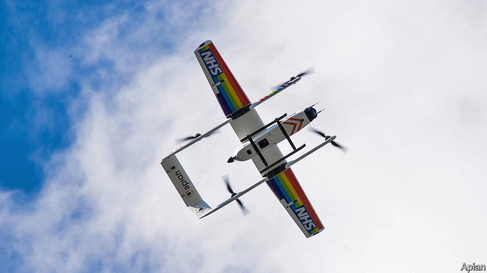

###### Unmanned aviation

# A superhighway for drones to fly between British cities 

##### The corridor will help avoid collisions with other aircraft 

 

> Jul 21st 2022 

Since they began to whirr and hover over a decade ago, small autonomous drones have turned from the plaything of hobbyists into the stuff of venture capitalists’ dreams. Drones now carry out many commercial tasks: inspecting infrastructure, surveying crops, filming videos, transporting medical supplies and, in some places, dropping off shopping and delivering pizzas. But such flights are strictly limited by aviation regulators in order to prevent accidents, especially collisions with manned aircraft. The British government has decided that it is time to give drones the freedom of the sky with the world’s biggest “superhighway”.

The scheme was announced by Kwasi Kwarteng, the business secretary, at the opening of the Farnborough air show on July 18th, as part of a series of measures to boost aerospace innovations. Known as Project Skyway, the 265km (165-mile) drone superhighway will connect airspace above Reading, Oxford, Milton Keynes, Cambridge, Coventry and Rugby over the course of the next two years. This corridor could later be expanded down to Southampton and east to Ipswich.

As useful as they are, commercial drones are currently not supposed to be flown beyond an operator’s visual line-of-sight, or bvlos as it is known. For long flights this pushes up costs, since ground pilots and observers are required along the route. Britain’s Civil Aviation Authority (caa) has authorised some bvlos flights without such restrictions, but the procedures can be tortuous and may involve the closing of nearby airspace. In recent trials the Royal Mail has carried letters to the Isles of Scilly and the Orkney Islands, and the nhs has flown chemotherapy drugs from Portsmouth to the Isle of Wight. 

As in other countries, the caa takes the line that if firms want to operate regular bvlos flights, their drones must be able to detect and avoid both planes and each other, just as crewed aircraft do. Specialist gear is being developed to equip drones to do this, but it will add cost and weight to what are often small machines. The idea of a designated superhighway is that instead of putting such kit in the drones, it can be installed on the ground; this equipment would monitor and communicate with the machines, and automate flights so that they are completed safely.

Project Skyway is backed by a consortium of firms, including Altitude Angel, a specialist in automated air-traffic management, which has been testing the idea with an 8km drone corridor in the Thames Valley. Another partner is bt, which aims to use its telecoms network to link the superhighway to drone operators, who often use apps on mobile devices to fly their machines. bt will also fit the ground sensors to some of its mobile-phone masts. 

Drone operators would need to be registered to use the superhighway. It would be set at low altitude, below Britain’s busy flight corridors where airliners zoom. But it would be designed to detect general aviation, so that light aircraft and helicopters could pass through the superhighway safely. If a potential conflict is detected, the drone would be instructed to change its flight path or even land. Operators would be notified and would be able to take manual control of their drone if required. On some estimates, nearly 900,000 commercial drones could be buzzing around Britain by 2030; if so, the superhighway could be as busy as the m25 on a Friday afternoon. Without the queues. ■

