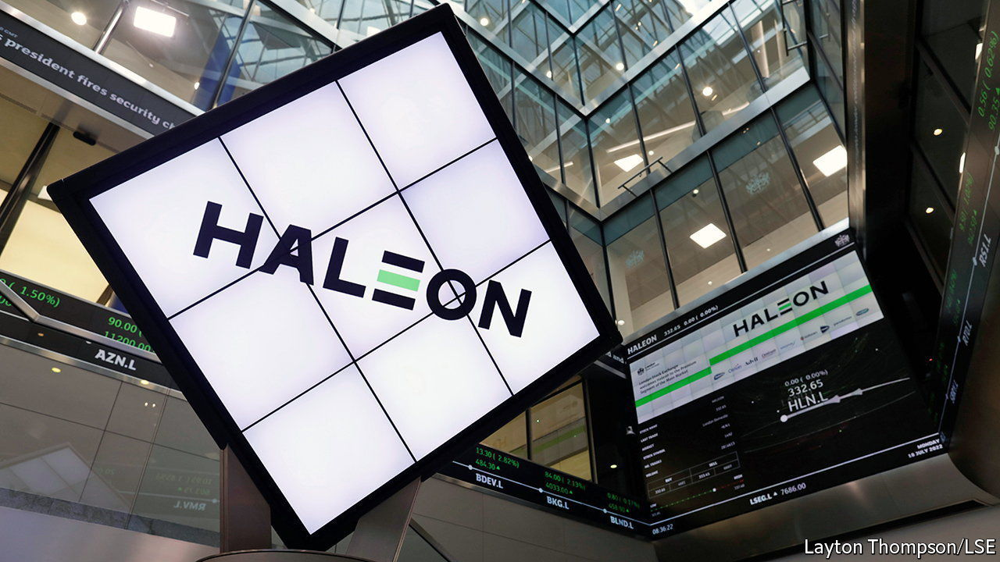
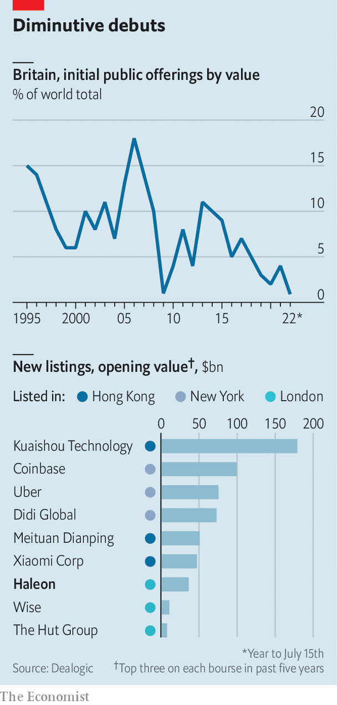

###### Don’t gloat about the float

# Haleon’s listing shows the problems afflicting the London Stock Exchange 

##### A big debut for a firm that sells toothpaste 

 

> Jul 18th 2022 

The london stock exchange welcomed its largest new entrant in over a decade on July 18th. GlaxoSmithKline (gsk), a pharmaceuticals giant included in the ftse 100 index of leading shares, spun out its consumer health-care division in order to focus on new drugs and vaccines. Each of gsk’s shareholders received one share in Haleon, the new firm, for every gsk share they owned. Haleon started trading at a market capitalisation of £30.5bn ($36.4bn).

 


The listing is emblematic of the travails of a stockmarket whose best days are behind it. Haleon is not a fast-growing technology or life-sciences firm. It is a long-standing business selling Sensodyne toothpaste and smartly packaged ibuprofen. Haleon is not attempting to raise any new funding by listing, which may be just as well: Britain’s stockmarket has accounted for less than 1% of the capital raised in global initial public offerings so far this year. The largest firms that have listed in London in recent years have been dwarfed by those choosing New York or Hong Kong (see chart).

One big reason for the City’s dimming appeal is the departure of long-term capital. Twenty years ago British defined-benefit pension funds had around half their assets in London-listed equities; today the share is less than 3%. Another is that tech firms worry City investors are too focused on short-term profits to take their businesses seriously. A new Financial Services Bill includes tweaks to the rules to make the lse more attractive, but it can do little about the attitudes of those trading on it. Pass the Advil.

