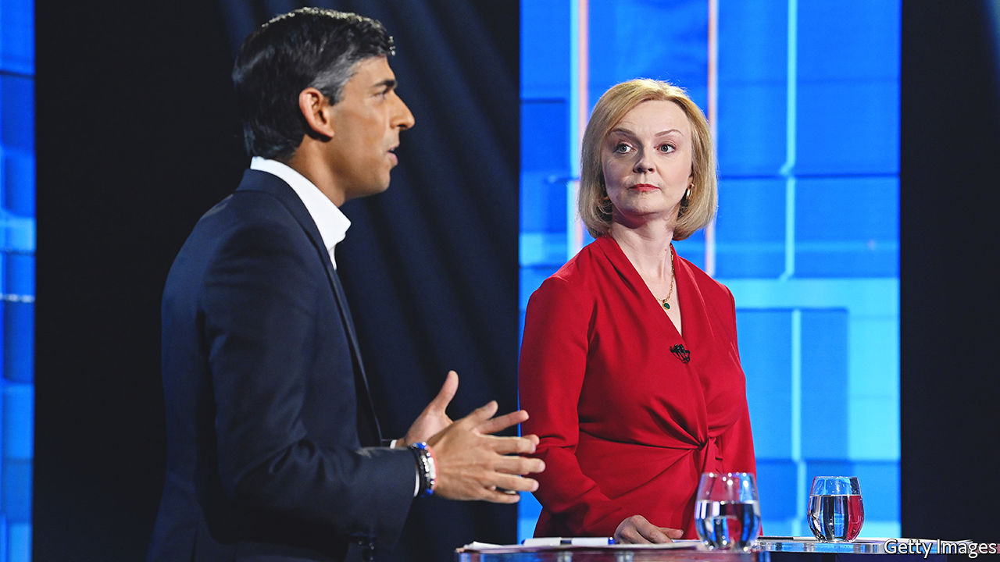

###### There is one alternative

# Rishi Sunak and Liz Truss will battle to be Britain’s next prime minister 

##### Two children of Thatcher vie to succeed Boris Johnson 

 

> Jul 20th 2022 

The conservative party has spent three decades seeking an heir to Margaret Thatcher. It now has two pretenders to choose from. On July 20th, after nearly a fortnight of often vicious campaigning, the  was reduced to Rishi Sunak and Liz Truss. One resigned as chancellor, helping precipitate ; the other is his outwardly loyal foreign secretary, who made up ground among mps as other contenders dropped out. 

Conservative Party members  in a ballot over the summer; a new party leader and prime minister will be installed in early September. Mr Sunak won the support of more mps and goes down better with swing voters, according to Opinium, a pollster. Ms Truss is more popular with members by a distance, and is therefore the bookmakers’ favourite. 

Both seek to harness Thatcher as they battle to follow her into Downing Street. Ms Truss was raised by nuclear-disarmament activists before turning to the right at university. Her critics see in her a bizarre tribute act to the party’s most deified figure: she flecks her speech with Thatcherite aphorisms, dresses like the former prime minister and lauds Ronald Reagan. Mr Sunak is a Stanford mba graduate who speaks with the sunny inflections of Silicon Valley; no 1980s-style pinstripes here. But he is an emblem of the era of globalisation that Thatcher helped usher in: he made a small fortune in the City and married the daughter of an Indian tech billionaire. 

The two draw different lessons from the Thatcher era. Ms Truss, like much of her party, remembers Thatcherism as a tax-cutting project. This is the legend that is told on tea-towels at the annual party conference. She promises to reverse tax rises implemented or planned during Mr Sunak’s time as chancellor. (These hikes are worth 2% of gdp, compared with a reduction in the tax take of 4.7% of gdp under Thatcher.) “We are predicted to have a recession because you have raised tax,” she told Mr Sunak in one debate. 

For Mr Sunak this is a partial telling. He recalls Thatcherism as a project to tame inflation, which he regards as “the ultimate enemy” and which tax cuts now would risk fuelling. Prices rose by 9.4% in the year to June, the highest rate since 1982. Mr Sunak styles himself as a fiscal disciplinarian, who, like Thatcher, helped with the books in his parents’ shop and who was blown off course only by the pandemic. In an address in February, he approvingly quoted Nigel Lawson, a Thatcher-era chancellor, who rejected the notion that unfunded tax cuts would pay for themselves through economic stimulus as a “spurious kind of virtuous circle”. “This something-for-nothing economics isn’t conservative, it’s socialism,” he told Ms Truss in the debate. 

Ms Truss more strongly echoes Thatcher in her monetary policy. She has suggested that she would revise the mandate of the Bank of England to tackle inflation. “We have not been tough enough on monetary supply,” she said, voicing a widespread concern that quantitative easing has driven spiralling prices. Setting money-supply targets would mimic an unsuccessful Thatcher experiment in the early 1980s. Mr Sunak defends the central bank’s record and has said he is “worried” by the direction of the debate. 

The two candidates agree on a Thatcherite agenda of post-Brexit deregulation, although Mr Sunak’s plans are more fleshed out. He promises a “Big Bang 2.0” for the City (in truth, his proposals to date are more like a balloon pop). And both have Thatcherite instincts on the climate; the former prime minister was hostile to government subsidies but increasingly agitated by the state of the planet. Both have said they support the target of reducing Britain’s carbon emissions to net zero by 2050. But Mr Sunak says it must be done “in a way that carries people with us”; Ms Truss thinks it can be “more market-friendly”.

Ms Truss comes over most Maggie on foreign policy. She talks of a civilisational struggle between autocracies and the “free world”. Such language once appeared eccentric to many Conservatives, somewhat less so after Russia’s invasion of Ukraine. She accuses Mr Sunak of being soft on China. Once a Remainer, she is the author of legislation that will renounce some of Britain’s treaty obligations to the eu; that delights the section of the party which thinks Thatcher’s handbagging of European leaders at Fontainebleau in 1984 marked the high point of British diplomacy. The fact that Mr Sunak campaigned to leave the bloc, and is now cast as a Europhile, underscores the ideological brittleness of the Brexit project. 

In truth neither arouses genuine enthusiasm among mps. Mr Sunak’s colleagues agree he is a diligent administrator who will impose order after Mr Johnson’s chaotic reign. Some fear he risks resembling Theresa May or Gordon Brown, workaholics who commanded their departments but were overwhelmed in the top job. “At the Treasury you have the luxury of staged, well-planned interventions,” says a former colleague. “The reaction to immediate events he has not done so much.” 

Ms Truss’s record as a minister divides those who think her quietly effective from those who dub her “the human hand grenade”. The ideological rectitude that party members seem to admire may prove an obstacle to the imperfect business of government. “I’m a pragmatic Conservative and more tax cuts are not the answer to everything,” says a cabinet minister. 

These tepid reactions bode ill for party unity. The contest is bitter and personal. Whoever wins, their share of mp endorsements will be the lowest of anyone who went on to lead the party since Iain Duncan Smith in 2001. Thatcher clocked up more than 11 years in office. On that, at least, she will go unimitated. ■

