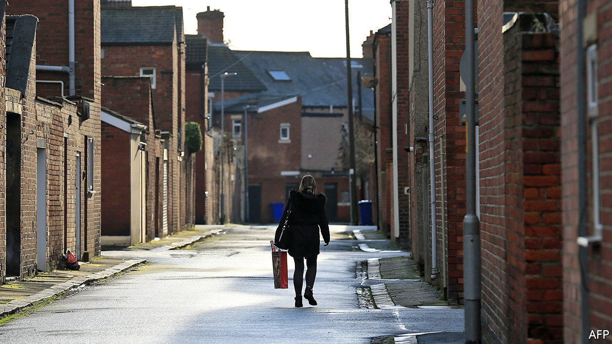
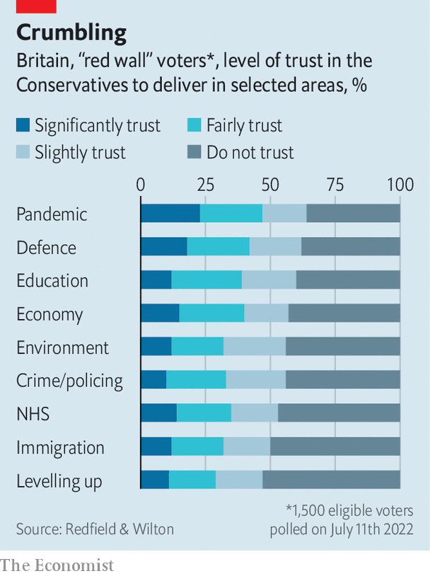

###### Regional development

# The Tories seem to be cooling on Boris Johnson’s signature policy 

##### Farewell, levelling up? 

 

> Jul 21st 2022 

Few places need levelling up more than the Royal housing estate in Edlington, a town in South Yorkshire once dominated by coal mining. Houses have been abandoned and boarded up; local children terrorise some of the remaining residents. The local Conservative mp, Nick Fletcher, has a plan for the estate. He wants to lock up criminals, hold community meetings, tidy people’s front gardens and use government funds to spruce up the high street. But his party seems to be losing interest. 

“Levelling up”, a catch-all term for economic development, infrastructure and beautification projects in the poorer parts of Britain, was Boris Johnson’s big domestic idea. The assumption was that in 2019 Conservatives such as Mr Fletcher won election in traditionally Labour “red wall” seats in the north of England because the Tories promised to get Brexit done and because Labour was led by Jeremy Corbyn. In order to hold such seats, however, Tories must demonstrate that they can quickly improve people’s lives. Hence levelling up.

It is now hardly spoken of. The race for the Conservative Party leadership has featured obsessive talk of tax cuts and transgender issues, but not levelling up or the red wall. Some of the candidates briefed that levelling up seemed rather expensive and narrowly focused on the north. “Conservatives need to win in lots of different places,” said Rishi Sunak, one of the final two candidates. A hustings on levelling up on July 19th was held behind closed doors. 

Northern Conservatives are incredulous. “Levelling up is an amazing phrase,” says Andrew Isaacs, a Doncaster lawyer and prominent local Tory. Politicians in the red wall have begged the candidates to commit themselves wholeheartedly to Mr Johnson’s agenda, lest they (and the Conservative Party as a whole) be defeated at the next general election. Perhaps electoral logic will eventually draw Westminster’s attention back to the north. But Mr Johnson’s would-be successors have good reason to try to change the tune. 

Levelling up has always been vague and messy, like the man who pushed it as prime minister. It is a mixture of serious analysis about regional productivity gaps, worthy but uncertain ideas about devolving power to mayors and assorted grievances about the wealth of big cities, particularly London. It is a story as much as a policy programme—saying that you are levelling up is at least as important as actually doing it. Mr Johnson is an accomplished storyteller who could disguise the holes in his agenda. Neither of the candidates to replace him is as skilled. 

 


Even Mr Johnson was not adept enough to sell levelling up to the public. Opinion polls of red-wall voters find that the Conservative Party is distrusted on his signature policy (see chart). Some Tories believe that people are impatient for signs that headway is being made. Doncaster council, which covers Edlington, succeeded last year in a bid for money to improve the city centre. Jane Cox, the Conservative group leader, says people have yet to see progress. 

It is also possible, however, that the desire for rapid results is part of the problem. Not all Mr Johnson’s levelling-up policies emphasise speed, but many do. As he scaled back plans for high-speed rail in Yorkshire last year, for example, he argued that a revised plan would improve public transport more quickly. In a similar vein, Mr Fletcher hopes that the Royal estate’s problems will soon begin to dissipate if his plan is followed. But people who know the estate well remember previous efforts, which had little effect. They say its problems are caused by stubbornly troublesome families, some of whom moved from other estates that were being regenerated.

Perhaps the worst thing about Johnsonian levelling up is the assumptions it makes about northern voters. They have been treated as self-interested and transactional, willing to trade votes for local investment. In fact, opinion polls show, they worry about the same things as everyone else: inflation, the state of the nhs, climate change and so on. “Is levelling up that important?” asks Chris Bonnett, a Tory-leaning electrician from Tickhill, south of Edlington. “We’re at war with Russia.”■

