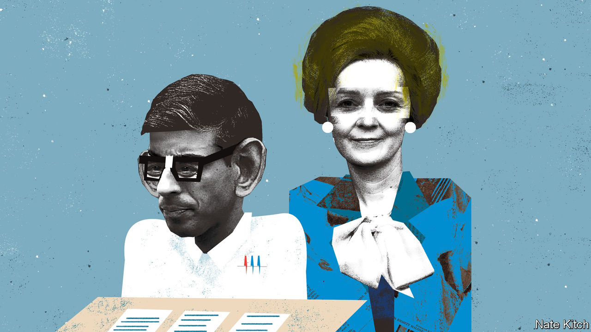

###### Bagehot

# The choice between Rishi Sunak and Liz Truss 

##### The Conservative Party is suspicious of cleverness 

 

> Jul 21st 2022 

Prejudice may stop Rishi Sunak from becoming prime minister. For Mr Sunak, the grandson of Indian immigrants, comes from a demographic that has long gone unrepresented at the very top of British politics: Old Wykehamists.

Winchester, the posh school that Mr Sunak attended, churns out clever clogs who never quite make it to become prime minister. Two former Labour chancellors, Stafford Cripps and Hugh Gaitskell, both attended the school, which now charges £45,936 ($55,000) in annual fees. Geoffrey Howe, a former Conservative chancellor who, like Mr Sunak, helped bring down a prime minister, is another alumnus. In total Winchester boasts six chancellors but just one prime minister (from more than two centuries ago). In contrast, Eton, a posher school that extols the virtue of leading over reading, has managed 20, including two of the past three. 

John Stuart Mill once labelled the Conservatives “the stupid party”. That is unfair. But it is true that Tories are suspicious of cleverness. They prefer a different characteristic: soundness. This trait is difficult to define. But, like pornography, Conservatives know it when they see it. Roger Scruton, a right-wing thinker, wrote that conservatism’s “essence is inarticulate”. To put it another way: anything that can be greeted with the guttural baying Conservative mps use to show approval (“Yeeeyeeeyeeeyeee”) is sound. The choice that party members must now make as they weigh up whom to pick as their leader is between cleverness or soundness. Mr Sunak is clever. Liz Truss, the foreign secretary and his opponent in the run-off, is sound. 

Desperate times mean that many Conservative mps have swallowed their aversion to intelligence and prefer the idea of a nerdy prime minister. During the rounds of voting to whittle the field down to two candidates, Mr Sunak won the support of more mps (137) than Ms Truss did (113). When asked to run down the reasons he was supporting Mr Sunak, one senior Tory highlights his tendency to actually read policy briefings. Applauding a cabinet minister for doing the reading might sound like praising someone for putting on their trousers before they leave the house. But it would be an improvement on the current occupant of Downing Street.

To win over the party members, however, cleverness must be hidden. Mr Sunak was early to the threat of inflation but will receive little thanks for it. Stupid policies are needed to win support from the stupid party. Mr Sunak has called for a ban on onshore wind turbines (“Yeeeyeeeyeeeyeee”). Britain needs more carbon-free electricity. Practically all polling shows wind turbines to be popular among the general public. It is smart to support onshore wind. It is, however, unsound. 

A hawkish foreign policy is sound indeed. That suits Ms Truss, who has taken a tough line on everyone from Brussels to Beijing. In contrast, Mr Sunak has been linked with a less confrontational approach to the eu. A letter leaked during the contest from Mr Sunak’s team at the Treasury warned against the wholesale shredding of eu legislation on vat, which would result in years of litigation. A calmer relationship with the eu will help Britain’s enormous domestic problems. But it is not sound. 

Being sound does not always come naturally to Ms Truss (who, to be clear, is also clever). There is a pantomime element to her politics. Ms Truss has appeared so often in strikingly similar outfits to those worn by Margaret Thatcher that people no longer assume it is coincidence. When speaking about foreign policy Ms Truss uses a near-parody of Thatcher’s tone. When speaking about economic policy the foreign secretary reverts to a chattier manner. It may be odd. But it is sound.

Mr Sunak may be helped by the fact that he is an intelligent man with a taste for bad ideas. Ms Truss, once a Remainer, is now a hardliner on Brexit due to a mixture of democracy (17m people voted for it) and cynicism (it is impossible to criticise Brexit and rise in the Conservative Party). Mr Sunak simply thought leaving the eu was a fabulous idea from the off. As a backbencher he championed free ports, which, at best, shuffle wealth around rather than create it. He is blessed that when he is stupid, he is sound. 

Penny Mordaunt, who came third in the voting among mps, was neither smart enough nor sound enough. “Greater”, her magnum opus on the state of Britain, is thrillingly insane. In a list of examples of plucky defeat she listed both Frank Spencer, a hapless television character, and the battle of the Somme. Finishing the book leaves the reader wondering whether, like a footballer’s autobiography, its lead author even read it, never mind wrote it. 

The Portsmouth mp pitched herself as the soundest candidate. Naturally, she supported the new royal yacht, which would sail the oceans extolling British free trade (“Yeeeyeeeyeeeyeee”). Sadly for Ms Mordaunt, an unsound past was discovered. As equalities minister she was seen as a staunch ally of transgender activists. As a candidate Ms Mordaunt distanced herself from such views. Voters may not care. But Conservative mps did. Anything that smells of wokery is not welcome in the current Tory party. 

Too clever by half

Yet Mr Sunak and Ms Truss were part of an extraordinarily diverse cast of leadership candidates. Half were women; half were ethnic minorities. The best a straight white male managed was fifth and that was despite a career engaged in the soundest of all possible activities: shooting foreigners. Although the contest was explicitly unwoke, it was accidentally intersectional, with race, class and gender all tangled together and often discussed in a more nuanced way than usual for British politics. 

Ideological questions ended up trumping ones of identity. But in one important way, there is little difference between the clever choice and the sound choice. Both Mr Sunak and Ms Truss poll far behind Labour. With the Conservatives wandering towards defeat, even the cleverest, soundest politician would struggle.■


