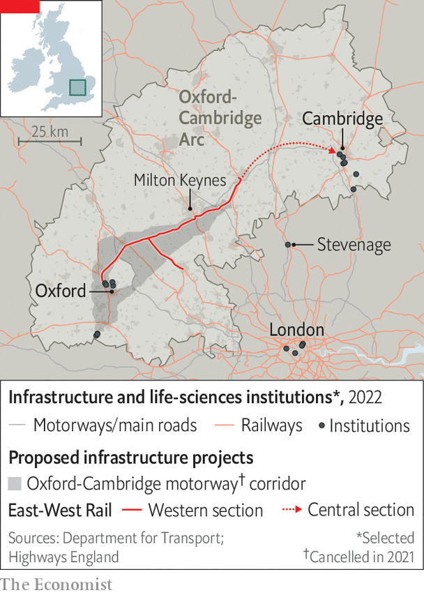
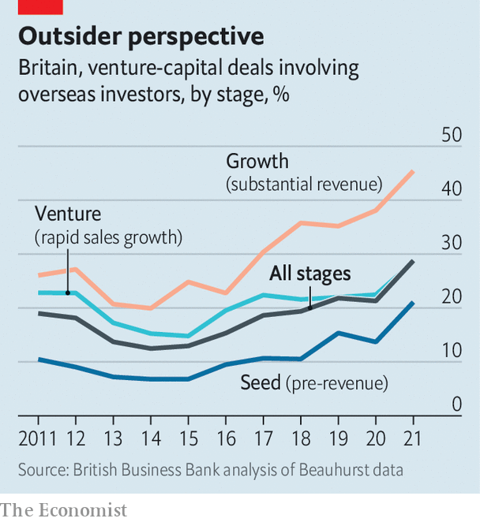

###### Britain’s growth crisis

# The life-sciences industry is a jewel in Britain’s economy 

##### Policymakers can do more to help it sparkle 

 

> Jul 20th 2022 

Tree-lined lawns and historic buildings provide the backdrop for high-tech wizardry at the Babraham Research Campus in Cambridge. Alchemab, a three-year-old company housed in its laboratories, is built on the idea that a person’s response to chronic diseases may stem from differences in the antibodies they produce. Jane Osbourn, the firm’s chief scientist, says they have already found a set of antibodies common to survivors of pancreatic cancer. The firm raised £60m ($82m) in 2021 on the back of such discoveries. 

The painstaking collaboration of the scientists in Cambridge stands in striking contrast to the noisy combativeness of the Conservative Party leadership contest, which was winnowed down to  on July 20th. But these two worlds are linked. As Rishi Sunak and Liz Truss spend the next few weeks taking lumps out of each in their bid to become party leader, they will be asked over and again about their plans to revive Britain’s sagging economy. 

Few industries have greater growth potential than life sciences. Although the sector employs people throughout the country, the country’s most vibrant collection of life-sciences researchers, entrepreneurs and funders are, like those at Alchemab, in the “golden triangle” that contains Oxford, Cambridge and London. If the Tory candidates are serious about growth, they will be thinking hard about what makes this megacluster work, and what holds it back. 

 


According to the  supplement’s 2022 ranking, the region is home to four of the ten best universities in the world for health care: Oxford, Cambridge, Imperial College London and University College London (ucl). Strong clusters have developed around all three vertices of the triangle (see map). The biggest is in Cambridge; at its heart is the Cambridge Biomedical Campus, the largest centre of medical research and health science in Europe. It is the site of AstraZeneca’s new global headquarters, which will house 2,000 employees when finished. The Wellcome Sanger Institute, home to the bulk of Britain’s genomic-sequencing capacity, is 13km farther south.

The Oxford cluster is centred on the Old Road Campus in Headington, and includes the Jenner Institute, which developed the Oxford-AstraZeneca vaccine. Harwell, a sprawling science park south of the city, is built on 280 hectares of land reclaimed from the Atomic Energy Authority. It is the home of Oxford Nanopore, which makes whizzy gene-sequencing equipment and is one of the largest firms to emerge from the British life-sciences ecosystem.

London’s cluster includes the Francis Crick Institute in Kings Cross, with ucl and the Wellcome Trust close by. It also serves as the main connection between Oxford and Cambridge, since there are no direct motorway or rail links. Right in the middle of the triangle is Stevenage, the British home for r&amp;d of GlaxoSmithKline (gsk), another pharma giant. 

This network of nerds and nous is yielding results. According to the BioIndustry Association, a trade body, British life-sciences firms raised £4.5bn in 2021, compared with just £261m in 2012. It was not always thus. Andrew Williamson, the boss of Cambridge Innovation Capital, a venture-capital fund, says Cambridge was an “academic ivory-tower town” 25 years ago. The best graduates from the university’s biology doctorate programmes would make for the City of London and well-paid jobs in finance. Now they want to join startups. “There’s a complete cultural shift,” says Mr Williamson. When he returned from Silicon Valley in 2017 it was because he could “see going on here exactly what was going on there 20 years ago”. 

In theory one of the great advantages that British life-sciences startups have is the National Health Service (nhs). A unified health system, in which every patient is assigned a single number that follows them from birth to death, is particularly useful for running clinical trials. Adrian Hill, who runs the biotechnology cluster at Harwell, notes that the trials done on the covid-19 vaccines in Britain were both very large and done very fast. 

Its unified nature should make the nhs a fast adopter of innovative products, as well as the cleanest, largest pool of medical data in the world. “The basic narrative is ‘we are a sample set of 60m people, you can come and prove your technology here’,” says Alexis Dormandy, the boss of Oxford Science Enterprises, an investment firm that has just raised £250m and counts arms of Alphabet and the Singaporean government as shareholders. Optimists envisage a virtuous cycle: data feeding into the golden triangle’s firms, fuelling innovations that feed back into a more productive nhs.

This vision is only slowly emerging, however. Many nhs data are a mess: the systems which house them need an overhaul for which no one is keen to pay. The nhs tends to focus on cost control when buying in new products. And instead of operating cohesively, bits of the system tend to move at their own pace. None of these smaller chunks of the network is big enough to be a really decent market.

This is not a trivial problem. The American health-care system may be a lot less centralised than the British one, but its wealth, scale and competitiveness make it a magnet for new technology. nhs infrastructure and data may help young British firms to develop products, but often the first market they deploy it in is America. 

Another factor also pushes promising British life-science firms abroad: investors. Life-sciences companies are capital-intensive: it takes a lot of cash to build laboratories and run expensive clinical trials. They also tend to grow slowly, as their products are complex and highly regulated. The relatively small pools of capital available through Britain-based investors are simply insufficient for the winding path to viability. “Our venture-capital (vc) guys tend to have small funds, between £100m and £200m,” says Sir John Bell, a professor of medicine at the University of Oxford.

Cash is not the only thing that startups need from investors. They want access to networks—of people sitting on the boards of large companies that might one day buy their own firm; of bankers and lawyers who can marshal the next attempt to raise capital; of people who know biotech inside out. And the investors with these kinds of networks tend not to be based in Britain.

That is partly because of the dearth of large firms that might snap up a successful startup. American investors have links to tens of companies with the resources to make acquisitions. Britain has only two obvious buyers: AstraZeneca and gsk. 

It is partly because of the state of the public markets. The London Stock Exchange is seen as a hostile place for firms to float. “The lse isn’t the Nasdaq. It’s not even the Hang Seng,” says Fred Cohen, a biotech investor who now divides his time between the Bay Area and London. “The stock exchange needs to decide if it wants to be a source of capital and liquidity for the innovative companies that don’t follow the price-to-earnings metrics that the lse was designed around.” On July 20th Abcam, a Cambridge-based biotech firm, announced that it was abandoning plans to join the lse’s growth market and would maintain a sole listing on Nasdaq.

Alchemab is a good worked example of these issues. The vast majority of its £60m in funding was raised from American investors, most of it from ra Capital Management, in Boston, Massachusetts. One of the conditions of funding was that a new chief executive should be appointed in Boston; its current hiring is split evenly between Boston and Cambridge. This may be a good thing for the company, but it is now on a path where much of its growth is likely to happen in America.

A firm called Artios, on the other side of the Babraham campus, has a similar story. It specialises in a technology called dna Damage Response, creating compounds that inhibit processes which let cancers spread. Niall Martin, its boss, says that the $153m he raised from American investors last year comes with a plan to float the firm on the Nasdaq stockmarket in New York in a few years’ time. Artios banks with Bank of America as a result, and in order to meet Nasdaq’s requirements, the firm must base its chief financial officer in America. 

 


In both cases the lack of growth capital from investors with British networks (see chart) nudges them towards placing more resources in America. Britain is left with a strong commercial research-and-development base, but without sales forces or manufacturing hubs. “We don’t want more pre-revenue companies,” says Sir John. “They don’t pay tax or add to growth.” “Capital is definitely part of the problem,” says Sir Jonathan Symonds, chairman of GlaxoSmithKline. “There is no uk source; we are totally dependent on us funds coming to pick on British tech.” 

The obvious policy fix, changing regulations so that British pension funds are able to invest in venture-capital firms, is not imminent. One glimmer of light is that some foreign venture capitalists are now seeing the wisdom of putting down roots in London, building out new networks of contacts to grab opportunities in the triangle. Sir John says he knows of between six and eight “really high-class investors” who are joining Mr Cohen in putting together a British base. 

The dearth of lab space across the golden triangle also puts a cap on domestic growth. Mr Martin of Artios says his 100-person company can find absolutely nowhere to expand into (another reason to go to America, where lab space is plentiful). Commercial-property investors seem to have got the message, at least. In Stevenage, gsk has sold 12 hectares of land to developers as part of a £900m deal to build 130,000 sq metres of laboratory and office space; last year BioMed Realty, a Californian property developer, paid £850m for two Cambridge sites. 

Finding a place to work is one part of the puzzle. Improving the connections between the various bits of the golden triangle, and opening up affordable new places for life-sciences employees to live, are others. A study prepared by the Oxfordshire Local Enterprise Partnership in 2020 found that the region between Oxford and Cambridge contributed £111bn in gross value added to the economy every year; the government reckoned that could rise to between £191bn and £274bn a year if a programme of building created new homes and linked up towns by rail and motorway. 

“People can’t afford the housing here or in Cambridge,” says Jim Naismith, director of the Rosalind Franklin Institute near Oxford. “That is where the government can make a big difference.” But planning rules remain a big barrier to growth. The housing stock in Oxford has grown by just 1,440 net homes in the past five years, a slower growth rate than the English average, due largely to the lush “green belt” of land that surrounds it. In 2021 the government cancelled a proposed motorway between Oxford and Cambridge; plans for an east-west rail link still just about survive. 

Strengthening the cluster of life-sciences companies in the golden triangle could have profound effects on its culture, too. Although academics at Britain’s best universities are shaking off their ivory-tower mindset, they have not yet developed the appetite for risk that their American counterparts often possess. Being part of a large network helps to encourage all-or-nothing bets. If it succeeds, then the company is on a fast track to growth. If it fails then the firm’s founders and employees can just walk across the road to another firm, bringing their valuable experience with them. The whole ecosystem benefits.

By recycling people through different firms, “fast failure” also helps to ease the talent shortage that afflicts expanding life-sciences firms in Britain. Some of this shortage relates to specific skills. Lab technicians and biological scientists have been labelled “shortage occupations”: the government has dropped the minimum salary requirement for visa applications for people in these jobs. But some of it is about characteristics. Katya Smirnyagina, a life-sciences partner at Oxford Science Enterprises, says its portfolio companies particularly need people who combine scientific knowledge with entrepreneurial ability. 

Britain’s political climate is another problem. Brexit might have freed British regulators from the burdens of alignment with the eu: on July 16th Mr Sunak promised a streamlined domestic system of clinical-trials approval to replace the one in operation in the bloc. But scale matters. In 2019 the British pharmaceutical market was worth £36.7bn, according to the Association of the British Pharmaceutical Industry, a trade body; the eu’s was worth €227bn ($232bn). Research from James Barlow at Imperial College Business School has found that the British medical regulator approved fewer novel medicines in 2021 than its equivalents in either the eu or America, in part because firms are prioritising bigger markets. A standoff between Britain and Brussels over the trade arrangements governing Northern Ireland has jeopardised British participation in Horizon Europe, the world’s largest research-and-development funding programme.

A sense of grievance against highly educated elites may sand away the edges of the golden triangle, too. Boris Johnson’s government shelved the Oxford-Cambridge Arc project out of fears that it would undermine his “levelling up” agenda, which was supposed to stimulate economic activity outside London and the South East, and spark a revolt among Tory voters in affected constituencies. “There’s a tendency in politics to think pulling down the golden triangle will help build up other things,” says Mr Naismith. “That’s not true.”

The life-sciences industry in Britain is healthy in many ways. Capital pools are expanding. An array of bodies, such as nhsx, a government unit devoted to innovation, has made progress in creating a more fertile environment for new technologies. The strengths of the golden triangle are very hard to replicate. But it needs help to achieve its potential. The next occupant of Downing Street must provide it. ■

