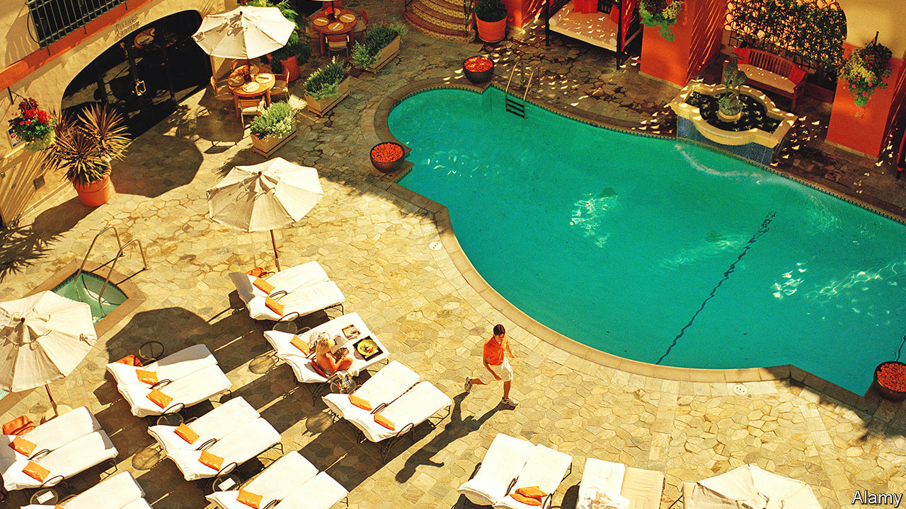

###### Puttin’ it up at the Ritz

# Are vacationing plutocrats the true victims of inflation? 

##### The microeconomics of luxury hotels 

 

> Jul 21st 2022 

Pity those looking for a slice of luxury this summer. Consumer prices are rising fast the world over but at the fanciest hotels they are soaring. Last year you could book a night at Le Bristol, Paris’s best, for less than €1,000 ($1,170) a night, if you looked hard enough. Now rooms are going for hundreds of euros more. The price of a gin martini at London’s Dukes hotel (straight from the freezer, and hands down the city’s best) is shooting up faster than the tippler’s blood-alcohol level after the first sip. A basic room on a Monday night in November at a new Four Seasons in California’s wine country is going for about $2,000. 

 


The cost of staying at a posh hotel crashed amid the first wave of covid-19 but has roared back. str, an analytics firm specialising in the hospitality industry, finds that the typical worldwide daily rate for a luxury hotel has more than doubled in the past two years (see chart). Prices for rooms at lesser establishments are up, but by nowhere near as much. Hotel accommodation, as measured by America’s consumer-price index, has risen by 27% in that period, twice as fast as the index as a whole. 

Two factors explain why the very swankiest hotels are raising their prices the most. The first relates to labour costs. Fancy places employ a lot of people, from porters to car-parking valets, in order to satisfy their guests’ every whim. As a consequence, they are more exposed to wage rises than are regular hotels, where guests wait longer to be served and more services are automated (or, increasingly, dispensed with entirely). The latest data suggest that rich-world pay is currently rising by about 4.5% a year in nominal terms, the highest rate in decades, and it is surging even faster in America. 

The second factor has to do with profit margins. Luxury hotels find it easier than others to pass on higher costs to customers. Business travellers using corporate cards do not study prices on menus very closely. The rich are probably even less price-sensitive than usual while on holiday. After a couple of years of less or no travel, and with their savings pots even fuller, they are ready for a good time. To a microeconomist that all makes sense—even if it doesn’t make the price of a glass of champagne at the Ritz any easier to swallow. 


