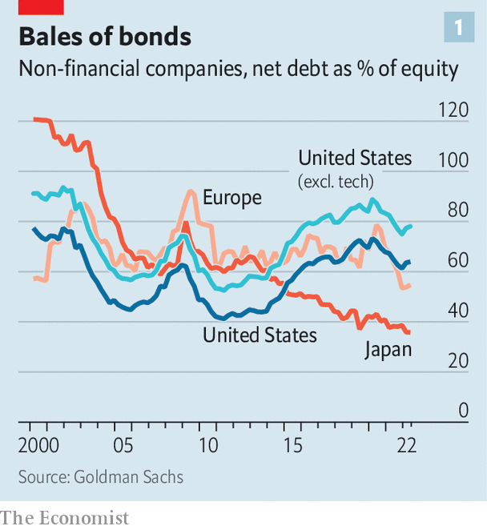
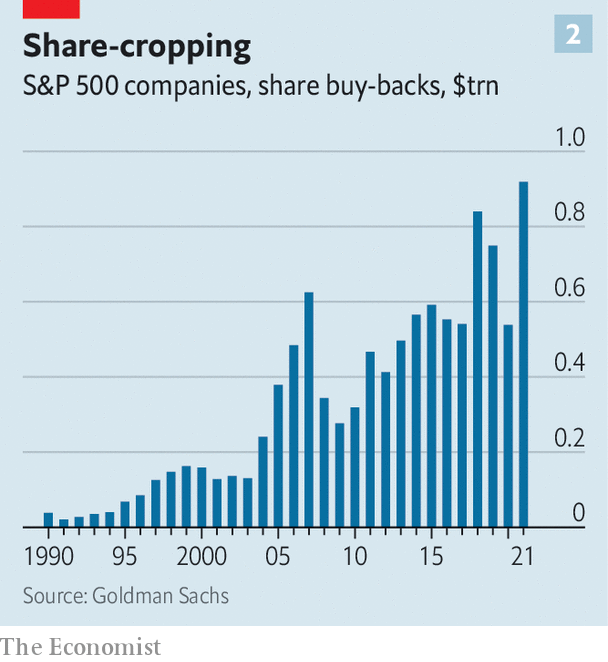

###### Companies and stagflation

# How to manage a balance-sheet in troubled times 

##### The juggling act involving capital structure, returns and investments gets trickier 

 

> Jul 19th 2022 

Few teenagers dream of becoming a chief financial officer (cfo) when they grow up. If things are going well, ceos take the credit (and a fatter slice of the spoils) instead. cfos seldom make the news and, when they do, it is usually preceded by a crisis. Corporate historians and markets alike judge finance chiefs by their ability to juggle the competing demands of capital structure, investor returns and investment. The imperfect scorecard for this game is the balance-sheet, the statement of what a firm owns and owes. Today’s topsy-turvy economic conditions, with  and , make managing it far trickier.

Since the financial crisis, historically low interest rates have allowed firms to borrow cheaply and plentifully. High profits have been returned to shareholders instead of being used to boost investment. Now the rules are changing. A new economic chapter has begun, marked by squeezed profits and . 

Less than half of big American firms in the s&amp;p 500 index that reported their latest quarterly results last week beat expectations on sales and earnings, below the average in recent quarters. On July 19th the share price of Lockheed Martin slid after the armsmaker announced an earnings miss and trimmed its guidance. The same day a similar fate befell Johnson &amp; Johnson, a drugmaker. Wall Street analysts are revising down profit forecasts. At the same time, debt issuance has slowed and yields on American corporate bonds rated bbb, the lowest and most common investment-grade rating, have risen to 5.1%, up from an average of 2.4% in 2021. All this turns the calculus for what firms should save, spend or return to shareholders on its head.

Start with capital structure. Prudent cfos have at least one eye permanently fixed on a firm’s mix of debt and equity. They must constantly weigh the benefits of debt over equity (interest payments are typically tax deductible; dividends owed to the holders of equity are not) against the risk of financial distress (angry creditors are worse than irate shareholders). 

 


A decade of cheap credit has fuelled a . The market for American investment-grade corporate bonds has tripled in size since 2009, to nearly $5trn. Average indebtedness for members of an index of investment-grade bonds (excluding those issued by financial firms) compiled by Bloomberg, a financial-data firm, has risen to three times earnings before interest, tax, depreciation and amortisation (ebitda), from 1.6 times in 2010. Corporate America is increasingly funded by debt, especially if you exclude cash-rich technology giants (see chart). 

As central banks raise interest rates, the cost of borrowing is rising for the first time in years, and sharply. Even so, big businesses’ cfos remain relaxed about debt, with good reason. Companies had a golden opportunity to fortify their balance-sheets during the covid-19 pandemic, riding a wave of huge issuance at low interest rates. Many grabbed it, locking in low rates on $1trn-plus of investment-grade bonds in 2020. Most firms are still finding it easy to pay interest on those borrowings. At the end of the first quarter of 2022, firms in the Bloomberg bond index had ebitda equal to 15.4 times their interest payments, compared with 11.5 times in 2018. 

With the maturity of corporate debt pushed into the future by all the pandemic fundraising, and with interest payments within the bounds of comfort, profits would need to take a hammering before cfos begin to lose sleep over debt. According to a survey of American cfos conducted in May and June by Duke University and the Federal Reserve Banks of Richmond and Atlanta, tighter monetary policy ranks eighth on the list of respondents’ worries, behind a litany of operational challenges, from labour shortages to cost pressures. 

 


These worries—and corporate sentiment at its glummest since the early innings of covid-19—have not stopped companies from forking money over to shareholders. s&amp;p 500 firms paid out $141bn in dividends to investors in the second quarter of 2022, compared with $119bn in the same period in pre-pandemic 2019. In the three months before, they bought back $281bn-worth of their own shares, continuing an explosive growth in such pay-outs (see chart 2). All told, big American firms may spend $1trn this year on their own stock. So long as markets stay stormy, ceos will be reluctant to rein such payments in, lest this be interpreted as signalling distress. 

For some firms, this is a no-brainer. Technology giants, which executed more than 25% of American buy-backs in the first quarter of 2022, remain flush with cash. Apple spent more than $92bn repurchasing shares in the 12 months to March. Less deep-pocketed companies have also been lavishing money on shareholders. In 2021 more than 80 members of the s&amp;p 500 spent more on dividends and buy-backs than their free cashflow (money left over after operating expenses and capital spending are accounted for). As borrowing gets pricier, growth slows and margins are crimped, their cfos may need to make their capital-returns plans stingier.

If the current run of blockbuster shareholder payouts is to end, though, the biggest culprit will almost certainly be higher investment. The share of operating cashflows reinvested by American firms in new capital expenditure and research and development has declined over the past decade to 27%, from over 40% in 2009. Companies, investors and governments are all expecting it to rise as businesses meet the demands of the post-pandemic world.

In the short term, firms are spending more today to avert supply-chain chaos tomorrow. The inventories of the largest 3,000 firms globally, excluding real-estate firms, increased from 5.2% to 6.2% of global gdp between 2019 and 2021. This creates additional cash demands as companies increase working capital (calculated by subtracting what firms owe suppliers from the value of their inventories plus what they are owed by customers). 

Businesses are also investing for the future. Capital spending for s&amp;p 500 firms rose by 20% in the first quarter of 2022, year on year. Mentions of “reshoring” and “onshoring” have spiked in earnings calls, amid a deepening rift between the West and China, on whose supply chains Western firms have come to depend. Ambitious pledges to cut greenhouse-gas emissions will require energy firms, which are among the most generous with shareholder payouts, to raise their capital spending dramatically. The total bill will be huge: Goldman Sachs, a bank, estimates that $2.8trn of additional “green capex” is needed each year over the next decade.

Finance chiefs who dust off their finance textbooks will be reminded that returning capital to shareholders and investing it are two sides of the same coin: capital which cannot be invested at a rate exceeding its cost should be handed to shareholders, who can put it to better use elsewhere. Dividends and share buy-backs are not, on this view, backward-looking celebrations of high profits. They are a forward-looking pursuit of shareholder value. Even so, shifting from capital returns to investment, while keeping a beady eye on profits and interest rates, will require cfos to show off those juggling skills. ■


