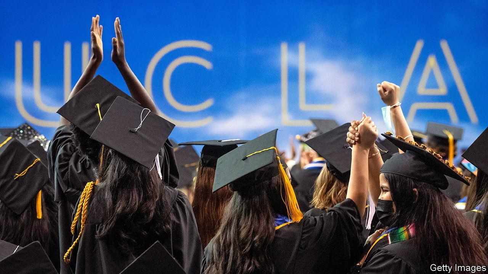
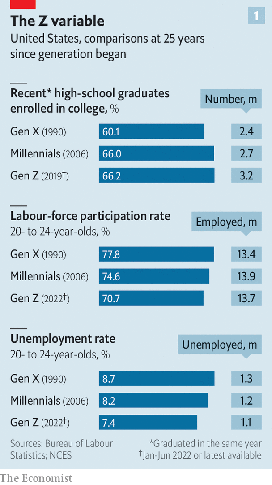
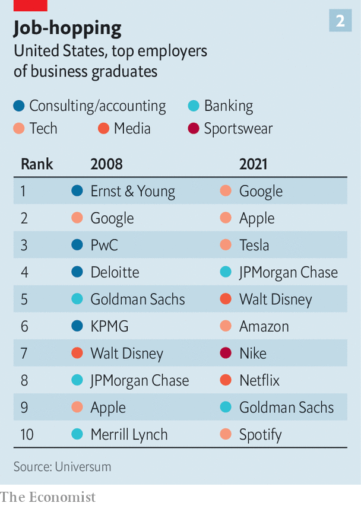

###### Class of 2022

# What Gen-Z graduates want from their employers 

##### More flexibility, more security—and more money 

 

> Jul 21st 2022 

Generation z is different. As a whole, Americans born between the late 1990s and early 2000s are less likely to have work or look for it: their labour-force-participation rate is 71%, compared with 75% for millennials (born between 1980 and the late 1990s) and 78% for Generation x (born in the decade or so to 1980) when each came of age. As a result, they make up a smaller share of the workforce. On the other hand, they are better educated: 66% of American Gen-zs have at least some college (see chart 1). The trend is similar in other rich countries. With graduation ceremonies behind them, the latest batch of diploma-holders are entering the job market. What they want from employers is also not quite the same as in generations past. And as the economy sours following a pandemic jobs boom, those wants are in flux.

 


Start with their broad preferences. Although Gen-z recruits felt more lonely and isolated than their older colleagues at the start of the pandemic, the ability to work remotely has unearthed new possibilities. The benefits go beyond working in your pyjamas. Many are taking calls from beach chairs and hammocks in  or fleeing big cities in search for cheaper or larger homes. 

In Microsoft’s latest Work Trend Index, which polled more than 30,000 workers in 31 countries in January and February, more than half of Gen-z hybrid workers said they were relocating thanks to remote work, compared with 38% of people overall. The option to work remotely is increasingly non-negotiable. Workers aged 18 to 34 are nearly 60% more willing to quit than their older peers if the choice is taken away, according to research by McKinsey, a consultancy. They are also more likely to engage with job listings that mention flexibility. 

This has big implications. Industries with jobs that cannot be done from home are falling out of favour with recent graduates. A study by ManpowerGroup, a recruitment company, suggests an inverse relationship between talent shortages and flexible working policies. The sectors which are either less able to offer remote work or have been slower to embrace it—including construction, finance, hospitality and manufacturing—have faced some of the biggest skills gaps for all types of job. The same is almost certainly true for their university-educated workers.

That in turn has accelerated a pre-existing trend of young recruits trading Wall Street for Silicon Valley. Ever since thousands of banking jobs were axed—and the industry’s reputation tarnished—in the wake of the financial crisis of 2007-09, big tech has looked more attractive to graduates than big banks have. In Britain, the number of young people studying computer science rose by almost 50% between 2011 and 2020, to over 30,000. More than 31,000 took up an engineering course in 2020, up by 21% from 2011. 

Now technology bosses are more willing than their opposite numbers in finance to let employees work from home (or anywhere else). Bank ceos such as Jamie Dimon of JPMorgan Chase or James Gorman of Morgan Stanley have urged employees back to the office. By contrast, Mark Zuckerberg has allowed workers at Meta, his social-media giant, to work from anywhere if their role allows it even after the firm reopened its American offices in March. 

 


Annual rankings of employer desirability by Universum, a graduate-staffing consultancy, bear this out. In 2008 the list of best employers as graded by American graduates was dominated by big banks and the Big Four consulting firms (Deloitte, ey, kpmg and pwc). By 2021 seven of the ten highest spots were occupied by tech and media giants (see chart 2). 

There are signs that Gen-zs’ love affair with tech may be losing some of its ardour. After a decade of frantic hiring, tech is suddenly looking like a less secure early-career bet for the ambitious graduate. Having taken a battering from nervy investors this year, companies such as Alphabet, Meta, Microsoft and Uber have slowed hiring. Twitter has revoked recently made job offers. Netflix has laid off hundreds of workers. So have newer tech darlings such as Coinbase and Robinhood. Elon Musk, Tesla’s chief executive, has announced a hiring freeze and cuts of about a tenth of the electric-car maker’s staff. More than 28,000 workers in America’s tech sector have lost their jobs so far in 2022, according to Crunchbase, a data provider. Those graduates who do choose tech are likelier to pick an established firm over a sexy startup with hazier prospects.

Experimenting with drugs

Some graduates may instead opt for other high-tech sectors that seem less vulnerable to economic swings. Drugmakers at the forefront of the covid-19-vaccine rollout are finding particular favour. AstraZeneca and Pfizer, each of which has produced an effective jab, shot up in the rankings of Britain’s most attractive employers last year. AstraZeneca doubled its intake of high-school and university graduates in 2021. The war in Ukraine, meanwhile, may boost the appeal of armsmakers—shunned by some millennials and Gen-xers as irredeemably unethical but now able to portray themselves as producers of the “arsenal of democracy”.

Graduates’ sharpening focus on job security also boosts the appeal of the public sector, notes Dan Hawes, co-founder of Graduate Recruitment Bureau, a British firm. In Britain, applications for government jobs rose by nearly a third at the start of the pandemic. In March there were an estimated 67,000 more public-sector employees in the country than a year earlier. Around 1.4m Chinese vied for just over 31,000 government positions by sitting the notoriously tough national civil-service exam in November 2021, up by more than 40% compared with the previous year.

If graduates keep gravitating towards safe government jobs, that will leave a smaller talent pool for private employers to fish in. Despite signs of a slowing economy, labour markets remain tight. Many older professionals quit their jobs during the pandemic. Others retired early. 

Britain’s labour force has lost more than 250,000 people since covid-19 first struck. America has 3.3m fewer people working. The latest official figures there show 11.3m job openings but only 6m unemployed Americans. It will take at least four years for the American labour market to return to its pre-pandemic employment rates, according to the oecd, a club of mostly rich countries. 

How far will companies go to entice younger workers—and keep them happy? For the time being the short answer seems to be: quite far. To burnish its flexible-working credentials Citigroup, a bank, has opened a new hub in the Spanish coastal city of Málaga, luring over 3,000 applicants for just 30 analyst roles. In addition to providing gourmet meals, round-the-clock massages and nap pods, Google recently hired Lizzo, a pop star, to perform for staff. 

The best thing firms can do to attract young talent is to cough up more money. According to Universum, some earlier Gen-z hobby horses such as an employer’s commitment to diversity and inclusion or corporate social responsibility have edged down the list of American graduates’ priorities. A competitive base salary and high future earnings have edged up. Banks such as JPMorgan Chase, Goldman Sachs and Citigroup, and management consultancies including McKinsey and bcg have bumped first-year analysts’ annual pay up to $100,000. Law firms have been raising their starting salaries. bp, a British energy giant, offers recent graduates sign-on bonuses of as much as £5,000 ($6,000) and discounts on cars. Money isn’t everything. But it’s something. ■


