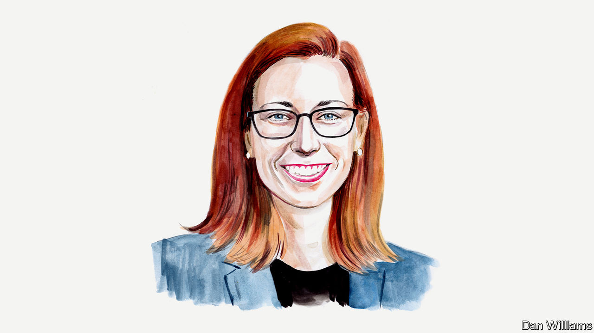

###### Labour in America

# Reform labour laws to tackle inequality in America, urges Celine McNicholas 

##### The policy expert points out that almost half of workers say they would join a union if given the opportunity 

 

> Jul 18th 2022 

Inequality has grown rapidly in America’s economy over the past five decades. Wage growth has been uneven and has failed to keep pace with productivity, even as those at the top captured a greater share of income. The result? Measured by the Gini coefficient, inequality in America reached its highest ever in 2019, according to the US Census Bureau. (On this scale 1 represents total income inequality and 0 represents total equality.) In 1967, when the bureau started studying income inequality, the Gini coefficient was 0.397 before tax. By 2019 it had climbed to 0.489. No European country had a score greater than 0.38 that year. 

During the same period, the share of private-sector workers in a union plummeted from 37.5% in 1953 to 7.0% in 2021. The rate of unionisation is now even lower than it was before workers had a federally protected right to join unions. That is no coincidence. Unions give workers and their communities the power to ensure that the American economy’s productivity gains are shared more evenly. As unions have withered, the benefits of increased economic capacity have flowed to a very small share of the population. 

Union membership has also declined across oecd countries. But it has declined most precipitously in America, where policy is perhaps the least friendly to unionisation. Globalisation and technological change cannot account for it. And strikingly, the drop has nothing to do with fewer workers wanting unions. In fact in 2017 nearly half of all non-union workers said they would vote for a union in their workplace if given the opportunity. Further, recent polling by Gallup reveals that overall approval of labour unions is at its highest since 1965. Far more workers want union representation than can win a union in their workplace. This is a failure of policy, not of union popularity—as those who oppose unions often suggest. 

The National Labour Relations Act (nlra) of 1935 gave most private-sector workers in America the right to organise and bargain collectively. In the 87 years since the law was enacted, however, those rights have become increasingly theoretical for the overwhelming majority of American workers. The nlra has not been significantly updated since anti-union amendments passed in 1947. 

Those amendments permitted employers to interfere with organising efforts by letting them compel workers to attend so-called “captive audience” meetings. These were designed to bombard workers with anti-union propaganda and complicated the process of establishing a union. Current law fails to meaningfully penalise employers who violate workers’ right to organise. At worst, employers must offer back pay for illegally firing a worker for supporting a union. But there are no civil financial penalties under the nlra, putting it among the weakest of America’s statutes for protecting workers. Our conservative judiciary has also allowed employers to interfere and defeat efforts by workers to organise. This has resulted in a system of labour law that in effect denies workers the right to join a union and to collective bargaining. 

Even so, America is seeing a resurgence of union organising. According to the most recent available data, between October and March union election petitions filed at the National Labour Relations Board, the agency that oversees the nlra, have increased by 57% relative to the same period a year earlier. Workers want unions because they know the difference a union can make in their workplace and beyond. Young workers in particular report seeing unions as the best way to combat low wages and poor working conditions.

A wealth of research points to the positive effects unions have for workers and on reducing inequality and, as a result, for strengthening the broader economy. On average a worker covered by a union contract earns 10.2% more than a peer with similar education, occupation and experience in a non-unionised workplace in the same industry, according to the Economic Policy Institute, where I work. Further, unions help to reduce gender, racial and ethnic wage-gaps.

Unions also provide workers with better benefits. For example, union workers are far more likely to be covered by employer-provided health insurance. And unionised employers contribute more to their employees’ health-care benefits. Union workers are also more likely to be able to take paid sick days: more than nine in ten workers covered by a union contract are entitled to them, compared with 77% of non-union workers, says the Bureau of Labour Statistics (bls). This difference mattered hugely during the covid-19 pandemic.

The benefits of unionisation go beyond the workplace. The higher the proportion of local workers in an economy who are unionised, the greater the benefits for non-union workers. That is because unions in effect set broader standards—including higher wages—which non-union employers must meet to attract and retain staff. High unionisation rates are consistently associated with higher state and local minimum wages, better health benefits, easier access to unemployment insurance, paid leave for medical or family reasons and unrestricted voting access. 

The failure of American policymakers to ensure workers have a meaningful right to a union and collective bargaining is just one example of many—from gun violence to reproductive freedom to preserving voting access itself—where law and practice do not reflect the popular will. American voters must demand more of their elected officials. 

The erosion of labour policy must be reversed. The Senate should swiftly pass the Protecting the Right to Organise Act, which passed the House of Representatives earlier in this congressional session in a rare bipartisan vote. This legislation makes important amendments to the nlra. Restoring workers’ right to a union is critical to a functioning economy and a thriving democracy. If policymakers do not reform our broken labour laws, American workers will continue to face a rigged system. ■

_______________


