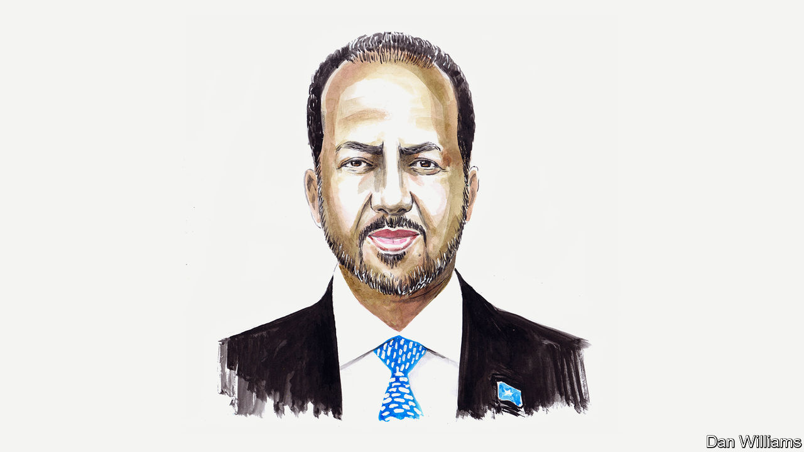

###### Terrorism

# Somalia’s president wants help to fight Africa’s terrorist groups 

##### Hassan Sheikh Mohamud says jihadism is un-Islamic and impossible to justify 

 

> Jul 19th 2022 

I feel i am uniquely qualified to speak on international terrorism because I have survived at least three attempts to assassinate me. They came during my first term as Somalia’s president from September 2012 to February 2017. The first attempt was on my very first day in office; the second while I was walking to pray at the mosque in the presidential compound; and the third while I was on my way to visit Marka, a town we had liberated from Al-Shabaab, an Al-Qaeda affiliate and jihadist group which operates in Somalia. 

Terrorism still wreaks havoc across Africa, Asia, the Middle East and East Asia, and most of the world, including Europe and America, are on high alert, according to the 2022 Global Terrorism Index (gti) compiled by the Australia-based Institute for Economics and Peace. Although the report states that deaths from global terrorism are in decline, it does highlight that Africa accounted for a staggering 48% of them in 2021. Somalia alone accounted for 8% of all deaths, on par with Mali and Niger and surpassed only by Afghanistan (where 20% of deaths occurred) and Burkina Faso (10%). 

Given that most prominent terrorist groups have expansive international objectives and networks, and are aided by sophisticated technology, nobody should take comfort from a relatively low score in the gti. It is arguable that terrorism is not on the wane, but that terrorists are reinventing themselves and adapting. We must do the same. 

In Somalia we have been at war with terrorists for almost two decades and the conflict has cost our people dearly. I have witnessed first-hand how terrorism impedes sustainable development. It precludes the creation of an economy which can provide meaningful long-term opportunities—an important way of tackling some of terrorism’s root causes. It has also harmed our neighbours. My new government is determined to bring it to a peaceful resolution through a mixture of different security strategies and tough negotiations with Al-Shabaab.

The Somali government’s gains against Al-Shabaab are clear, but the rapid early progress made in my first term as president dangerously slowed under my predecessor. Somalia’s paralysed politics allowed Al-Shabaab to experiment with a variety of tactics to frighten, extort and kill the Somali people. We will liberate all remaining territories, no matter how small or remote, so that our people can live in peace. But the group will survive if it remains able to co-ordinate and operate across borders, to recruit locally and internationally through social media, and to intimidate local populations in areas it controls. 

Can you negotiate with terrorists? It is easy to consider the question philosophically when you are not a victim or potential victim every day. But really it is a painful question. History suggests discussions can be successful when groups are on a path towards rejecting their violent ideologies. We in Somalia are on the frontline, like many other African countries, including those in the Sahel region, and we must be realistic about how we bring about lasting peace and stability. It is simply too dangerous to stick to the idea that military defeats alone will miraculously produce ready-made peace. Talks are needed, too. 

Somalia’s experience, and international research, clearly shows that terrorism is exacerbated by poverty, social exclusion, injustice and a lack of opportunity for citizens, especially the young. (Of course, there are rich and educated individuals who decide to become terrorists, too. Osama bin Laden was a notorious example.) We understand that we must move more rapidly in our state-building agenda. For a better society we need good governance, economic opportunities, stronger rule of law and more inclusive politics. Bad politics underwritten by rampant factionalism and perpetual crisis, as exemplified in the delay to the recent Somali elections, only serve to weaken fragile states like Somalia and to give respite and encouragement to terrorists. 

Ultimately it is for Somalis to secure their future against Al-Shabaab. Yet we are grateful for the support provided to Somalia by all of our valuable international partners in the fight against international terrorism. This partnership is vital because although Al-Shabaab and Islamic State cause most suffering in their localities, they do not hide their international ambitions. In the past they have shown that they are prepared to expand their brand of violent, inhumane misery to new geographical frontiers. This makes it all the more pressing to re-double international efforts in security co-operation and effective development assistance.

We can also work together to combat terrorism by exposing the lies that underlie it. Today’s so-called “global jihad” is a modern contradiction. It is impossible to justify under the peaceful teachings and principles of Islam and is espoused only by terrorists who seek to destroy humanity for their own gain, not for God or any caliphate. “Global jihadism” should be called what it really is: international terrorism. This point is fundamental because it strikes a blow at the heart of the terrorists’ flawed ideology. For too long the narrative on jihad and Islam in general has been hijacked and abused by terrorist organisations. In truth, they are nothing more than self-serving zealots. They should be reviled as such. 

Curbing international terrorism is the responsibility of all, not just of policymakers in government. Civil society, the private sector and local community leaders must be included when we discuss solutions. And solutions are desperately needed. The long-standing international policies of containing and degrading Al-Shabaab and other terrorist groups is no longer enough. For us to all be safe, these terrorists must be militarily and ideologically defeated. ■

_______________


