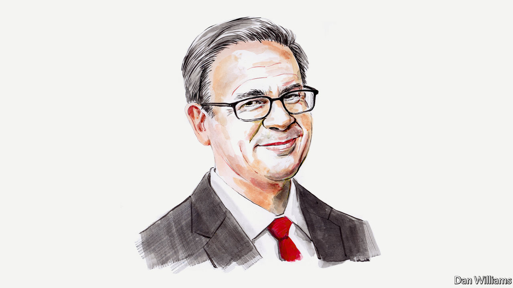

###### Labour in America

# Unions are now a lifestyle choice for some young, aspirational workers, says Walter Olson 

##### That hides a deeper malaise, reckons the think-tank analyst 

 

> Jul 18th 2022 

AMID REPORTS of successful union drives at an Amazon warehouse in New York City, an Apple Store in suburban Baltimore and scattered Starbucks outlets, there is talk of the resurgence of American unions. Supporters say labour organisations are securing wins that finally will turn around their long decline. Maybe so. Curiously they have begun to benefit from their growing popularity among young, well educated and aspirational types. But there are reasons for caution. 

Consider the numbers on unionisation first. According to the Bureau of Labour Statistics (BLS), the share of American workers belonging to unions fell last year from 10.8% to 10.3%, matching the share in 2019. That proportion is measly compared with the 20.1% of workers who belonged to unions in 1983, and indeed the all-time peak of 34.8% in 1954. 

As has been true for decades, the movement’s vitality is concentrated among government workers, almost 40% of whom are now unionised—compared with only 6.1% of private-sector workers. The two differ fundamentally. Public-employee unions, unlike the private kind, can increase their own power by engaging directly in politics. They might do so to expand their employers’ budgets and service missions, or even to install friendly managers across the negotiating table. 

Meanwhile private unions are seeing their clout diminish. Both they and their public counterparts struggle to recruit sufficient joiners to make up for the dues-paying members they lose each year. In sheer numbers, the BLS reports, overall union membership was down last year by 241,000 to 14m. 

Public opinion isn’t the problem. Pew and Gallup both report an upward trend in unions’ popularity (though with much polarisation between liberals and conservatives). But recent decades show that poll respondents may view unions favourably without showing much interest in joining one themselves.

One frequently cited statistic, on union representation petitions to the National Labour Relations Board (NLRB), the federal agency that supervises union elections and investigates what it deems to be unfair practices, is striking but misleading. During the six months from October 2021 to March 2022, such petitions increased by 57% compared with the year before. Impressive, right? Note, however, the background. The new Biden administration finally took over the NLRB in July 2021. Its new appointees appear friendly to organised labour: in November the agency ordered a do-over election after Amazon workers in Alabama voted by a wide margin not to unionise. That may have encouraged unions to move forward with otherwise doubtful petitions. 

Union progress is typically sectoral rather than across-the-board. Perhaps its most visible area of success lately has come in media, with youthful, well-educated types signing up at places like Vox, BuzzFeed,   and the . Unions have also made rapid inroads at some charities and advocacy organisations. And there have been wins among specialty workers: craft-brewery employees in San Francisco and ski patrollers at resorts in the Rocky Mountains. There have also been attempts at organisation among high-tech workers (where efforts have been mostly unsuccessful so far) and among university graduate-student teaching assistants. 

There is an obvious pattern. Many of these jobs attract a generation whose members often have strong opinions on social issues, and perhaps see the workplace as more than just the vehicle for a paycheque. Public opinion on unions shows a notable split by age, with younger Republicans, for example, more favourably disposed toward unions than their elders. Some graduates today see unions as admirable vehicles for striving toward greater equity, among other social goals. There’s a reason organisers report more success among staff at national environmental organisations than among, say, drywall installers, a sector employing 140,000. 

Last year’s BLS report is consistent with this shift. Although unions’ decline last year was fairly even across the sexes, all races and other age groups, 18-24-year-olds were the rare subgroup that showed a slight uptick in share of union representation, though not membership. (Part-timers also showed a small increase.) To the extent that these young workers do not shift employers or industries, today’s sign-ups might portend some replenishment of membership rolls over the longer term. 

This youthful enthusiasm is somewhat ironic. Historically, American unions were known for looking out for the interests of “old-timers”, a group very often consisting largely of white males approaching or past retirement age. But like some of their counterparts among employers, today’s unions have travelled a long way towards embracing aspirations of equality and diversity.

Unions have struggled with their stances on immigration. Many members sought restrictions on immigrant labour in the 19th century and through the first half of the 20th century, seeing it as a competitive threat. In the 1980s the movement pivoted to trying to organise these newcomers. A new working paper from the Cato Institute, where I work, suggests that the workers’ original fears were not without basis. It finds that nearly 30% of the decline in union density in the 40 years to 2020 can be accounted for by immigration. Even so, unions now embrace newcomers like never before.

As unions have changed, academic assessments of their effects, once mixed, have become highly positive, helping make them more attractive to the youthful graduates. An earlier generation of economists criticised unions for exploiting monopoly power, protecting deadwood workers and stymieing the spread of technical advances. By contrast, Richard Freeman and James Medoff in their book “What Do Unions Do?”, published in 1984, traced the positive functions unions could serve, such as offering a collective voice to counter bad management and negotiating for workplace conditions tailored to the wishes of a particular workforce.

Many of these positives have been diminished, however, because they are now provided through other means. Much of the work once done by safety, pension, overtime, and sick-leave committees has been handed over to outside prescription through a series of federal laws mandating employer conduct in each of these areas. Job security against firing and discipline, once a reason to be on good terms with your shop steward, might now be more effectively handled by a private lawyer. Fringe benefits once won by negotiation may now be explicitly mandated by law. An “open-door” policy, inviting workers to take problems to senior executives, can enable workers to call out an errant local manager, and so on.

Unions across the democratic world have struggled with such competition, which is one reason union membership as a share of the workforce has declined in most of those countries, not just in America. It is not clear that in the end persuasion, or even law, will make much difference. But if joining unions is viewed increasingly as altruistic by younger generations, it would at least slow their decline.■

_______________


