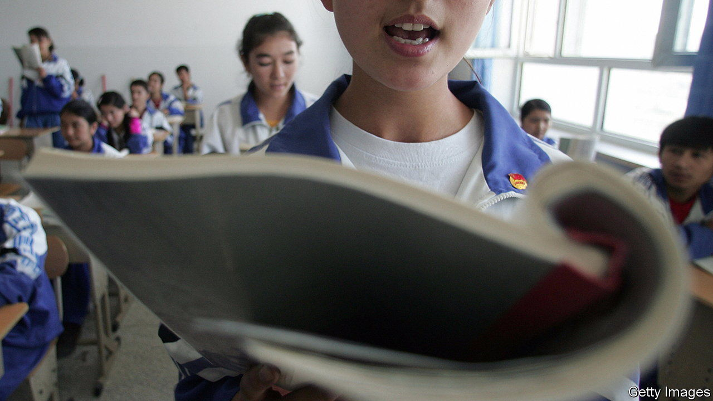

###### Lessons from Malcolm X

# How Uyghurs became so good at English 

##### They had help from famous black Americans 

 

> Jul 21st 2022 

When president xi jinping visited the region of Xinjiang this month, he painted China as a tolerant, multi-ethnic country. Never mind that after Mr Xi’s last visit, in 2014, China launched a campaign of mass detentions and unprecedented surveillance to quell resistance among local Uyghurs. More than 1m of them have been detained, often simply for being devout Muslims. 

Among the victims of those policies were English teachers, who once led a remarkable movement to learn the language. Despite representing less than 1% of China’s total population, and notwithstanding official efforts to focus on teaching Chinese, from 2004 to 2014 Uyghurs performed notably well in most of China’s big English competitions. A new paper explores how they became so good at the language.

The authors, Darren Byler of Simon Fraser University in Canada and his Uyghur collaborator at Stanford University, known by his initials, MA, note the story of Kasim Abdurehim, who saw English as a ticket to the world. Growing up in Xinjiang, he was not taught English in the state schools most Uyghurs attended, so he enrolled in night school. His English improved so dramatically that he won an award at a national English competition in 2004 and became a household name among Uyghurs. 

In 2006 Mr Abdurehim opened Atlan Education, a private school that became a favourite among Uyghurs studying English. Instead of plodding textbooks, teachers selected books and films which could speak to their students’ lives. Some favourite texts included “Animal Farm” and “1984” by George Orwell. But of particular interest were the stories of famous black Americans such as Martin Luther King and Barack Obama.

Prejudices abound among Han Chinese towards ethnic minorities. Uyghurs are often viewed as “backwards”, says Mr Byler. So they understood how Malcolm X and Muhammad Ali felt as members of racial and religious minorities in a country that viewed them with suspicion, and they devoured writings about them. When Mr Obama became the first black president of America, students memorised lines from his victory speech. 

These works taught students more than just English. They also taught them about a world outside Chinese rule: one where a member of a racial or religious minority could hold power. English felt like a passport to another life. 

But in the years following Mr Xi’s visit in 2014, the movement came to a halt. Uyghur-managed schools were closed. Teachers were detained. Uyghurs knew something was going to happen, says Mr Abdurehim, who fled to America. “We just didn’t realise it would come to this.” ■

