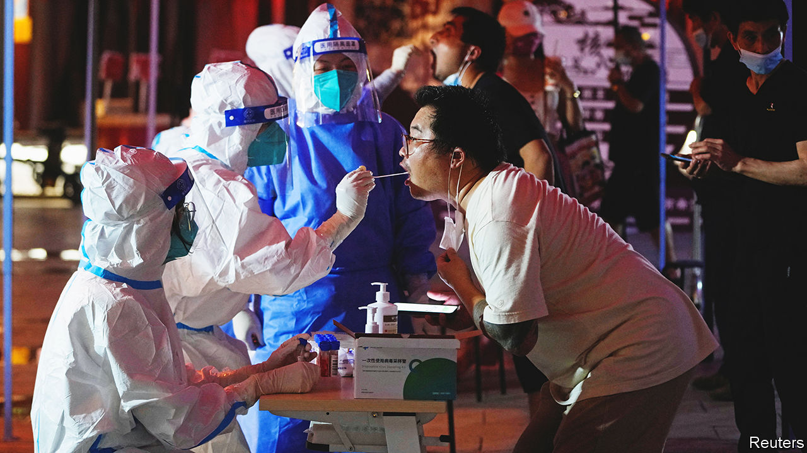

###### Test after test

# New subvariants are the latest challenge to China’s zero-covid policy 

##### Omicron BA.5 has many cities on edge 

 

> Jul 21st 2022 

In early july Steven Ho, a lawmaker in Hong Kong, tested positive for covid-19. That is hardly news in a city reporting some 3,000 new cases a day. But two days earlier Mr Ho had stood just metres away from Xi Jinping, China’s president. Mr Ho would have been tested and made to quarantine before seeing Mr Xi. Still, the virus (which is not detectable right away) probably entered the room with Mr Ho. 

Apart from a gap in his schedule, there was nothing to suggest that Mr Xi had been infected. But the incident shows how hard it is to suppress the virus. That is the goal of China’s “zero-covid” policy, which relies on mass testing and lockdowns to contain outbreaks. The highly transmissible Omicron variant has strained that strategy. Now even more infectious subvariants, , are circulating. Longer, more frequent and concurrent outbreaks are likely, say experts.

The number of daily new cases in mainland China is still in the hundreds. But it is rising, with outbreaks leading to new restrictions in many places. Four districts, with nearly 3m residents, have been locked down in the north-western city of Lanzhou. Shanghai, still in shock after a  earlier this year, required residents in nine areas to take two tests over three days from July 19th. All in all, some 260m people across 41 cities are affected by lockdowns or local controls, according to Nomura, a Japanese bank.

Yet there is no sign that the government is reconsidering its policy. Doing so would have “unimaginable consequences”, Mr Xi said last month. Policymakers fear that if the virus were allowed to spread, hospitals would be overwhelmed and the death toll would spike. Many of the most vulnerable have still not been vaccinated. “Rather than harming the lives and health of the people, it is better to temporarily affect economic development a little,” says Mr Xi. 

But the  is doing significant . gdp rose by just 0.4% in the second quarter compared with a year earlier. Not since the start of the pandemic has the economy looked so anaemic. Nearly a fifth of young people are unemployed. Dozens of private hospitals—forced to devote resources to mass testing—have declared bankruptcy in the past two years. Recently Macau, the world’s biggest gambling hub, closed its casinos because of an outbreak.

The government has made some tweaks to its rules, such as reducing the quarantine time for international travellers from 14 days to seven. But bigger changes may depend on how the virus evolves. Yanzhong Huang of the Council on Foreign Relations, a think-tank in America, believes it would take a new variant that overwhelms attempts to contain it, like a “dambuster”, to cause a change in strategy. Otherwise, he says, China will try to exit the zero-covid policy according to its own timetable.

What that timetable looks like—or whether it even exists—is anyone’s guess. To avoid mass death, any exit strategy would have to start with a campaign to vaccinate the elderly. Ideally this would require them to receive two doses of a vaccine, plus a booster shot. As of July 7th only two-thirds of those over 60 had been jabbed three times. People over 80 appear the most hesitant to get vaccinated.

Cities have tried to increase vaccination rates by, for example, offering eggs or cash to old people who get jabbed. But these sops look tiny compared with the resources thrown at testing and enforcing lockdowns. Only a few cities require proof of vaccination to enter public spaces. The municipal authorities in Beijing recently floated the idea, but backed down after opposition. In general, officials appear more worried about the potential backlash should they force shots on the elderly than about mass fatalities from the virus.

Mr Xi does not seem to be pushing them. He has not even confirmed that he has been vaccinated, let alone jabbed on television, as the leaders of some other countries have been. While most countries have accepted that the virus cannot be eradicated, Mr Xi says China will continue with the zero-covid policy until a “final victory” has been secured. Perhaps only he knows what victory looks like. ■


