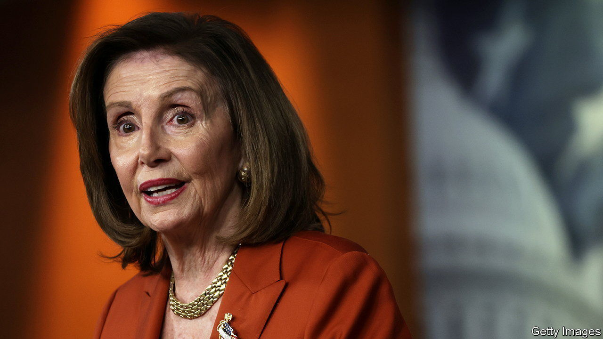

###### Travel bug

# Talk of Nancy Pelosi visiting Taiwan angers China 

##### Times have changed since a Speaker of America’s House of Representatives last went to the island 

 

> Jul 21st 2022 

The last time a Speaker of America’s House of Representatives visited Taiwan, the Chinese government could do little more than grumble. Newt Gingrich, who held the position from 1995 to 1999, stopped over in 1997 and met the island’s president at the time, Lee Teng-hui. A few days earlier Mr Gingrich had visited China and warned its leaders that America would intervene if they invaded Taiwan, which China claims. “ok, noted,” he described them as responding. “Since we don’t intend to attack, you won’t have to defend.”

There is scant hope of such a meek response if the current Speaker, Nancy Pelosi, goes ahead with a plan to visit Taiwan in August. The trip has not been confirmed, but people familiar with her planning said a stopover was possible as part of an Asia tour originally planned for April and postponed after she caught covid-19. When asked about the trip on July 20th, President Joe Biden said he did not know the status of it. American military officials, he added, thought it was “not a good idea right now”.

China has already made its feelings clear, threatening “strong and resolute measures” if the trip goes ahead. Hu Xijin, a former editor of a nationalistic Chinese tabloid, proposed that China’s armed forces impose a no-fly zone on Taiwan or at least fly aircraft over the island. He also suggested that Chinese warplanes should escort Ms Pelosi’s aircraft and that, if they came under fire, China should attack Taiwan’s military aircraft and bases. 

Until recently such threats might have been dismissed as bluster. Ms Pelosi’s visit is arguably no more provocative than Mr Gingrich’s. American congressional delegations have visited regularly, as have other countries’ legislators.

Yet there are reasons to be worried by China’s sabre-rattling. In 1997 it did not have the capabilities for an effective military response. That became clear in 1996, when America sent two carrier groups to the area after China fired missiles into waters nearby. Since then China has accumulated many of the forces needed for an assault and, in the past two years, tested Taiwan’s defences with frequent aerial drills around the island. 

Chinese officials are increasingly convinced that the White House is recalibrating America’s “one-China” policy (which acknowledges the Chinese position that Taiwan is part of China), including by sending officials to Taiwan more often. Ms Pelosi’s trip would come at a sensitive moment for China’s leader, Xi Jinping, about three months before a Communist Party congress at which he is expected to secure a third term, violating recent norms. Mr Xi is already facing unexpected challenges in sustaining his zero-covid strategy, managing an economic slowdown and finessing his support for Russia on Ukraine. Having linked Taiwan’s reunification to his “national rejuvenation” goal, he might feel a need to prove his resolve if tested. 

“The Chinese appear to perceive the need to demonstrate that the us cannot keep salami slicing its one-China policy with impunity,” says Bonnie Glaser of the German Marshall Fund of the United States, a think-tank. She added that in April a former Chinese army officer emailed her to express his “personal opinion” that China’s air force would stop Ms Pelosi’s plane from landing in Taiwan. Such aerial brinkmanship is still unlikely given the risk of escalation. But one thing is certain: there is turbulence ahead. ■

