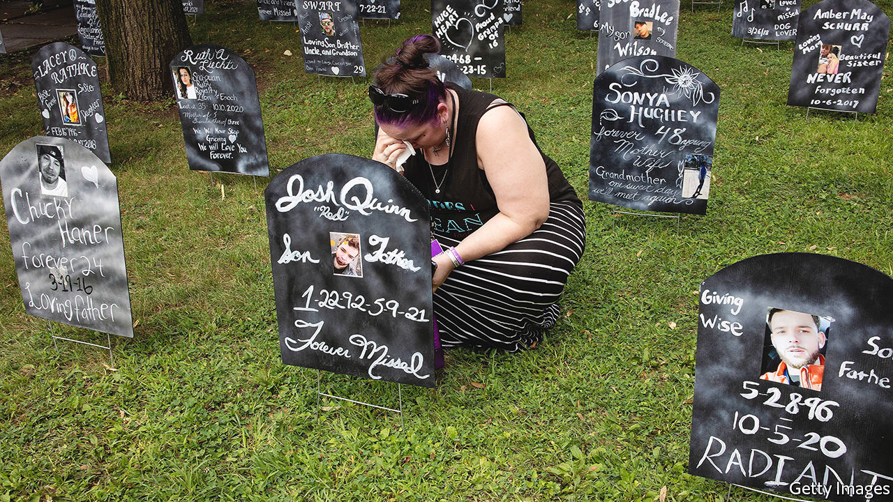

###### The guilty and the gone

# America’s opioid crisis developed in plain sight 

##### Scott Higham and Sari Horwitz chronicle the tragedy in “American Cartel” 

 

> Jul 21st 2022 

By Scott Higham and Sari Horwitz. 

No name is more synonymous with the devastation inflicted by America’s opioid epidemic than Sackler. For over two decades, Purdue Pharma, a drug firm owned by members of the Sackler family, pumped OxyContin, a highly addictive opioid painkiller, into communities across the country. In “American Cartel”, Scott Higham and Sari Horwitz shed light on the other culprits—the callous executives, elected officials and government bureaucrats who fuelled what would become the deadliest drug crisis in American history—and on the few who tried to stop them.

Between 1999 and 2020 the epidemic killed over half a million Americans. What began as a scourge of neglected places, hitting blue-collar Appalachian towns and Native American reservations particularly hard, became ingrained in the national consciousness. For all the subject’s notoriety, though, Mr Higham and Ms Horwitz offer fresh insights. In engaging short chapters they whisk readers through the legal fight against obscure drug distributors who earned billions from opioids. Investigative journalists by trade, they make esoteric legal theory and a maze of litigation both comprehensible and intriguing.

“American Cartel” opens with a “cast of characters”, which helps readers keep track of the more than 70 people and companies that crop up. But it is a small band of scrappy agents and lawyers at the Drug Enforcement Administration (dea) who are the backbone of the narrative. Eventually, they lend their testimony to a sprawling legal team that builds what Mr Higham and Ms Horwitz call “the most complex civil action in the history of American jurisprudence”.

Certain facts and anecdotes are difficult to forget. In West Virginia the bodies of overdose victims piled up so fast that “the state’s burial-benefits department had run out of money”, meaning the only option available to “the grieving and impoverished” was cremation without ceremony. In Cabell County, West Virginia, which has just under 100,000 residents, around 1% of them died of opioid overdoses in the 2010s.

Also striking is the tardiness of the general government response. Alarm bells were sounding as far back as 2002. A doctor noticed a jump in addiction stemming from OxyContin; two lawyers who subsequently looked into it agreed there was a case to be made against Purdue Pharma. Yet Eric Holder, who became attorney-general in 2009, seemed unaware of the extent and nature of the crisis until 2014. The book recounts an exchange between Mr Holder, his aides and a dea official. “You’re telling me that more people are dying from pharmaceuticals [than heroin]?” Mr Holder asked. He turned to his aides: “Were we aware of this?”

Washington’s revolving door, whereby bureaucrats responsible for regulating industries move to cushy corporate jobs in the same sectors, slowed efforts further. Politicians in Congress, even some from the worst-afflicted states, accepted thousands of dollars in campaign contributions from lobbyists for pharmaceutical firms. Some sponsored legislation devised by a former dea agent-turned-lobbyist, who knew how to stymie his former employer’s efforts. The bill, which passed without objection, crippled the dea’s ability to police the abuse of prescription opioids.

“American Cartel” delves only fleetingly into the personal stories of opioid victims and their families. But the few it recounts linger. One involves a town-hall meeting in a high-school gymnasium in Portsmouth, Ohio, in 2011. A slideshow flashed up photos of the lost. “Sons and daughters and grandsons and grand-daughters in graduation pictures. They were dead before they had a chance to live.” ■

