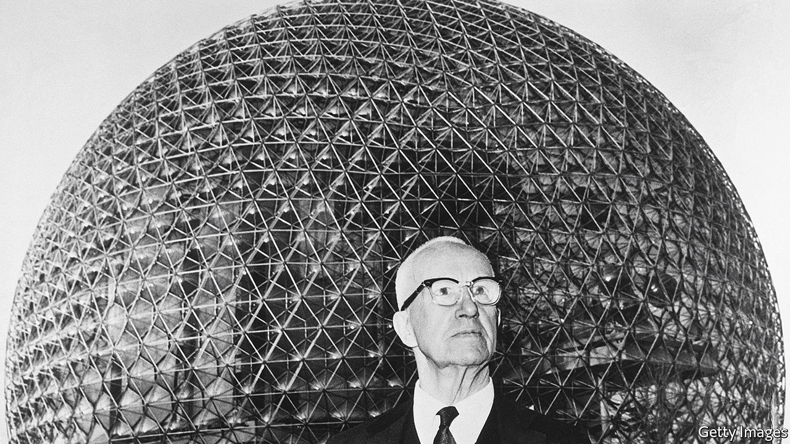

###### Designs for living

# Buckminster Fuller was a prophet of technology 

##### Alec Nevala-Lee gives him his due in “Inventor of the Future” 

 

> Jul 20th 2022 

By Alec Nevala-Lee. 

A man brimming with big ideas, Buckminster Fuller saw the grand flow of history and sought to direct it into more constructive channels. Among the crises he identified before they entered the popular consciousness were climate change, unaffordable housing and technology-driven unemployment—to which he offered such tentative solutions as a fuel-efficient car, mass-produced homes and a universal basic income.

“My objective”, Fuller wrote with typical immodesty, “has been humanity’s comprehensive welfare in the universe.” In pursuit of that goal he crafted not only innovative technologies but new perspectives, coining terms such as “Spaceship Earth”, which encouraged his fellow voyagers to view the planet as a fragile vessel. But it was a ship ultimately capable of being steered by a skilled and benevolent captain.

The scope of Fuller’s ambition was his greatest asset and his greatest weakness. He could be prescient, as when, prefiguring today’s anxiety over a workless future, he claimed that “industrialisation is inevitably headed towards automation, that is towards disenfranchisement of man as a physical machine.” But his tendency to make great leaps from slight data meant his ideas often lacked solid foundations—much like his geodesic domes, novel structures that soared skywards without apparent support and occasionally came crashing down. One of his less insightful pronouncements was made in April 1940, when he said that, in war, dictatorships necessarily outdo democracies.

Fuller’s path to recognition as a messiah of salvation-through-technology is an improbable tale of redemption. He was born in 1895 into a distinguished family in Massachusetts (his great-aunt was Margaret Fuller, a Transcendentalist writer); but his father’s early death left him financially and socially insecure. At the age of 32, with a string of disasters behind him—including two expulsions from Harvard, a chequered employment history and, most tragically, the death of a young daughter—he stood on the shore of Lake Michigan contemplating suicide. Before he could take the plunge, however, he had a sudden epiphany: “You do not belong to you. You belong to the universe…” 

Possessing few skills besides a native gift for geometry and little practical experience beyond collaboration with his father-in-law in a failed building company, Fuller decided to devote himself to bettering the human condition, embarking on a journey that led to a series of breakthroughs. These included his aerodynamic Dymaxion car, his prefabricated Wichita House and a new kind of self-supporting architecture based on what he called the “vector equilibrium”. It employed a geometric lattice that allowed for the efficient distribution of weight and stress.

More important than these innovations—which never quite lived up to their transformational promise—were less tangible but mind-expanding ideas, which he tossed off with abandon. Among the most fruitful were “ephemeralisation”, the aspiration to do “with ”, which anticipated the information age; and the World Game workshops, which involved scores of young disciples dedicated to a more equitable and sustainable distribution of global resources. Fuller’s tireless efforts to improve society through technology let him appeal to both rebellious youth and the establishment. Although he was lionised by the counterculture of the 1960s, its staunchest critic, Ronald Reagan, awarded Fuller the Presidential Medal of Freedom before his death in 1983.

Alec Nevala-Lee is a sure-footed guide to a dizzying life. He eschews mythmaking, laying out the way Fuller burnished his own legend by rewriting history and slighting the contributions of his collaborators. Clear-eyed about his subject’s faults, Mr Nevala-Lee nevertheless gives him his due as a dazzlingly original thinker. The book’s approach to this protean career is relentlessly chronological; incident follows incident at breakneck speed, a structure that captures Fuller’s irrepressible energy but sometimes leaves the reader exhausted. An occasional pause to stand back and view the wider panorama would have helped. 

Still, the portrait the author paints is compelling. Fuller’s life did not quite justify Arthur C. Clarke’s branding of him as “the world’s first engineer-saint”: his ego was too big for canonisation. But he comes alive in these pages as a visionary who rose above his imperfections to labour for the benefit of humankind. ■

