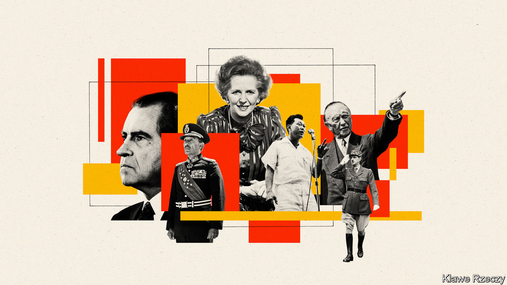

###### The vision thing

# Henry Kissinger explains what he thinks makes great leadership 

##### His study of six leaders from the 20th century is partial but enlightening 

 

> Jul 21st 2022 

 By Henry Kissinger.

Whatever you think of Henry Kissinger, the 99-year-old former national security adviser and secretary of state in the Nixon and Ford administrations has an elephantine memory and experience that makes it an important historical resource. In his latest book, Mr Kissinger, an unofficial adviser and friend to many presidents and prime ministers, considers how six leaders from the second half of the 20th century reoriented their countries and made a lasting impact on the world. 

Mr Kissinger’s six are an eclectic bunch. Konrad Adenauer was the first post-war chancellor of West Germany. Charles de Gaulle saved France twice, first during the second world war, then at the time of the Algerian crisis. The author’s old boss, Richard Nixon, shook geopolitics with his opening to China before scandal brought him down. Anwar Sadat paid with his life for forging a lasting peace with Israel as Egypt’s president. Lee Kuan Yew made tiny Singapore one of the most prosperous places on Earth. And Margaret Thatcher reversed decades of British decline—while widening social and economic divisions—before being defenestrated by her party. 

A project of this kind might have amounted to a series of brief eulogistic biographies of famous people. Much of the book will indeed be familiar to many readers—and at times the author’s willingness to glide over inconvenient truths is distasteful. He justifies Nixon’s covert bombing of Cambodia by the need to force the Vietnamese to negotiate. One of its consequences, the rise of the Khmers Rouges, merits a single sentence, which blames Congress for cutting off military aid to the Cambodian government. (Watergate, too, is downplayed.) De Gaulle’s extraordinary refusal to give credit to allies fighting and dying to liberate France nearly earns admiration. The controversy in which Thatcher almost revelled escapes all criticism. 

The book is redeemed, and more, by the analytical framework in which each leader is examined, and by the author’s personal knowledge of his subjects. Moreover, the writing is always crisp and lucid, even when conveying arcane theories of international relations, such as the notion of “equilibrium” that defined Nixon’s foreign policy (and, by extension, Mr Kissinger’s). 

Having seen so many leaders at close hand, Mr Kissinger understands the constraints they must acknowledge and bypass. Among these are “scarcity”, or the limits of their societies in terms of demography and economic heft; “temporality”, or the prevailing values, habits and attitudes of their times; “competition” from other states that have their own goals; and the “fluidity” of events, the pace of which can force decisions to be made on the basis of intuition and hypothesis. Leaders must traverse a tightrope from which they fall if they are either too timid or too bold. 

In Mr Kissinger’s view, there are essentially two types of leader, the statesman and the prophet. Statesmen manipulate circumstances to their advantage, temper vision with wariness and work with the grain of societies until existing institutions need to be changed or confronted. Prophets are prepared, if not eager, to break with the past no matter the risk. 

Five of his six leaders clearly belong more to one category or the other. Adenauer, Nixon and Thatcher had most of the characteristics of the author’s complete statesman, although all three had a motivating vision. Adenauer envisaged a humble Germany able to take its place among other liberal democracies. Nixon was committed to using America’s economic and military might to bring the international system into a long-term equilibrium that would render war between great powers much less likely. Thatcher believed passionately in individual autonomy and the capacity for national renewal—if the energies of ordinary people could be freed by the magic of market economics.

By contrast, de Gaulle and Sadat were both driven by a prophetic ideal of what their countries could and should become. De Gaulle’s feat of keeping the idea of the Free French alive when stranded in London in 1940 was an almost mystical triumph of will over reality. Sadat’s belief that Egypt could never be independent and free without setting the terms of peaceful coexistence with Israel was rooted in a profound sense of his country’s long history. Both could be pragmatic, but that was not their main . 

The perfect leader, thinks Mr Kissinger, combines elements of both archetypes. Of his six subjects, Lee may come closest, with his unflinching realism, ruthlessness (especially in tackling corruption) and unwavering vision of what a multi-ethnic community of Chinese, Indians and Malays, with few geographical advantages, could achieve. Singapore is far from being a liberal democracy—either Lee or his son have been prime minister for most of the city-state’s existence. Mr Kissinger is not too fussed by that, but concedes that Singapore’s ability to evolve from its founder’s model will become essential to its continued success. The ultimate challenge will be to devise a better balance “between popular democracy and modified elitism”.

At the close, the author asks whether leaders are now emerging with “the character, intellect and hardiness required to meet the challenges facing world order”. He is not optimistic. The decline in erudition and the socially atomising effects of technology are unhelpful. So is the erosion of moral purpose and the religious belief that often underpinned it, and which animated five of these six leaders (even Nixon was influenced by his Quaker upbringing). 

Above all, Mr Kissinger writes, faith in the future is the indispensable quality for successful leaders and the “elevated purposes” they aim to inculcate. He ends with a warning: “No society can remain great if it loses faith in itself or if it systematically impugns its self-perception.” ■

