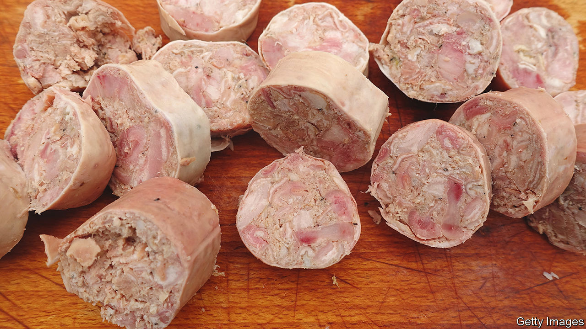

###### World in a dish

# In praise of subterfuge, an underappreciated culinary skill 

##### To see why it matters, try eating an andouillette 

 

> Jul 21st 2022 

A francophile who hasn’t been to Paris in years may find himself so excited at breakfast that he orders andouillettes, the single most French thing on the menu. These subvert the old adage that warns against watching sausage being made: there is no mystery to them. They are simply pigs’ intestines stuffed into a casing, then boiled or grilled. They have a slithery, entropic texture—slice into them and little grey curlicues slide out—and smell like a urine-soaked barnyard.

Brought up on cornflakes and toast, the Francophile’s children are unconvinced, and stick with . In their scepticism, they have plenty of company. Barbecuers in Texas nickname their spicy sausage “hot guts”, but at least it looks like a sausage, and tastes good. Andouillettes look like actual guts, and the best that can be said of their flavour is that it is better than their stench. Their declining popularity—not just at your correspondent’s table but among French diners as a whole—testifies to the importance of an often overlooked culinary skill: subterfuge.

Parents know this trick well. Grating courgette into pasta sauce is a good way to add vegetables to the diets of picky youngsters. Donald Trump’s doctor in the White House also used this ruse, getting cauliflower mixed into his patient’s mashed potatoes. But for most grown-ups, the ingredient that requires disguise is meat. 

Devotees of andouillettes—such as the Association Amicale des Amateurs d’Andouillettes Authentiques (Friendly Association of Lovers of Authentic Andouillettes), which certifies the best in France—may scorn those who blanch at them. Even they might concede, however, that a wide gulf separates good from mediocre andouillettes, as is also true of, say, hot dogs. But a mediocre hot dog is still a hot dog. A mediocre andouillette is botched abdominal surgery on a plate.

And though some gourmets may revile hot dogs, they are a triumph of culinary subterfuge, as are many other sausages. Butchers developed this skill of necessity. The first, say, three-quarters of cutting up an animal for consumption—hams, ribs, loin, belly—is relatively straightforward. But what to do with the organs and other unappetising scraps? 

German immigrants taught Americans to boil and mix them with oats and cornmeal to make goetta and scrapple, which are shaped into loaves, then sliced and fried crisp; served on toast, there is no better winter breakfast. A more widespread answer is to chop the bits up, season and pack them into casings—made from the animal’s intestines, another leftover—and turn them into sausage. For a hot dog, the meat is pounded into a paste (though most today contain no offal).

Nowadays most sausages are industrially made, and andouillettes are artisanal. To some that makes them worth defending as a holdout against processed uniformity, a stance that in theory has a virtuous appeal. In practice, there are as many ways to disguise scraps and offal as sausage as there are sausage-makers. Almost all of them taste better than andouillettes. ■

