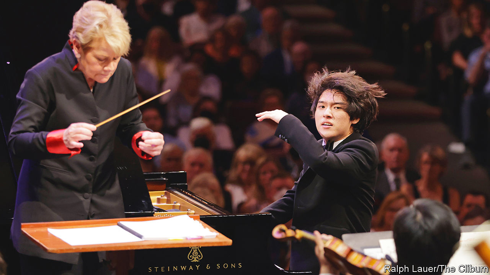

###### Classical music

# The wonder of Lim Yun-chan’s performance of “Rach 3” 

##### The 18-year-old pianist’s version of a famously difficult piece has wowed music fans 

 

> Jul 21st 2022 

Still standing at her podium, the distinguished conductor Marin Alsop wiped away a tear. She says she cannot remember the last time she cried onstage, but she was far from alone in feeling moved by the artistry of Lim Yun-chan. Ms Alsop had just conducted the 18-year-old South Korean pianist in Rachmaninoff’s “Piano Concerto No. 3” in Fort Worth, Texas—a performance that last month helped make him the youngest-ever winner of the prestigious Van Cliburn International Piano Competition. A video of his mesmerising interpretation of “Rach 3”, as the piece is known by pianophiles, has been viewed more than 5m times on YouTube.

Some classical musicians and aficionados think artists ought to have more experience of life before tackling works that demand emotional maturity, whether late Beethoven piano sonatas or Rach 3. Daniil Trifonov, a superb Russian pianist, decided not to perform the concerto early in his career because he didn’t feel ready to convey its intensely passionate arc. But despite his youth Mr Lim “is an old soul”, reckons Ms Alsop, as well as a “phenomenal talent” with “jaw-dropping technique”, which complements “an innate musicality that is hard to fathom”. He also has a fearsome work ethic: Mr Lim explains that his usual practice routine stretches from around 1pm until the following dawn. 

A pianist and conductor as well as a composer, Rachmaninoff wrote the 40-minute concerto in 1909 and gave its premiere during a successful American concert tour in the same year. He practised on a cardboard keyboard during the long voyage from Russia. Other pianists of his generation were intimidated by Rach 3, which was mostly ignored until it was championed in the 1930s by the Kyiv-born pianist Vladimir Horowitz (whose recordings of it Mr Lim cites as an inspiration). Gary Graffman, an American pianist who is now 93, has said he regretted not learning the concerto when he was “still too young to know fear”. 

Rach 3’s formidable reputation was reinforced by “Shine”, a film of 1996 about David Helfgott, a troubled Australian pianist played by Geoffrey Rush (who won an Oscar); in the movie, Helfgott collapses from nervous exhaustion at the end of the concerto. It is a wildly emotional, lyrical piece that reflects the Russian romantic tradition, which Rachmaninoff continued as his peers experimented with avant-garde sounds. (Stravinsky began the groundbreakingly dissonant “The Rite of Spring” in 1911.) Some scholars have noted echoes of folk and liturgical music in the melancholic d-minor melody that opens Rach 3 and resurfaces throughout, though the composer denied any such influences, claiming the tune wrote itself. 

Mr Lim plays this melody with a mournful dignity. At the beginning of the video he sits almost completely still, his hands barely moving over the keys. This initial restraint allows him to slowly build tension as the music ebbs and flows, until he renders the fiery climax of the third movement with exhilarating speed and force. Played by inferior musicians, Rachmaninoff’s cascading notes often become a blur, but Mr Lim makes each crystalline, purposeful and often startlingly beautiful. After only two rehearsals, he and the accompanying Fort Worth Symphony Orchestra evince the chemistry of longtime collaborators. Their seemingly intuitive give-and-take imbues the complex score with an increasingly urgent pulse.

He was one of three pianists to take on the piece in the finals of the Cliburn, which bucked current trends and invited young pianists from Belarus and Russia to compete. Anna Geniushene, a Russian who has expressed solidarity with embattled Ukraine, won silver; Dmytro Choni, a Ukrainian, claimed bronze. (The contest is named after an American pianist who won the International Tchaikovsky Competition in Moscow at the height of the cold war.) But the headline news was the music itself. Anyone needing a break from doomscrolling is advised to join the millions of listeners enthralled by Mr Lim’s Rach 3. ■

