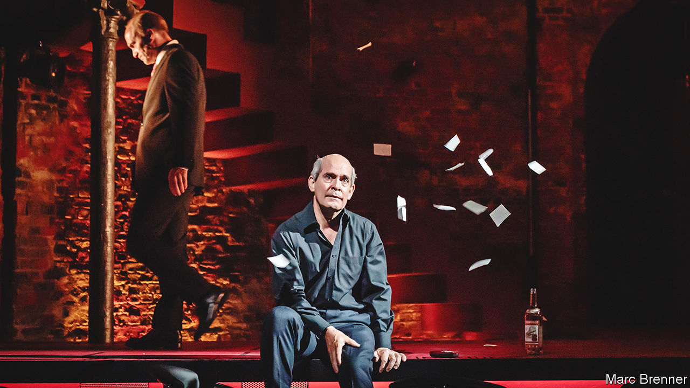

###### Back Story

# The writer of “The Crown” takes on Putin and the oligarchs 

##### In “Patriots”, Peter Morgan brings the drama of Boris Berezovsky’s fall to the stage 

 

> Jul 19th 2022 

In retrospect, would Boris Berezovsky agree that the Russian privatisation scheme of the mid-1990s was unfair? The questioner had in mind the way a few insiders took over vast industrial assets for a song, a giant scam that helped discredit markets and democracy among their struggling compatriots. Absolutely it was unfair, replied Berezovsky, who in 2000 had sought refuge in Britain, where the exchange took place: Mikhail Khodorkovsky got more than he did.

Mr Khodorkovsky, once Russia’s richest man, spent a decade in prison before his release into exile in 2013; Berezovsky died in contested circumstances in the same year. Both numbered among the original Russian oligarchs: a small cadre of men who grew up in the Soviet era and in the bare-knuckle 1990s became more rich, more quickly than almost anyone ever had. They brought their feuds to London, along with their wealth, in some cases eventually losing much of it. They lived many lives in one, all of them dramatic. Now Peter Morgan has written a version of that drama. 

“Patriots” opened this month at the Almeida Theatre in London. In it, Mr Morgan, writer of the tv megahit “The Crown”, brings Berezovsky back to life—the epic chutzpah, manic energy, restless intelligence, appetites and ruthlessness. Amid a high-speed, simplified tour of post-Soviet Russian politics, the play’s focus is on how Berezovsky helped lever Vladimir Putin into the presidency, and how, in return, his protégé drove him out of Russia and destroyed him.

 “In the West you have no idea,” the Berezovsky character rightly says of foreigners looking in on Russia. Among the common Western naiveties is a presumption that the persecuted must be virtuous. This play knows that bad things can happen to flawed people. Berezovsky (played by Tom Hollander) is forever bribing others or shaking them down, all the while insisting that his goal is to save his country. His targets include Alexander Litvinenko (Jamael Westman), who would be poisoned in London in 2006, and a coyly scheming Roman Abramovich (Luke Thallon), who, according to a court ruling of 2012, had owned much of what Berezovsky claimed was his.

The star turn, though, is Will Keen as Putin. The stage is shaped like a nightclub bar, and for a while Putin sits on a low stool, unnoticed, before—literally and symbolically—Berezovsky yanks him up and into the action. Mr Keen mimics the snarl and seething menace of a hangdog who wants to be top dog. During his traceless rise from deputy mayor of St Petersburg to fsb boss, prime minister and then the presidency, Putin’s nervy strut becomes a swagger, the posture hardens inside his better-cut suits. The heart dies.

It didn’t have to be this way. That is one message of “Patriots” (in which, for almost everyone, patriotism and self-interest are fused). Cornered on press night, Mr Morgan said the tragedy of his play lies not in Berezovsky’s fate but in the miscalculation he makes in elevating Putin, a mistake with still-spiralling consequences. Live and organic, theatre is the perfect art form to capture this feeling of contingency, the vertiginous sense that history turns on moments and decisions that might have gone differently.

The trouble with dramatising recent history, though, is that it can catch and overtake you. “Patriots” mixes current affairs with zany comedy, spicing the power struggles with cynical wisecracks and ironies of hindsight. “You, Volodya, are clearly a decent man,” Berezovsky tells Putin. “We must become close to the West,” Putin avers. There is a winking line about the size of his desk. Given the carnage in Ukraine, some viewers may feel it is either too late, or too soon, for jokes about the warmonger.

As for Berezovsky and his peers: the lesson the real Putin taught them—that, under him, the Russian state would flout all laws and scruples and observe no restraints—is now on display to the world. Amid a horrific show of state force, the oligarchs seem more like bit parts in history than headliners. Those still standing are immured by their money, trapped between Western sanctions and the worse punishment that breaking with the Kremlin might entail.

Another moral of Berezovsky’s fall—about the perils of proximity to brute power, and the sympathy due to those who court it anyway—is more concisely expressed in a parable that a different businessman shared with Back Story. A man finds a lion cub and takes it home. His friends warn him that lions are dangerous, but the man insists his pet is tame. The cub grows up, and eats him. ■


