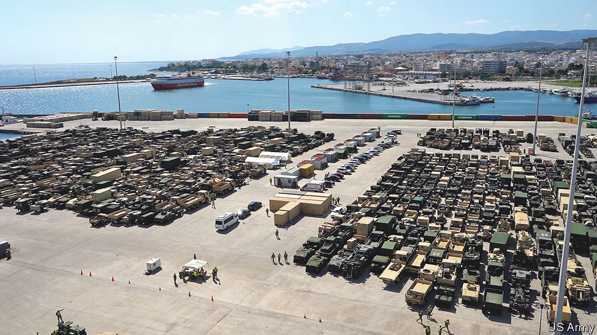
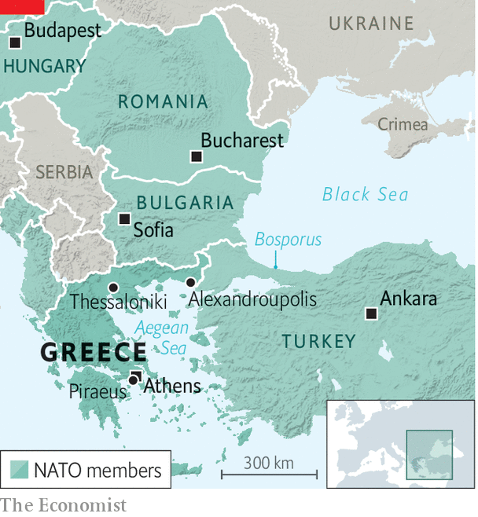

###### Red-hot in Alex

# A sleepy Greek port has become vital to the war in Ukraine 

##### American ships dock there. A firm with Russian ties wants to buy it 

 

> Jul 21st 2022 

The small Greek city of Alexandroupolis, 15km from the border with Turkey, briefly ran short of eggs and chicken this summer. The reason was a three-day influx of hungry American marines who had arrived on the . Alexandroupolis has turned into something of a boom town of late, no longer reliant on selling coffee, cake and souvenirs to tourists from Turkey and the Balkans. For that it can thank Vladimir Putin’s invasion of Ukraine, which has caused activity at the city’s port to explode. 

The port’s geography makes it attractive to nato’s logistics planners. It is on the Aegean Sea, with good road and rail links north through the alliance’s eastern flank. In particular, it provides access to Ukraine via Bulgaria and Romania. Using it as a way-station skirts the Black Sea, which Russia patrols, and the Bosporus, a choke-point controlled by Turkey, a member of nato but a capricious one. Better still, the port has plenty of spare capacity, unlike the two larger Greek ports of Thessaloniki and Piraeus (which also happen to be run by firms with links to, respectively, the Russian and Chinese governments).

Since Russia’s invasion of Ukraine, America’s armed forces have stepped up their use of Alexandroupolis to deliver weapons, including tanks, armoured personnel carriers and helicopters. At one recent point, more than 2,400 pieces of military equipment sat on the dock. When your correspondent visited on July 12th, they had just been shipped out to seven other nato countries, according to Andre Cameron, the head of the American armed forces’ local logistics team. Some 630 truck- and train-loads of equipment have left the port so far, he says, though he declines to say how much was Ukraine-bound. The next batch of hardware is due within a fortnight. Britain and Italy, among others, are also planning to use the port for military shipments, says Mr Cameron. 

 


The port’s chairman, Konstantinos Chatzimichail, believes it could also become a big trans-shipment point for exports of Ukrainian grain and other commodities—though it is not currently deep enough to host the largest bulk-carriers. The port may soon be an energy hub, too, with plans for two floating liquefied natural gas (lng) terminals a few miles offshore. These will bring mostly American lng to Greece, Bulgaria and other parts of south-eastern Europe, helping them to reduce reliance on Russian gas.

With support from the Greek government, the port authority (currently housed in a modest dockside building with a corrugated-iron roof) has drawn up an ambitious expansion plan. This would add a lot more dock space, a new cargo terminal, an extra 500-metre pier and a bypass to the local motorway. A €1.1bn ($1.1bn) upgrade will add an extra track and electrify the railway that links the port to the eu’s Trans-European Transport Network. Thanks to Ukraine, says Mr Chatzimichail, “We are preparing for a world with different corridors. It will last long after the war ends.”

Greece’s foreign minister has described Alexandroupolis as “one of the most important elements” of the country’s mutual-defence pact with America. James Stavridis, a former nato supreme allied commander for Europe, says the port is “located at a strategic crossroads between the Aegean and Black seas, and will be of increasing potential value as events unfold in Ukraine.” He says nato could also “forward-base warships there temporarily and have them positioned to move rapidly into the Black Sea in a crisis, with the permission of Turkey.” This riles Russia: the Kremlin’s spokesman, Dmitry Peskov, has described nato’s increased use of the port as a “sticky” issue that “makes us nervous”.

All of which makes it a sensitive time to privatise the port. The Greek government, perennially impecunious, is pushing ahead with plans to sell a 67% stake in Alexandroupolis via a 40-year concession. Offers are due on July 29th. Two of the four consortia that have pre-qualified to bid are backed by American investors and are therefore seen as friendly to nato. The allegiances of the other two are less clear.

One of those consortia is led by Ivan Savvidis, a Greek-Russian tycoon who is based in Russia and is reported to be on good terms with the Kremlin: he used to be an mp with United Russia, the party unofficially led by Mr Putin. Mr Savvidis’s chances of winning seem remote. Were he to offer the most, the bid could be blocked on competition grounds: he already holds the concession at Thessaloniki.

The final consortium bidding is widely seen as the front-runner. It is led by an entity controlled by the family of Dimitris Coupelouzos. He is one of Greece’s best-known billionaires, with interests spanning energy, construction, property and media. A former Greek mp, and reportedly a donor to multiple political parties, he is also one of its best-connected.

The Copelouzos empire has long-standing business links to Russia. For over 30 years it has been a 50/50 partner in Prometheus, a joint venture with Gazprom, Russia’s state-controlled gas giant, which currently provides Greece with around a third of its natural gas. Mr Copelouzos is “one of the few Greek entrepreneurs who have developed business activities in Russia, especially in the field of infrastructure,” according to a report in 2020 by the Centre for the Study of Democracy (csd), an independent think-tank. He was part of the consortium that revamped the airport in St Petersburg. 

Mr Copelouzos was one of two Greek business bigwigs whom Mr Putin met when visiting Greece in 2001. He has hosted dinners at his home in Athens for Gazprom’s top brass and Russian officials. The csd report calls him “the most influential businessman who has been closely linked with Russia’s interests in Greece for at least four decades”, and his holding company, Copelouzos Group, “an intermediary for Russian interests in Greece”. The company was closely involved in developing two Russian-led pipelines (one of which was shelved) to bring Russian gas and oil into Greece and neighbouring countries, notes the think-tank. A leaked American diplomatic cable about Copelouzos Group, from 2007, was titled “Gazprom by any other name?” and said that Prometheus “operates as an extension of Gazprom’s network”. Copelouzos Group did not respond to three requests for comment.

Supporters of the Copelouzos bid say he is no Russian stooge. “He’s not inherently pro-Russian or pro-Western. He’ll work with anyone. He just wants to make money,” says one. In recent years he has stepped up his business dealings with America. A firm he owns is one of the main contractors renovating the American embassy in Athens. His group is also the lead investor in the floating lng terminals that will receive American gas. 

These recent deals have helped to convince some in Washington that a Copelouzos-owned Alexandroupolis would not be a strategic disaster. Nevertheless, America has made it clear to the Greek government that it would greatly prefer to see an American-backed consortium win. Some Western officials are said to be worried that, were the Copelouzos-led bunch to win, it might give Russia a better view of the goings-on at the port or, even worse, slow down its development. The terms of the tender do not stipulate a minimum level of investment.

For its part, the government in Athens led by Kyriakos Mitsotakis—loyal to nato and very friendly with America—will not want to irk its allies by handing the port to anyone seen as close to their geopolitical rivals. A spokesman for the state fund selling the port plays down the risks, saying that, while the aim of the sale is to “maximise the economic return”, it will be subject to “screening…as regards safeguarding national security and defence”.

Mr Cameron, the Americans’ logistics director at the port, is not distracted by the question of ownership. He says his team is already getting ready for the next shipment of military equipment, which could be in place to defend nato’s eastern border and Ukraine by mid-August. “And there will be plenty more after that.” ■


