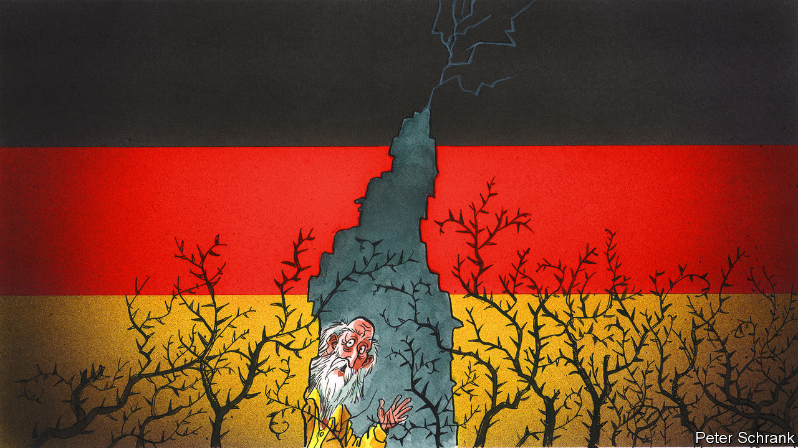

###### Charlemagne

# Germans have been living in a dream 

##### Their energy policy has been a fantasy 

 

> Jul 21st 2022 

The story is old and takes many forms. A fairy-tale version, recorded two centuries ago by the Brothers Grimm, tells of a certain Karl Katz, a goatherd in the Harz Mountains of central Germany. One night a straying goat leads Katz deep into a cave. Tempted by strange men, he drinks a potion and falls asleep. On waking he finds that not hours, but years have passed. The world around him has changed. 

The bewilderment felt by Katz is now shared by many Germans. Some years ago Europe’s richest country slipped into a state not quite of slumber, but of sleep-walking. Newly reunited and lulled by their own economic and diplomatic success, Germans settled into a comfortable belief that their system was working near-perfectly. Governmental policies came to be guided less by pragmatism than by self-deception, as leaders plied voters with intoxicating talk of perpetual prosperity with minimal friction and, of course, zero emissions.

The awakening, to the sound of Russian tanks grinding into nearby Ukraine, has been rude. In some ways Germany finds itself not, like Katz, years in the future, but decades in the past. Instead of cruising on an Autobahn towards liberal democracy, much of the wider world has skidded into ugly kinds of populism that Germans recall all too well. Rather than enjoying an era of peaceful co-operation, Germany is finding that guns and soldiers—including American ones—are suddenly back in demand. German prosperity turns out to rely not solely on the industriousness of its people, as in the cheering fairy-tale version, but also on cheap imported energy and manpower. And of course that nice Vladimir Putin, who gift-wrapped whole pipelines full of natural gas, turns out to be a wolf. 

Put simply, years of complacency have landed Germany in a pickle. Yet even as the establishment comes to terms with the scale of its dilemma, and with the immense challenge of changing course, Germany’s conversation with itself remains strangely parochial and lacking in urgency. Even more odd, in a country that prides itself on the openness of its democracy, is the failure to account for what went awry. Yes, some public figures have rightly been scolded for looking at Russia through rose-tinted lenses. But the systemic nature of Mr Putin’s deceptions and of Germany’s wilful blindness have hardly been explored. No one seems to want to talk about what happened “in the cave”.

Consider Germany’s woeful dependence on Russian fuels. This came about not only because Mr Putin seduced businesses and politicians with low prices, so boosting Russia’s share of Germany’s natural-gas consumption from 30% two decades ago to a 55% chokehold. Decisions were also taken to shrink the supply of energy from other sources. Among numerous examples of such foolishness, the best-known concerns nuclear power. When a tsunami hit the Japanese nuclear reactors at Fukushima in 2011, the government of then-chancellor Angela Merkel , shutting down half of Germany’s nuclear generation capacity virtually overnight. It set a closing date for the last three plants of December 2022, a target that is only now being questioned, as crippling power shortages loom. Reflecting the peculiar absence of urgency in German politics, one mooted compromise calls on the Greens to drop their insistence on closing the reactors in exchange for their liberal coalition partners dropping objections to speed limits on the Autobahn. 

Yet perhaps Germany’s biggest own goal was scored against its own natural-gas industry. Germans lack the luck of the neighbouring Dutch, whose giant Groningen field, a mere bicycle-ride from the border, has gushed out some $500bn worth of gas since 1959 (allowing this newspaper in 1977 to coin the term “Dutch Disease”). But neither are Germany’s own reserves puny. At the turn of the millennium Germany was pumping out some 20bn cubic metres (bcm) of natural gas a year, enough to meet close to a quarter of national demand. But although geologists think that Germany holds at least 800bcm of exploitable gas, production has not grown but rather collapsed, to a mere 5-6bcm, equivalent to just 10% of imports from Russia.

Fear of fracking

The reason is simple. Geology dictates that nearly all Germany’s gas can only be extracted using hydraulic fracturing, but the German public holds an irrational fear of fracking. Not just a fear: in 2017 Ms Merkel’s government passed a law that essentially bans commercial fracking, even though German firms have been using the technique in the country since the 1950s, with not a single reported incident of serious environmental damage. 

The causes of the public’s fear are not hard to find. In 2008 Exxon, a big American oil firm, proposed expanding the use of fracking at a site in northern Germany. As environmentalists piled in to protest, the increasingly influential Green party joined the fray. So did Russia Today, a pro-Kremlin channel, blaring warnings that fracking causes radiation, birth defects, hormone imbalances, the release of immense volumes of methane and toxic waste, and the poisoning of fish stocks. No less an expert than Mr Putin himself declared, before an international conference, that fracking makes black goop spew out of kitchen taps.

Germans do seem to like fairy tales. “Eventually we gave up trying to explain that fracking is absolutely safe,” sighs Hans-Joachim Kümpel, a former head of the main government advisory body on geoscience. ”I can’t really blame people who have no understanding of subsurface geology, if all they hear is horror stories.” 

German gas producers say that given a chance, with today’s even cleaner and safer new fracking methods they could double their output in as little as 18-24 months. At that level Germany could be pumping gas well into the next century. That would trim imports by some $15bn a year. And that is no fairy tale. ■


