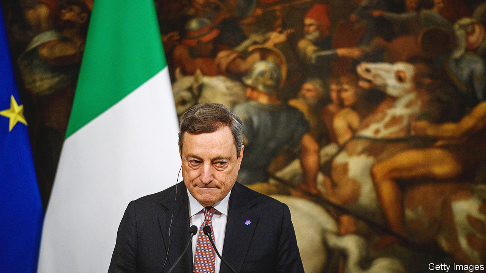
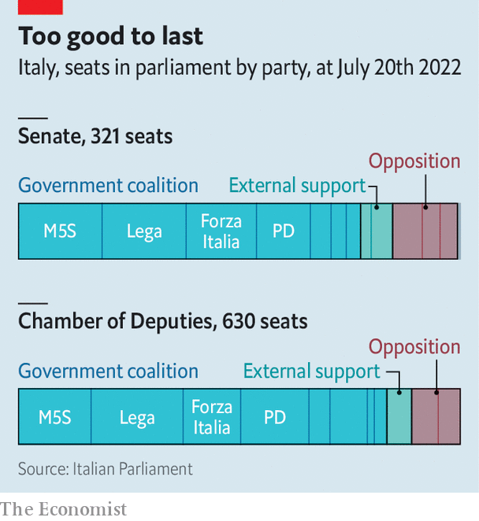

###### Game over

# Mario Draghi, Italy’s reformist prime minister, resigns 

##### But he will stay on as a caretaker until an early election 

 

> Jul 21st 2022 


Beset by partners turned adversaries, his coalition in tatters and his government facing extinction, Mario Draghi nevertheless managed to retain his wry sense of humour. As passions flared in a debate in the Senate on July 20th on a motion of confidence in his government, one of the speakers took aim at Mr Draghi’s status as an unelected technocrat. “Enough of appointed prime ministers,” the senator cried. “True,” exclaimed Mr Draghi, shortly before getting up to leave the chamber. Asked if he was going to see the president, Sergio Mattarella, to confirm his resignation, Mr Draghi replied, “For now, I’m just taking the lift.”

But the following day, Mr Draghi, who had already offered to go the week before, went to see Mr Mattarella and reaffirmed his resignation and that of his government. A statement from the president’s palace later accepted the resignation, dissolved both chambers of parliament and said that early elections would take place within 70 days, that is, by the end of September. Mr Draghi will stay on as caretaker until then.

The Senate debate on July 20th doomed the prime minister. Having begun it lacking the support of one of the biggest parties in his coalition, the anti-establishment Five Star Movement (m5s), Mr Draghi ended it without the backing of two more. Meeting in a villa on the outskirts of Rome as the proceedings unfolded, the leaders of the Northern League, Matteo Salvini, and of Forza Italia, Silvio Berlusconi, issued a statement that ostensibly gave Mr Draghi their continued support. But it contained conditions that he had already ruled out—the expulsion from government of the Five Stars and a radical overhaul of the government’s programme. In effect, the two leaders were demanding that Mr Draghi’s broad coalition, delicately balanced between right and left, be turned into one with a straightforwardly conservative agenda.

Ironically, Mr Draghi won the confidence vote in the Senate, but with the backing of only 95 of the 321 senators; far short of an absolute majority. The Five Stars did not vote. Neither did the League or Forza Italia. The opposition Brothers of Italy (fdi) party voted against.

The early general election could scarcely come at a less opportune moment, amid at least three interconnected crises: over the invasion of Ukraine, energy and inflation. And, because of the lengthy procedures required to elect and install a new government in Italy, decision-making in the eu’s third-biggest economy will be paralysed until at least late October. That, in turn, will jeopardise parliament’s ability to approve a budget for 2023 on schedule. It also raises concerns for the rest of Europe.

Ready for the right?

Polls indicate a victory for an electoral alliance of the right that includes the radical, nativist fdi. And since they also suggest the Brothers would gain most votes, the probability is that Mr Draghi, a former president of the European Central Bank, will soon be replaced as prime minister by the leader of the fdi, Giorgia Meloni. An erstwhile neo-fascist, Ms Meloni’s only government experience was as youth minister in the three years to 2011.

Such an administration would raise grave doubts about Italy’s readiness to pass the reforms the European Commission is demanding in exchange for disbursing the €200bn ($205bn) or so in grants and low-cost loans that have been earmarked for Italy from the eu’s recovery fund. The League has vigorously resisted deregulation in a range of sectors from private seaside bathing concessions to ride-hailing. It has also raised objections to Mr Draghi’s efforts to improve tax collection and shift the balance of taxation away from employment to property. Crucial parts of Mr Draghi’s eu-approved plan—civil-justice reform; an overhaul of competition laws and a similar overhaul of tax laws—have been stuck in parliament, and will now die with his government. Italy may well lose further tranches of the cash.

 


The drama inside and outside parliament was the culmination of weeks of intensifying political turbulence. It first broke into the open in June when the foreign minister, Luigi Di Maio, stormed out of the m5s in protest at the party’s reluctance to back the supply of arms to Ukraine. Since then, more than 60 other lawmakers have left the m5s to join him.

Battling to stem the flow of defectors, the Five Stars’ leader, Giuseppe Conte, has adopted an increasingly strident stand on other issues. He has focused particularly on measures to offset for the poorest the effects of the rise in the cost of living. And it was largely because of dissatisfaction with a €26bn government aid package that the m5s withheld its support in the confidence vote on July 14th that prompted Mr Draghi to first tender his resignation.

Those close to the prime minister say that among his reasons for resigning was the fear that, were the Five Stars permitted to periodically withdraw their support, the League would soon start to exercise the same privilege. Ever since entering Mr Draghi’s coalition, Mr Salvini has watched impotently as support for his party has drained away to the fdi, which opted to stay out of government and has therefore been free to snipe at it from the sidelines. The League, currently below 15% in the polls, trails the Brothers by around eight percentage points. An election offers Mr Salvini, an effective campaigner, an opportunity to narrow the gap. It also holds out the prospect of being able to govern the country with like-minded allies afterwards. Mr Berlusconi, whose party is a shadow of its once-powerful self, is presumably thinking along similar lines.

At the outset, Mr Draghi succeeded in bringing out the best in Italy’s politicians, enthusing many with a sense of duty, a readiness to compromise and a belief in the need for national unity. But after just 17 months he is now falling victim to their reasserted worst: their ambition, narrow self-interest and failure to understand, or perhaps care, that events in their troubled country have unfortunate implications far beyond its borders. ■

