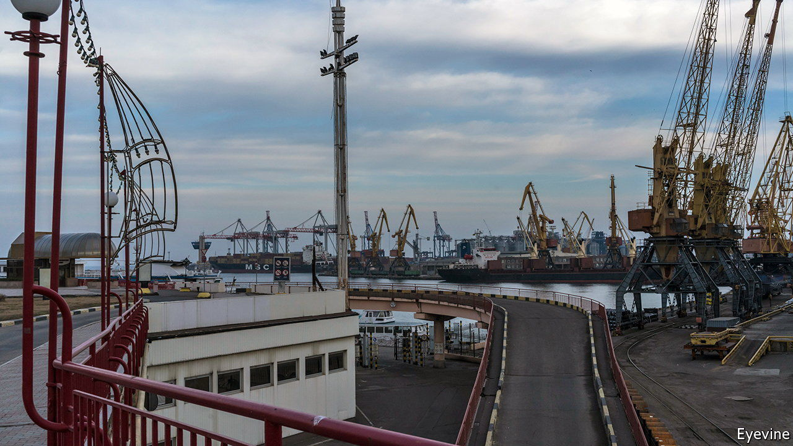

###### Lifting the blockade

# Odessa’s port may soon be reopened 

##### Turkey has helped broker a deal to resume food exports 

 

> Jul 21st 2022 


RECEP TAYYIP ERDOGAN likes to walk a geopolitical tightrope. In late June Turkey’s president rubbed shoulders with leaders of Western democracies at a NATO summit in Madrid. Three weeks later he glad-handed the rulers of Russia and Iran at a summit of autocracies in Tehran. Now, thanks to this balancing act, he seems on the point of pulling off a remarkable feat: a deal to reopen Ukraine’s ports and export its grain to a hungry world.

After five months of bloody fighting in Ukraine, and weeks of negotiation, on July 21st Mr Erdogan’s office announced that the president would host the UN secretary-general, António Guterres, along with delegations from Russia and Ukraine to sign a deal in Istanbul one day later. Ukrainian officials were more cautious, saying only that another round of negotiations would be held. The full details of the proposed agreement were not disclosed. 

One of the world’s leading agricultural exporters, Ukraine has been unable to ship most of its crops since the start of the war in February, raising world food prices and  in poor countries. Russia has ; Ukraine has mined its own waters to prevent an amphibious invasion.

Mr Erdogan’s funambulism has helped him to intercede. Turkey is selling Bayraktar drones to Ukraine, yet declines to join Western sanctions against Russia. Moreover, it bestrides the straits that link the Mediterranean and Black seas. “With your mediation, we have moved forward,” Mr Putin told Mr Erdogan in Tehran on July 19th. “Not all issues have yet been resolved, but the fact that there is movement is already good.” 

This is not the first Turkish mediation effort. Early in the war Turkey played up the idea that it might broker a peace agreement between the warring sides. Those talks came to naught. This time the signals are stronger. Ukrainian officials sounded upbeat after an outline agreement was reached on July 13th. 

Mr Guterres and senior UN officials have been in Istanbul to finalise the accord. “We’ve been working around the clock with intense behind the scenes talks with countless moving parts,” said Farhan Haq, a UN spokesman. With an agreement, he added, “we can potentially save hundreds of thousands, potentially millions of people, from having food be priced out of their reach.”

For the embattled Mr Erdogan—facing runaway inflation at home and treated as a problem child within NATO because of his on-off threats to block the accession of Finland and Sweden—closing the deal would allow him to recover some prestige. “If he can really see it through, it would vindicate his gymnastic balancing act between Western interests and the interests of Russia,” says Alper Coskun of the Carnegie Endowment for International Peace, a think-tank in Washington, DC. “At home, he can mesmerise the public by showing his ability to play a role.”

Diplomats say the proposed deal would create a “co-ordination centre” in Istanbul staffed by officials from Russia, Ukraine, Turkey and the UN. They would inspect and oversee the passage of cargo ships in and out of Ukrainian ports. Some reports say a second centre might be created in Odessa, which raises the question of who would represent Russia there. Another sticking-point has been Ukraine’s demand for a commitment that Russia stop attacking its ports. Ukraine will open only narrow sea corridors, to prevent a Russian attack from the sea.

Many questions remain: who would do the de-mining; how much repair do the ports require; will shipping firms trust assurances that they will be safe; and will Ukrainian cargo need to be trans-shipped in Istanbul? One Ukrainian official estimated exports could resume in “several weeks in the event there are proper security guarantees”.

Markiyan Dmitrasevych, Ukraine’s deputy agriculture minister, says about 18m tonnes of grain await export. In the first four months of the war, Ukraine shifted 5.2m tonnes—roughly the amount it used to ship in just a month—via alternative routes, mainly through ports on the Danube river but also by rail and road. A Russian missile damaged a bridge at Zatoka on July 20th; that may curb exports further. With 60m tonnes expected from this autumn’s harvest, Mr Dmitrasevych says Ukraine will  for 15m-18m tonnes. If the Black Sea ports remain closed, much food would be left to rot. Meanwhile, Ukraine has accused Russia of stealing grain from land it occupies; it has also chided the Turkish government for allowing Russia to ship the cargo through the Bosporus or sell it in Turkey.

Mr Guterres has pushed for the reopening of Odessa as part of a package deal that would also facilitate Russian grain and fertiliser shipments. The West says sanctions against Russia do not apply to food or fertilisers. But in an attempt to ease indirect restrictions the European Union seems set to release some frozen Russian assets to facilitate agricultural trade. America has reassured banks, shipping and insurance companies that such transactions would not breach sanctions.

Suspicion runs deep among Ukrainians and Western Russia-watchers. Would Mr Putin really throw Ukraine an economic lifeline while he struggles to advance on the battlefield? There is no sign that Russia is ready to negotiate a wider peace; indeed it has threatened to widen the war. Accusing Russia of weaponising food, Ned Price, spokesman for America’s State Department, welcomed the prospect of an agreement but added: “What we’re focusing on now is holding Russia accountable for implementing this agreement and for enabling Ukrainian grain to get to world markets. It has been for far too long that Russia has enacted this blockade.” ■


