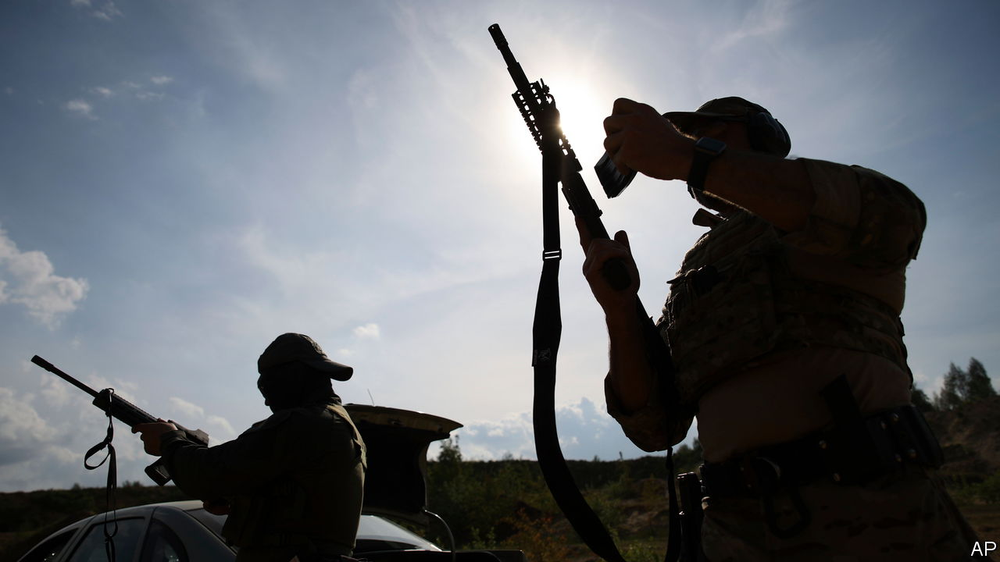

###### Striking back at the empire

# Why a regiment of Belarusian dissidents is fighting for Ukraine 

##### They see a common enemy in Vladimir Putin 

 

> Jul 19th 2022 

The russians were in front of them. The Russians were behind them. It was, says Aliaksandr Naukovich, as if “the war [were] saying, ‘What the fuck are you doing here?’” His unit, a ragtag battalion of Belarusian dissidents, had lived a charmed existence until then, surviving four months of fighting with only a few casualties. But the news coming through was not good. The battalion’s charismatic leader, Ivan Marchuk, was dead following an operation to stop an incursion by Russian tanks near Lysychansk, in the Donbas region. Two men were in Russian captivity, three others missing in action. 

Four months earlier, the 33-year-old former children’s entertainer had been living in Poland. He had fled there, like many fellow dissidents, after Alexander Lukashenko, Belarus’s despot, rigged a presidential election in 2020 and crushed the resulting protests by rounding up and torturing the protesters. 

Mr Naukovich’s new life was comfortable and safe, if a bit boring. But the outbreak of war changed everything. Feelings of shame and guilt pulsed through him: Russian tanks, planes and missiles were swooping from his country into Ukraine, killing people—and only because men like him had been unable to drive Mr Lukashenko from office. Mr Naukovich had no military experience, but his instincts told him he should go. So he packed a rucksack and left for the border. 

The Belarusian’s emotions were not, however, shared by the Ukrainian official guarding the border. “Purpose of journey?” she asked, barely disguising a sarcastic smile. “I’ve come to fight for Ukraine,” Mr Naukovich answered. The response was sharp. “No entry to Belarusians. Co-aggressors.” No amount of pleading, begging or argument would change her decision. Deflated, Mr Naukovich wrote about his experience on Instagram. It was a reply to that post that made him aware of a battalion that was being developed for men like him. He applied and, on March 6th, was cheerily waved through the crossing with a busload of fellow Belarusian warriors. 

Speaking in a café in Kyiv in June, just before the ill-fated Lysychansk deployment, his hair shaved Cossack-style, the soldier recalled the unit’s early days as chaotic to the point of comedy. Some of the men had military experience, but the vast majority were green: journalists, it specialists, welders, lorry drivers. They received only a minimum of training. Mr Naukovich remembers how he trembled as he dismantled a Kalashnikov; he had no idea where the bullets went. 

The Belarusian volunteers took only a limited part in fighting around Kyiv. But they earned their spurs during the spring months in dangerous operations near Mykolaiv in the south, and more recently have been routinely called in to support Ukrainian operations in eastern hot-spots such as Lysychansk. There are approximately 400 fighters in the unit, which now grandly calls itself a regiment. 

Sergei Bezpalov, a prominent Belarusian journalist also serving in the unit, helped fine-tune the recruitment process. First, prospective applicants send details via an anonymous social-media bot. These are then vetted by “Belarusian Cyber-Partisans”, a hacktivist group better known for sabotaging Russian digital logistics. The successful applicants then head to a recruitment station in Warsaw, where they are put on buses to Ukraine. They complete the formalities—army contract, military id, guns—once they reach Kyiv. It is a big commitment for all of them. Besides the danger of war, Belarus has promised to prosecute soldiers as “terrorists” and is intimidating their families. 

Despite all this, Mr Bezpalov says Belarusian soldiers struggle to win the trust of Ukrainians, especially those working in the security services. Few understand the difference between Mr Lukashenko and his opponents, he says. Recent murmuring that the Belarusian dictator might be about to send in his own ground troops has raised suspicions further. On June 24th Volodymyr Zelensky, Ukraine’s president, appealed to ordinary Belarusians in a video address. “You aren’t slaves and you aren’t cannon fodder. A lot depends on ordinary folk like you,” he said. 

Belarusian observers are sceptical about the prospect of Mr Lukashenko joining the war overtly. “The posture of the Belarusian army on the border remains a defensive one, and it isn’t capable of doing much else,” says Anton Motolko, a journalist and the founder of the Gajun project, an early-warning system that publishes crowdsourced information about military activity in Belarus. War remains a “frightening word” in Belarus, given the huge losses the country suffered in the second world war, he continues. “You need to understand our mentality. When the Russians say, ‘We can do it again,’ we say ‘Never again.’” But the intentions of the military elite, and of the country’s erratic leader, are harder to gauge. ■


