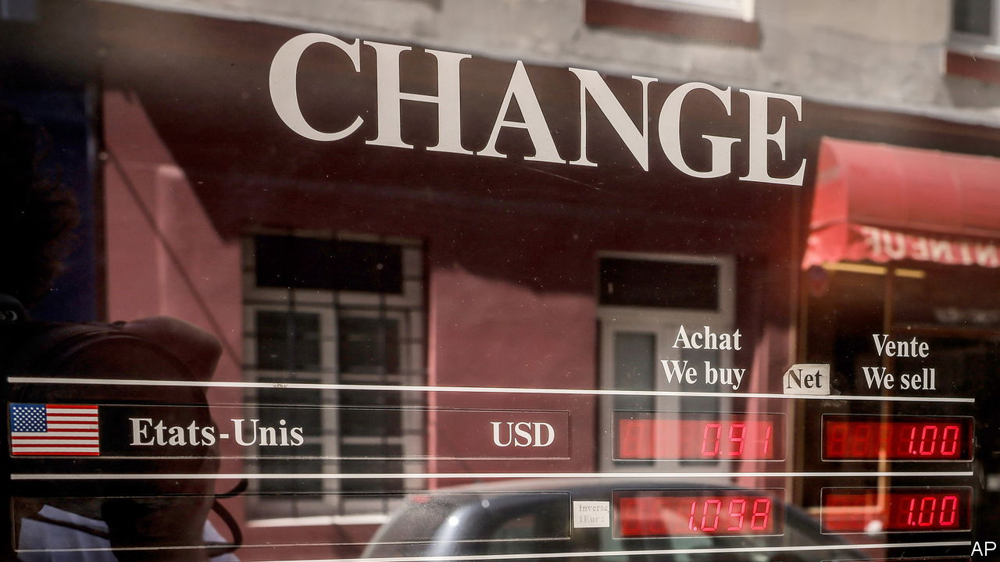
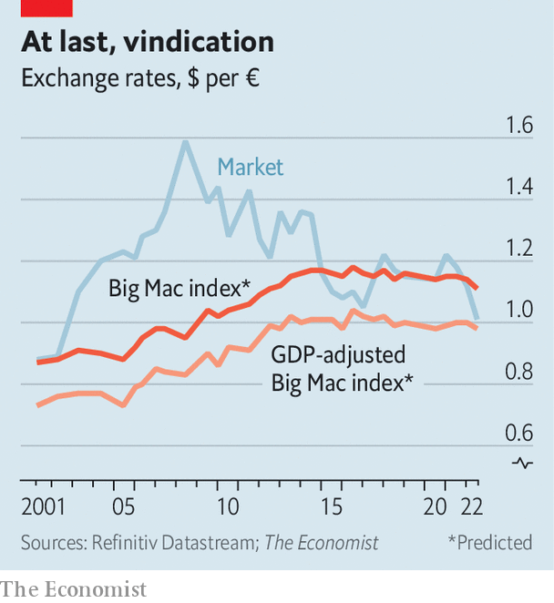

###### Three currencies, two theories, one burger

# Dollar-euro parity may be justified. But the yen looks cheap as chips 

##### How to use economic theory to value currencies 

 

> Jul 21st 2022 

Imagine you are a Parisian investor trying to decide whether to buy American or European bonds. You compare the yields on offer. A ten-year bond issued by America’s Treasury today offers 3%; German bunds return only 1.2%. But buying American means taking a gamble on the euro-dollar exchange rate. You are interested in the return in euros. The bond issued in Washington will be attractive only if the extra yield exceeds any expected loss owing to swings in currency markets.

This thinking, known as “uncovered interest parity” (uip), explains why the dollar has recently soared against the euro. On July 12th the greenback reached a one-for-one exchange rate with the euro for the first time since 2002. (It has since fallen slightly.) uip posits that changes in interest rates drive currency movements. If yields on Treasuries rise relative to those on bunds, then the dollar should strengthen until investors expect it to fall over the lifetime of the bonds, so that there is no longer any extra return from buying Treasuries. The Federal Reserve is expected to raise interest rates above 3.5% in 2023, more than twice the rate expected to be reached by the European Central Bank. The dollar has also risen by 20% against the yen in 2022 so far. That is probably because the Bank of Japan is not expected to raise rates above 0.2% in the next three years.

Yet there is more to currency valuation than monetary policy. Another theory, purchasing-power parity (ppp), says currencies and prices should adjust until a basket of goods and services costs the same everywhere.  has its own lighthearted measure of ppp: the Big Mac index, which was updated on July 20th. Instead of a basket of goods and services, it uses differences in the price of the ubiquitous McDonald’s burger to judge whether currencies are over- or undervalued.

 


Our measure suggests the weak euro may be justified (see chart). The headline index, which assumes Big Macs should cost the same everywhere, predicts an exchange rate of 1.11 dollars per euro. But a secondary index, which adjusts for differences in gdp, says the euro should trade just below dollar parity. The gdp-adjusted index takes into account differences in the prices of inputs, such as land and labour, that are hard or impossible to trade across borders, and therefore reflect local incomes. At dollar-euro parity, a Big Mac is 11% more expensive stateside. But because America is richer than Europe, such a difference in prices could make sense.

For the euro, then, the two theories of currency valuation look aligned. Not so for the yen, which is more than 40% undervalued against the dollar on both Big Mac indices. (Book that flight to Tokyo, American burger-lovers.) The yen has become more undervalued since January, both because the dollar has surged and because inflation is much higher in America. A Big Mac in Japan, including taxes, costs ¥390, a price that has not changed since 2018. The American price, $5.15, has gone up by 11.5% in that time, and by 2.2% since January. 

That uip is explaining recent movements better than ppp is no surprise. When exchange rates get out of whack with interest rates, traders can make a profit at the touch of a button. To the extent that varying purchasing power presents opportunities, it is to people and firms who might change the site of production or ship goods across borders. That takes time. And it is not always possible: the international delivery of Big Macs would be ill-advised.

ppp can fail even within currency zones. Our new index incorporates a change to the source for American Big Mac prices. We used to collect an average price from restaurants in four cities: Atlanta, Chicago, New York and San Francisco. These are relatively expensive places. Now we use a median price for the whole country, provided by McDonald’s, which is lower. The result is that the dollar does not look quite as strong. The change has been made for the whole history of the index, though the previous version is available online. We have also refined our method for calculating the gdp-adjusted index. Fans of burgernomics should tuck in. ■


