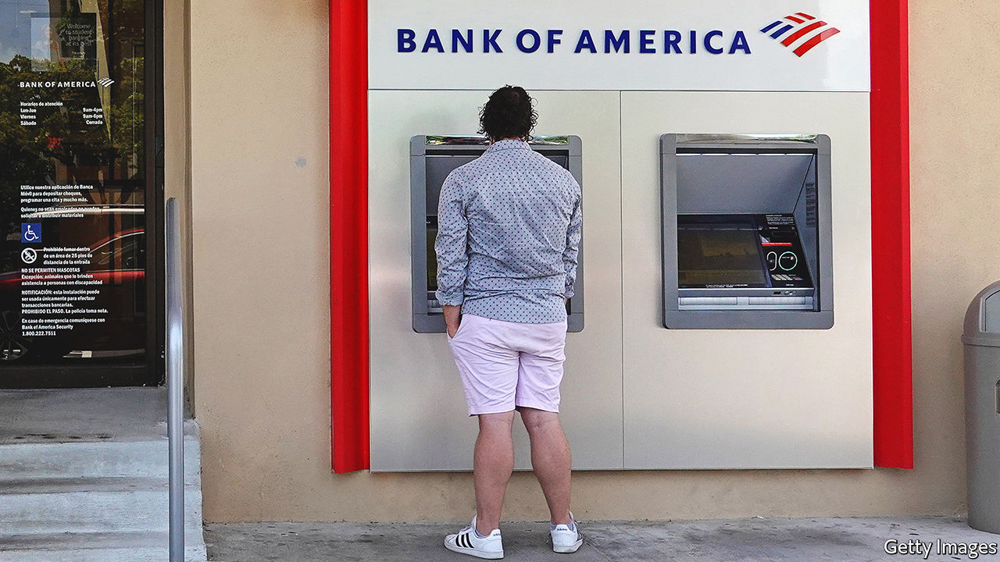
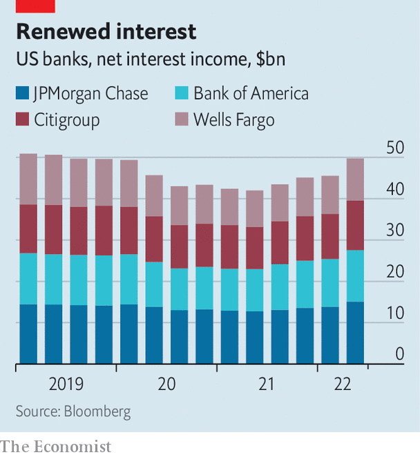

###### Bittersweet

# How American banks are responding to rising interest rates 

##### Investment banks are struggling, but consumer lending is holding up—for now 

 

> Jul 18th 2022 

In january investors expected the Federal Reserve to raise interest rates to just 0.75% by the end of the year. E dramatically since: by late June markets were expecting rates to hit 3.5% by the end of 2022. This change in expectations is far bigger than the actual move in interest rates, which have climbed by 1.5 percentage points. The impact of this duality—that expectations have leapt while reality has only hopped—was plain to see on July 14th, 15th and 18th as America’s six largest banks, Bank of America, Citigroup, Goldman Sachs, JPMorgan Chase, Morgan Stanley and Wells Fargo, reported earnings for the second quarter.

The activities of the lenders that run on expectations—conducted by the slick investment bankers who advise on big corporate investments, like mergers and acquisitions, and help firms go public or issue debt—had a tumultuous quarter. Investment-banking revenues plunged by 41%, year on year, at Goldman, by 61% at JPMorgan and by 55% at Morgan Stanley. Investment bankers who underwrite loans for deals have had a particularly rough time. All banks took losses on their “bridge books”, the portfolios of loans they have yet to sell to investors but have agreed to issue for  or mergers. These write-downs added up to more than $1bn in losses across the big banks.

 


Investment banks’ trading businesses fared better. These are often volatile, and tend to do well during periods of chaos and poorly in times of calm. Markets revenues climbed by 21% on the year at Morgan Stanley and 32% at Goldman, benefiting from  as investors braced themselves for higher rates.

But it was the usually staid business of retail banking that really boomed. In the early phase of a tightening cycle bankers see the net interest income they earn on things like business and credit-card loans rise, as appetite for them is still robust. But last quarter was unusually good: demand for loans roared, even in the face of modestly higher rates. Swelling loan portfolios and higher rates led to a jump in net interest income (nii). Bank of America’s nii rose by 22% on the year; Citi’s, by 14%. 

Consumer spending on credit cards leapt by 18% at Citi and 28% at Wells, driving card balances up. Customers have been “revenge spending” on travel and dining—expenditure in those categories climbed by 34% on the year at JPMorgan—and reducing spending on goods, like clothing and home improvements, which dropped by double digits at Wells. Commercial bankers did well, too. “We have never seen business credit be better, ever, in our lifetimes,” said Jamie Dimon, the boss of JPMorgan, on the firm’s earnings call.

The result of this mixed bag—bumper loan growth, vigorous consumer card spending, robust trading revenues but a slump in issuance and dealmaking—made for a mediocre quarter at Goldman and Morgan Stanley, where total revenues fell by 23% and 11% on the year, respectively. Results were better at banks where retail banking makes up a big share of business. Revenues at Bank of America went up by 6%, and at Citi by 11%, on the year.

The question is what happens as expectations become reality. It is hard to see the retail bonanza continuing: high inflation and rising rates will bite consumers eventually. Bankers at both JPMorgan and Wells pointed out that lower-income households were starting to look constrained. Charlie Scharf, the chief executive of Wells, noted that debit-card spending was up by just 3% on the year for customers who had received stimulus cheques (ie, those who earned less than $75,000). 

Rapid corporate-loan growth sounds less like an indication of business health, considering that it seems to have been driven by chaotic debt markets. Jane Fraser, the boss of Citi, told investors that “clients have been less inclined to obtain financing through the debt markets.” At Wells average loan balances were up by 22% year on year; Mr Scharf attributed this to the “disruption” in capital markets, which increased demand for bank financing. Interest rates in bond markets have risen more quickly than bank-loan rates, but those will probably catch up.

Still, rising interest rates and strong loan demand are, for now, a happy combination for retail bankers. For central bankers, though, they may be less welcome. As Brian Moynihan, the boss of Bank of America, put it, all this activity, together with low unemployment, “clearly makes the Fed’s job tougher”. ■


