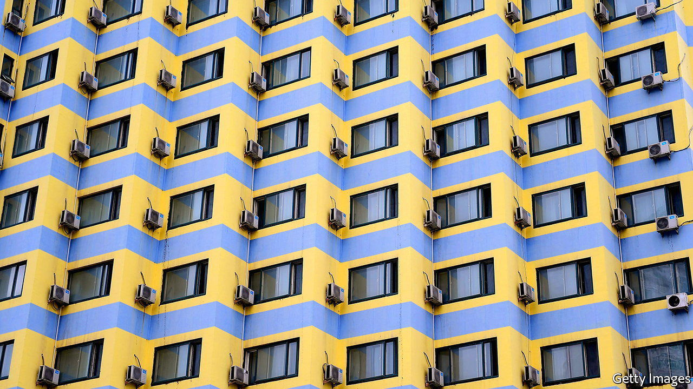

###### Power play

# Is China facing an energy crunch, too? 

##### Officials are anxious to avoid the widespread blackouts of 2021 

 

> Jul 17th 2022 

Air-conditioners are running full blast in central China as much as they are in Texas or on the Iberian peninsula. As many as 900m Chinese people have experienced record temperatures in recent days; more than 80 cities have issued heat alerts. In Zhejiang province, an important manufacturing centre in the east, some energy-intensive factories have been subject to power rationing. Thermometers in the region hit about 42°C on July 13th. Given the humidity, that feels more like 54°C.

For China’s leaders the sweltering temperatures raise fears of a repeat of the energy crunch of last year. As power suppliers struggled to meet demand, factories were forced to shut down, and some households experienced blackouts. The authorities have vowed to avoid shortages this time. But  and the Chinese government’s own lofty emissions targets present complications.

The events of this year and last lay bare the contradictions between the  and vigorous economic activity. In response, China’s leaders have tried interventions with varying degrees of heavy-handedness. The experience might prove instructive as governments elsewhere mull market-meddling to counter surging commodity prices.

Last year supply disruptions, together with poor policy, led to China’s . Officials had restricted the output of many of its coal mines, in line with their climate goals. Then the recovery from the early phase of the pandemic pushed up the demand for energy. But instead of letting prices rise, state planners maintained strict caps on electricity and some coal prices. Power generators began losing money and some stopped operating. Many miners halted work, too. The resulting power cuts took a severe toll on industrial output. 

This time the economy has been battered by the government’s “zero covid” policy. Nonetheless, surging commodity prices and the scorching heat have revived concerns about the adequacy of energy supply. Officials are seeking to allay those fears ahead of a Communist Party congress in the autumn. Their approach includes attempts to boost supply and build up stockpiles, as well as some market reforms. 

Take coal, which produces 60% of China’s power. Global thermal-coal prices have reached record highs, partly because European countries have reduced their reliance on Russian natural gas. China has this time loosened restrictions on mine production to increase domestic supplies. It has also been loading up on Russian coal, which is being shunned by the West. 

The National Development and Reform Commission, the state planning agency, has pressed power companies to lock in long-term contracts with miners and to stockpile at least 15 days’ worth of coal. Still, with market prices elevated and state caps on electricity prices for end-users in place, generators that are continuing to buy on spot markets could be squeezed if coal prices continue to shoot up.

China is highly dependent on foreign oil and gas, importing about 75% and 40% of its consumption of each fuel, respectively. Prices of both commodities surged after Russia invaded Ukraine, though  recently. Chinese importers have stocked up on crude from Iran, which is under American sanctions, causing inventories to build up in January and April, according to research by Michal Meidan of the Oxford Institute for Energy Studies. China is also buying more oil from Russia, which in May overtook Saudi Arabia as its biggest supplier of crude. 

China’s natural-gas imports are largely locked into long-term contracts, which for now has kept prices down. The domestic price of petrol and diesel, like that of coal, is capped. High global crude prices mean refiners make a loss on domestic sales; quotas stop them increasing exports when prices are high. One Western oil trader says that planners have been leaning on state oil firms to sell even less abroad. Refiners thus have an incentive to do fewer runs when prices are high, and to stockpile crude instead. “Export controls are a strategy to keep oil in the country in case there’s a shortage,” says Zhou Xizhou of s&amp;p Global, a rating agency.

At present there are no shortages. But that does not mean the government’s supply-side measures have had resounding success. A big factor in keeping shortages at bay has been the sorry state of the economy and the muted demand for energy. Some economists believe China’s oil demand could be flat this year compared with last year, or even lower. Optimistic forecasters see the economy recovering later in the year, even as growth slows in America and Europe. This could lower global energy prices just as China needs to import more.

If factories come roaring back to life earlier than expected, however, then China’s energy policy would face a real test. Miners, refiners and generators could respond to price caps and export bans by reducing supply. A particularly cold winter could force buyers of gas into the spot market, where prices have rocketed. And officials would start to feel the heat. ■


