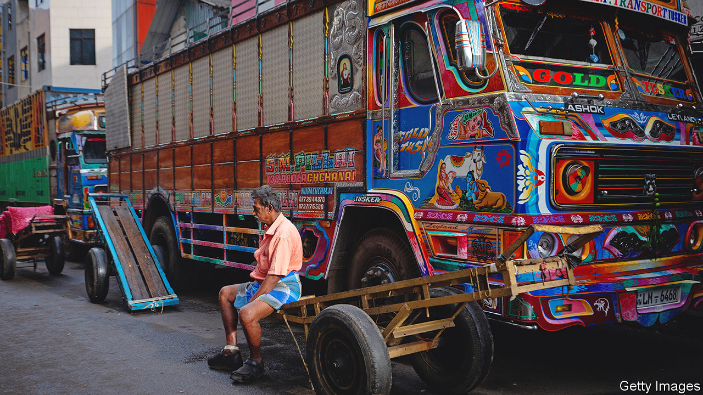
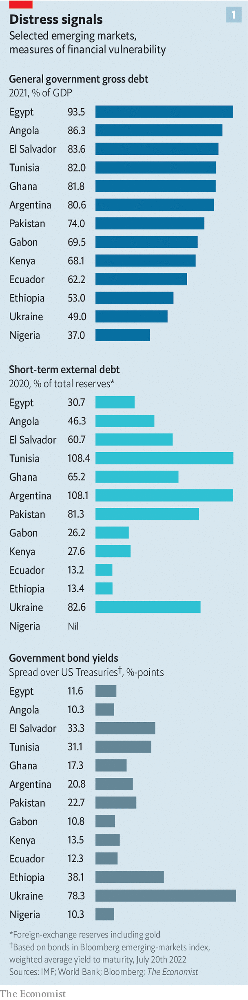
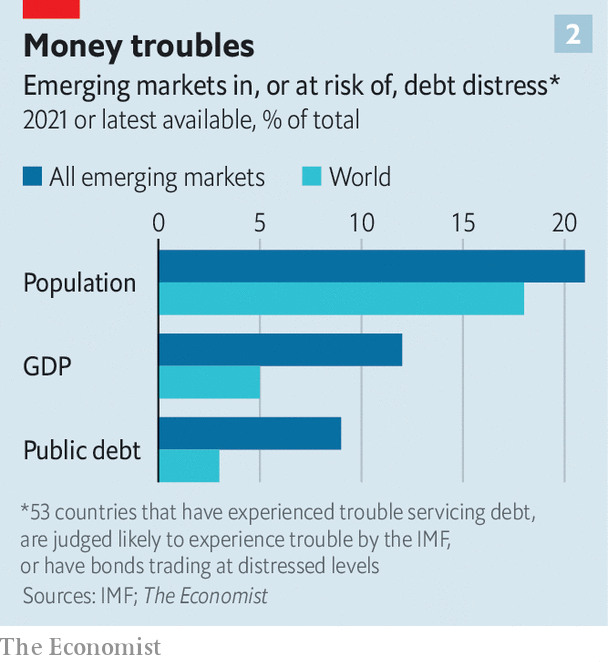
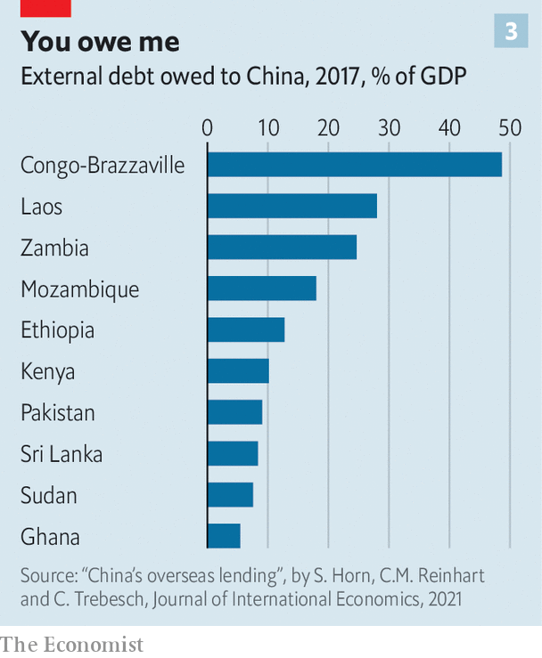

###### Distress signals

# The 53 fragile emerging economies 

##### The contours of a debt crisis are starting to become clear 

 

> Jul 20th 2022 

For a fleeting moment, the protesters seemed to be having a good time. On July 9th some of the  to express frustration at the country’s economic crisis stormed into the president’s residence, where they cooked, took selfies and swam in the pool. Not long after, word came that the president, Gotabaya Rajapaksa, . His successor, Ranil Wickremesinghe, until recently the prime minister, inherits a mess. In April Sri Lanka declared that it could no longer service its foreign debt. Its government has sought aid from India and Russia to pay for essential imports. The economy is likely to shrink dramatically this year. In June annual inflation climbed to 55%. If the government is unable to stabilise the situation, the country may yet succumb to hyperinflation and further political chaos. 

The scenes in Sri Lanka may be a sign of things to come elsewhere. Debt loads across poorer countries stand at the highest levels in decades. Squeezed by the  and energy, a slowing global economy and a s around the world, emerging economies are entering an era of intense macroeconomic pain. Some countries face years of difficult budget choices and weak growth. Others may sink into . All told, 53 countries look most vulnerable: they either are judged by the imf to have unsustainable debts (or to be at high risk of having them); have defaulted on some debts already; or have bonds trading at distressed levels.

Today’s bleak situation has an analogue in the desperate years of the 1980s and 1990s. Then, as now, a long period of robust growth and easy financial conditions was followed by leaner times and rising debt burdens. Macroeconomic shocks, rising inflation and, eventually, soaring interest rates in the rich world pushed many heavily indebted poor economies over the fiscal cliff. In August 1982 Mexico’s government announced that it could no longer service its foreign debt. More than three dozen countries had fallen behind on their debts before the year was out. By 1990 roughly 6% of the world’s public debt was in default.

Much has changed since. Many governments opened up to trade, liberalised their economies and pursued more disciplined macroeconomic policy. Faster growth and better policy led to broad improvements in the fiscal health of emerging economies. By 2008, as rich countries sank into an intense financial crisis of their own, the level of public debt across poorer economies stood at just 33% of gdp.

This allowed them to engage with the global financial system in a manner more like the rich world. Most emerging-market governments hoping to tap global capital used to have little choice but to borrow in a foreign currency, a risky step that could quickly transform home-currency depreciation into a full-blown crisis. Around the turn of the millennium, about 85% of new debt issued outside America, Europe and Japan was not denominated in the borrower’s currency. But by 2019 roughly 80% of outstanding bonds across the emerging world were denominated in local currency.

As emerging economies’ financial systems matured, their governments became better able to tap domestic capital markets. The crises of the 1980s and 1990s also taught them the value of stockpiling foreign-exchange reserves; global reserves rose from less than 10% of world gdp in 2005 to 15% in 2020. It was thanks largely to these adjustments that most emerging markets weathered the slow growth of the 2010s and the shock of the pandemic. Only six governments defaulted in 2020—including Argentina (for the ninth time), Ecuador and Lebanon—equivalent to just 0.5% of outstanding global public debt. 

But this greater resilience also allowed governments to rack up more borrowing. In 2019 public debt stood at 54% of gdp across the emerging world. The pandemic then led to an explosion in borrowing. In 2020 emerging economies ran an average budget deficit of 9.3% of gdp, not far off the 10.5% run by rich economies. 

Borrowing stabilised in 2021 as economies rebounded. But the picture has grown darker this year. The jump in food and energy prices that followed  is depressing growth across most of the world, increasing debt burdens. Rising import bills have drained hard currency from many vulnerable places—including Sri Lanka—eroding their capacity to service foreign debts. Conditions will probably deteriorate as rich-world central banks continue to raise interest rates. Hawkish turns by the Federal Reserve tend to diminish risk appetite and draw capital out of emerging markets, leaving overextended borrowers high and dry.

 


And Fed policy has not been this hawkish for some time. The federal-funds rate is expected to approach 3.5% by the end of this year, which, along with the unwinding of some recent asset purchases, would constitute the Fed’s sharpest tightening since the early 1980s. The emerging world has thus experienced net capital outflows every month since March, according to the Institute of International Finance, an industry group. The dollar has risen by over 12% against a basket of currencies since the start of the year, and is up by far more against many emerging-market currencies. As funding conditions have worsened, borrowing costs for some governments have soared. About a quarter of the low- and middle-income issuers of debt face yield spreads over American Treasuries of ten percentage points or more—a level considered distressed (see chart 1).

The combination of heavy debt burdens, slowing global growth and tightening financial conditions will be more than some governments can bear. One set of potential victims comprises the poorest economies, which have been less able to borrow in relatively safe ways—in their own currencies, for example—and which, because of the pandemic, were already vulnerable. Among 73 low-income countries eligible for debt relief under a g20 initiative, eight carry public-debt loads which the imf has deemed to be unsustainable, and another 30 are at high risk of falling into such a situation. Debt problems in these countries pose little threat to the global economy; together, their gdp is roughly equivalent to that of Belgium. Yet they are home to nearly 500m people, whose fates depend on whether their governments can afford to invest in basic infrastructure and public services.

Then there are the troubled middle-income economies in the mould of Sri Lanka, which are more integrated into the global financial system, and which through policy missteps and bad luck have found themselves exposed. Overall, 15 countries are either in default or have sovereign bonds trading at distressed levels. They include Egypt, El Salvador, Pakistan and Tunisia. 

Home discomforts 

More middle-income countries may be better insulated against deteriorating global conditions than they were in the past. Still, the imf reckons that about 16% of emerging-market public debt is denominated in foreign currencies. And the places that are more insulated have in many cases become so by funding borrowing through local banks. That, however, raises the possibility that any credit stress experienced by a government also feeds through to its banking system, which could in turn impair lending or even lead to outright crisis. Across the emerging world, reckons the imf, the share of public debt held by domestic banks has climbed over the past two decades to about 17% of gdp, more than twice the level in rich economies. Sovereign-debt holdings as a share of total bank assets stand at 26% in Brazil and 29% in India, and above 40% in Egypt and Pakistan.

Just how big this group eventually gets, and how serious the spillovers are to the rest of the world, depends on whether bigger economies, like Brazil and Turkey, are ensnared by crisis. Both have muddled through so far, despite some vulnerabilities, but poor policy could push them towards the brink.

As a commodity exporter, Brazil has benefited from higher food and energy prices. Its hefty pile of foreign-exchange reserves has so far reassured markets. The president, Jair Bolsonaro, trails in the polls ahead of an election due in October, though, and has loosened the country’s purse strings in an attempt to win support, adding to the country’s heavy debt load. He has also suggested that he may not obey voters should they decide to toss him out. If he spooks markets, an outflow of capital could at the very least leave the economy facing a severe fiscal crunch and recession.

Turkey has a dynamic economy and a modest level of public debt. But it owes a lot to foreigners relative to its available currency reserves. And its president, Recep Tayyip Erdogan, insists that the central bank keeps interest rates unduly low in the face of soaring inflation—which has climbed to near 80%. The lira has crashed in value over the past four years. Without a policy change, the government could face a .

Neither of the world’s largest emerging markets, China and India, is at high risk of an external crisis. Both have intimidating piles of foreign-exchange reserves. China’s government wields close control over both capital flows and the domestic financial system, which should allow it to contain panic, while India’s is only minimally reliant on foreign funding. Both, however, carry enormous public-debt loads by historical standards. And both matter enough to the global economy that a period of deleveraging that depressed growth and investment could have big knock-on effects.

 


Taken together, then, 53 low- and middle-income countries are already experiencing debt troubles, or are at high risk of doing so. Their economic size is modest—their combined output amounts to 5% of world gdp—but they are home to 1.4bn people, or 18% of the world’s population (see chart 2). And worryingly, there are few options available to ward off crisis. An end to the war in Ukraine seems a distant prospect. A growth rebound in China or elsewhere could be a double-edged sword: it would boost growth but also contribute to inflation, leading to further rate rises in the rich world.

Debt relief would help. Roughly a third of the massive debts owed by middle-income economies in the 1980s was forgiven under a plan put together by Nicholas Brady, then America’s Treasury secretary, in 1989. Additional relief was provided to 37 very poor countries through an initiative organised by the imf and World Bank in 1996. The g20 took similar steps during the pandemic, first with the Debt Service Suspension Initiative, through which more than 70 countries were eligible to defer debt payments, and then through the Common Framework, which was intended to provide a blueprint for broader relief.

Yet the framework has failed to gain traction. Only three countries have so far sought help under it, and none has completed the process. Prospects for improving the scheme, or for reaching agreement on debt relief, have been dimmed by the fact that lending by Paris Club countries—rich economies that have agreed to co-operate in dealing with unsustainable debts—has become less important, while loans from private creditors and big emerging markets, China in particular, have become more so. In 2006 Paris Club economies and multilateral bodies accounted for more than 80% of poor countries’ foreign obligations. Today they account for less than 60% of poor-country debt. Nearly a fifth is owed to China alone.

Indeed, work by Sebastian Horn and Christoph Trebesch of the Kiel Institute and Carmen Reinhart of Harvard University helps illustrate how massive and murky a force Chinese lending has become. They reckon that almost half of China’s lending abroad is unreported, such that their estimates of China’s claims on foreign governments probably understate the true figures. Even so, they reckon that from 1998 to 2018 China’s foreign lending, the bulk of which has gone to low- and middle-income economies, rose from almost nothing to the equivalent of nearly 2% of world gdp. And among the 50 economies most in hock to China, obligations to Chinese institutions amount to 15% of gdp on average, or about 40% of external debt.

 


More than a third of the world’s most debt-distressed countries also number among those most indebted to Chinese lenders. As of 2017, the debt owed to China by Kenya amounted to 10% of the latter’s gdp, and by Laos a staggering 28%. China is also a big creditor of Sri Lanka (which owed it the equivalent of 8% of gdp in 2017) and Pakistan (9%). Many indebted economies are loth to ask for debt relief from China, fearing the wrath of its leadership or a loss of access to future funding, and Chinese institutions have tended to prefer reprofiling debts to outright relief. Deteriorating relations between China and the West, meanwhile, have reduced the scope for co-operation in handling debt problems. 

In the 1980s, emerging-market defaults on loans owed to American banks pushed some financial institutions to the brink of insolvency. Residents of rich economies may take some comfort from the fact that their lenders are less exposed today. But for the billion or more people living in countries at risk of distress, the pain will be only too drawn out, both as fiscal woes infect local banks and as negotiations over external debt prove intractable. ■


