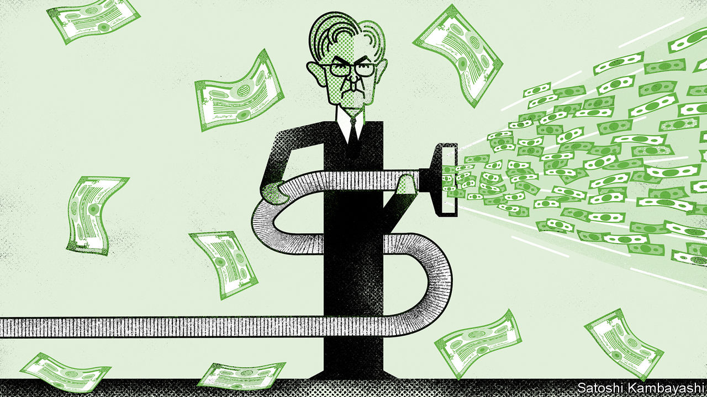

###### Buttonwood

# The Fed put morphs into a Fed call 

##### The once-benevolent central bank now looks vengeful for markets 

 

> Jul 21st 2022 

When stocks boomed early in the pandemic, an internet meme captured the madness of the moment. On the left-hand side of the image, a worried man exclaims that simply creating money cannot save the economy; on the right, a man representing the Federal Reserve replies “Haha money printer go brrr” while cranking out dollars. Joseph Politano, author of , an economics newsletter, recently tweaked the meme to better fit the present situation. On the left, the worried man laments that excessive monetary tightening is increasing the risk of a recession; to the right, the Fed representative retorts “Haha money vacuum go brrr”, while hoovering up dollars.

In more analytical, if less humorous, terms, another way of framing this shift is to ask whether the Fed put has become a Fed call. The concept of a Fed put dates back to the era of Alan Greenspan, a former chairman of the central bank. Starting with the stockmarket crash in 1987 and continuing for more than three decades, the Fed earned a reputation for easing policy, notably by cutting interest rates, whenever share prices plunged. To traders this looks a bit like a put option, a basic hedging tool that sets a price floor for investments. 

A Fed call would imply just the opposite: namely, that the central bank is in effect capping the market (similar to traders who sell call options on their stock holdings). Steve Englander of Standard Chartered, a bank, laid out this provocative idea in a recent note to clients: “The Fed may push back against equity market gains until it is comfortable that disinflation is a lock—in other words, [there is] a Fed call.”

This argument may, at first glance, seem rather crude. The Fed has long denied that it targets asset prices in setting monetary policy. Narrowly, its denials are credible. Central bankers look at oodles of data, from real-time growth figures to surveys of inflation expectations. They cannot afford to be swayed by swings in stocks. Moreover, share prices reflect many factors ranging from the overall economic outlook to corporate idiosyncrasies. Why would the Fed target something that is so volatile and only partially responsive to its actions?

In a broader sense, however, the stockmarket clearly matters to the Fed. Jerome Powell, its current chairman, has repeatedly said that its policies are transmitted to the real economy through financial conditions—a term that refers to the availability and cost of funding for businesses and consumers. Stockmarkets play a crucial role in both shaping and gauging financial conditions. Admittedly, they play a small part in a formal sense: for instance, in one index of financial conditions created by the Fed’s Chicago branch, equity and other asset markets account for just ten of its 105 separate inputs, contrasting with the bigger weights assigned to credit markets. But stocks reflect these other metrics. This is especially true at times of stress. Share prices have fallen this year as indices of financial conditions have tightened, and they have risen when these indices have eased.

Concerns about inflation only add to the market’s importance. When share prices rise, consumers, feeling flush, tend to spend more money and companies, feeling confident, tend to hire more workers. A paper in 2019 by Gabriel Chodorow-Reich of Harvard University and colleagues concluded that each dollar of increased stockmarket wealth lifted consumer spending by about three cents annually, while also boosting employment and wages. For a central bank fighting inflation, a large rise in share prices would therefore cut against its efforts.

This makes for borderline hypocrisy in Fedspeak. Sober central bankers can explain that they want “appropriate firming of monetary policy and associated tighter financial conditions” to help rectify the supply-and-demand imbalances that are fuelling inflation (as the Fed did indeed say in the minutes of its rate-setting meeting in June). Yet it would be beyond the pale for them to declare that they want “appropriate firming of monetary policy and associated weakness in the stockmarket”—even if their meanings are closely aligned.

In a market crash that impairs the financial system, the Fed put would come back into focus. For now, though, the sell-off has been mostly orderly. A sustained rebound in stocks would be unwelcome for the Fed, and might well tilt it towards more hawkishness. Investors accustomed to viewing the central bank as a friendly force must instead confront the harsh reality of a Fed call.


