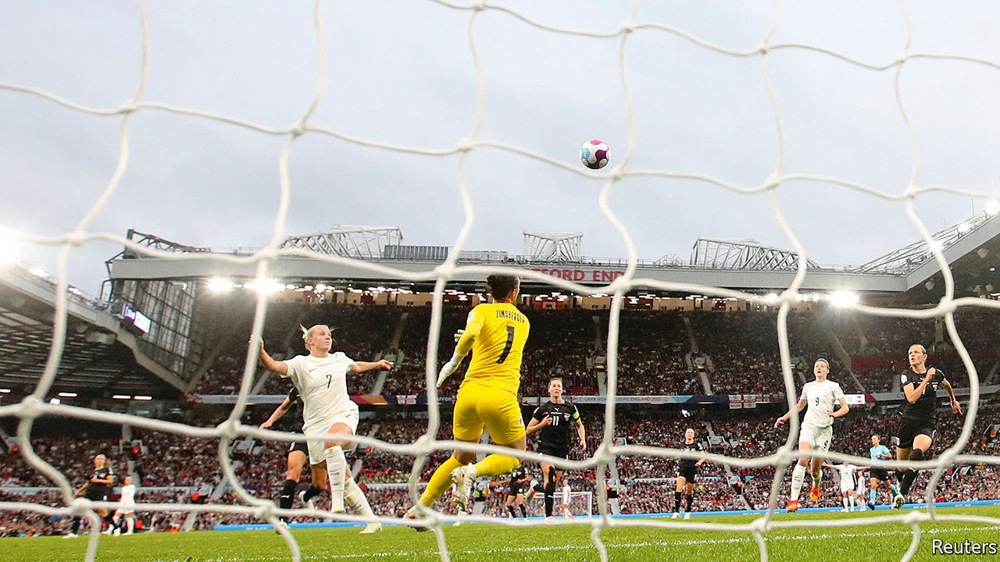
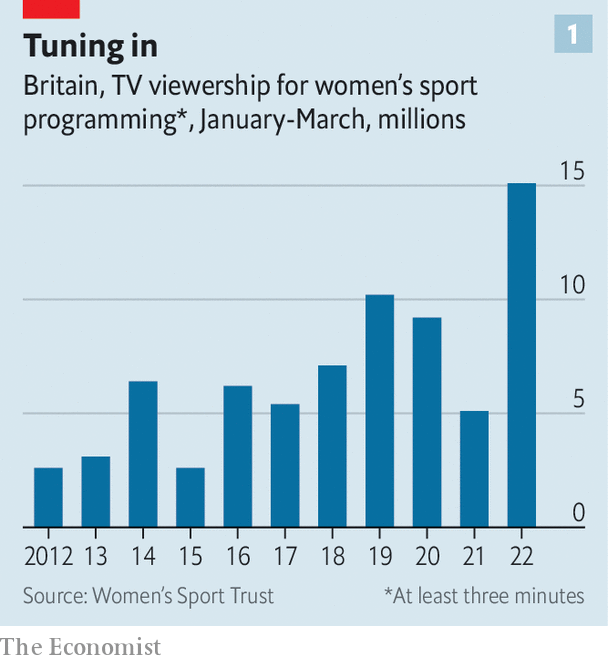
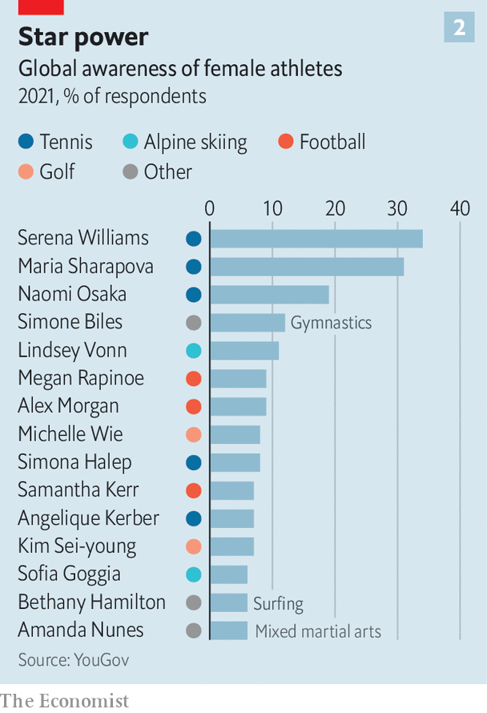

###### Raising the game

# The women’s Euros are selling out stadiums 

##### Investors and broadcasters are getting interested in women’s sport 

 

> Jul 21st 2022 

It was just the sort of start a host nation hopes for. On July 6th the opening game of the 2022 European Women’s Football Championship saw England beat Austria 1-0. Blowout victories against Norway (8-0) and Northern Ireland (5-0) propelled the team into the tournament’s knockout stages. A harder-fought 2-1 win over Spain put them through to the semi-finals. 

As is traditional whenever England’s footballers do well, the country’s newspapers have begun to speculate excitedly that the team could even win the whole tournament (it is equally traditional that it never actually does). 

uefa, European football’s governing body, will be happier still. The opening game packed Old Trafford, the home of Manchester United, with 68,871 spectators. That was a record for the tournament, beating the 41,301 who watched Germany beat Norway in the 2013 final in Sweden. This year’s final will be at the 90,000-seat Wembley Stadium, Britain’s biggest. Tickets are sold out. Television audiences have been strong, too. Around 4.5m people watched the opening game in Britain alone. uefa has sold viewing rights in 195 countries. It hopes viewership for the tournament will hit 250m, up from 178m in 2017. 

This is a banner year for women’s professional sport, with many big events. The Women’s Cricket World Cup was held in New Zealand between March and April, and broke viewing records of its own. The first-ever Tour de France Femmes will start in Paris on July 24th, the same day that the men’s race finishes there.

Disruption from covid-19 has helped pack the calendar. The delayed 2021 Rugby World Cup begins in New Zealand in October. (In pursuit of parity with the men’s game the “women’s” prefix has been dropped from the name.) The Euros have likewise been rescheduled from 2021. 

Women’s professional sport remains far behind men’s when it comes to coverage, prize money and exposure. More people watched the final of the men’s Euros (328m) than are expected to watch the entire women’s tournament. A study in 2019 found that only 5.4% of television sports news in America mentioned women’s events. In British newspapers last year the figure was 3%. Far fewer women are paid enough to play sport full-time than men. 

But interest from sponsors, broadcasters and startups is growing. “Until a few years ago investing in women’s football was seen as something you have to do because if you don’t you’ll get criticised,” says one analyst who prefers to remain anonymous. Attitudes are changing, he says, in part because even that token investment has boosted viewership and recognition. Even sports science is  to the specific requirements of female athletes (see Science section). 

Indeed, says Patrick Massey of Portas Consulting, which advises clients on the women’s game, some advertisers and sponsors think that women’s sports offer better returns than the expensive, over-subscribed male version. Mr Massey believes that, in Europe, women’s football will grow faster than any other sport over the coming decade. By 2030, he says, it could have more fans than most men’s sports. In 2019 the Women’s World Cup attracted a billion viewers. 

Spinning up

Men’s sport has for decades benefited from what investors call a “flywheel effect”. Big broadcast and sponsorship deals pump money into the game. That attracts more players, raises the level of play and improves the quality of the coverage, which helps attract more spectators and viewers. That, in turn, generates even more money the next time around. 

Women’s sport has long suffered the opposite phenomenon, says Tammy Parlour, who runs the Women’s Sport Trust (wst), a charity. Broadcasters have been reluctant to show it without being sure that people will watch. With few games available, viewers cannot tune in, and few viewers means little money. 

 


The flywheel may, at last, be starting to spin. Start with viewing figures. Numbers are not always easy to find. But the wst has been collecting statistics in Britain for a decade. The first quarter of 2022 saw the highest viewership by some distance, up by around 50% on 2019, the last full year before the pandemic (see chart 1). Women’s sport, says Ms Parlour, is bucking a general trend for people to watch less television. Streaming, meanwhile, offers a way to show games without expensive deals with broadcasters, helping to build fanbases.

Lynsey Douglas, an analyst at Nielsen, a media-research firm, says audiences for women’s football are split almost 50/50 between men and women. The figures frequently contradict the stereotypes. An Australian survey, published in 2020, found that more men watched women’s Aussie-rules football than women, and that the biggest age group was 50-64-year olds. Figures from the wst suggest some fans of women’s sport do not watch the men’s game, giving advertisers a way to reach an entirely new audience.

Money is starting to follow eyeballs. Viewership of the Women’s National Basketball Association (wnba) in America rose by 50% in 2021 compared with 2020. In February the wnba felt confident enough to close its first-ever funding round, raising $75m and valuing it at $1bn. The prize pool for this year’s women’s Euros is $16m, double the value in 2017.

One big change, says Ms Douglas, is that several big rights-holders, including uefa, fifa (which runs the football World Cup) and World Rugby, now sell sponsorship rights for women’s events separately, rather than bundled with the men’s tournaments as an afterthought. That forces buyers and sellers to think about exactly how much such rights might be worth, she says.

One of the biggest deals was in 2021, when Barclays, a bank, paid £30m (then $41m) to sponsor the Women’s Super League, the top level of women’s club soccer in England, for three years. (For comparison Barclays paid £48m for a three-year deal with the men’s Premier League in 2001.) In 2018 Aon, a financial-services firm, sponsored men’s and women’s professional golf at the same time. “Fewer and fewer brands are spending solely on men’s sports, says Ms Douglas. “Increasingly, they want a balanced portfolio.” 

Some think sponsors get a better deal with women’s sports. An Australian study last year found that fans of women’s sports were 25% more likely to buy a sponsor’s product than those who follow men’s sport. Research from the Sports Research Institute, an American non-profit, suggests that fans of women’s sport are more engaged than those who follow the men. 

Still, the gulf remains vast. The wnba’s billion-dollar valuation is around a sixth of the estimated value of the New York Knicks, just one of 30 teams in the American men’s basketball league. Carli Lloyd was the world’s best-paid female footballer until her retirement last year. Her reported annual salary of $518,000 is a sum that many male professionals make in a week. 

Investors are not betting that gap will shrink to nothing. But they see plenty of opportunity for women’s sports to grow. One idea is that, rather than copying men’s leagues, which were mostly established in the 20th century, women’s sport offers an opportunity to experiment with what a 21st-century league might look like. 

Athletes Unlimited (au) is an American firm founded in 2020 that runs women’s softball, basketball and volleyball leagues. Jon Patricof, a former boss of New York City Football Club and one of its founders, says he was inspired by the mismatch between the popularity of America’s women’s football team—which, unlike the reliably third-rate men’s squad, has four World Cups to its name—and the struggles of the National Women’s Soccer League. “Women’s professional leagues [in America] had not really succeeded by copying what the men’s leagues were doing,” he says. 

A change of tactics

Modern fans often feel more loyalty to individual players than to city-based teams, says Mr Patricof: “A really strong trend that we see in fans of all kinds of sports.” au seasons are limited to five weeks, and the action takes place in a single host city (which keeps costs down). Teams are not fixed; captains trade players at the end of every week. The system is partly inspired by fantasy-sports games, says Mr Patricof, which are growing fast around the world. Players accrue individual points, both for being part of winning teams and for playing well themselves. The one with the most points at the end of the season is crowned the champion. 

 


Matches are broadcast on television (the firm has signed a contract with espn, a big American broadcaster) as well as being streamed over the internet. Viewers can bet on games and exchange trading cards or nfts, a kind of trendy digital collectable. Audience numbers are growing, with viewer numbers for the firm’s most recent softball season rising by 70%. Limiting matches to a single location helps au put more money into slick production, says Mr Patricof. “The idea is to signal that this is a professional league, not amateur hour.” Many players come back for further seasons. The firm has signed sponsorship deals with Nike, a sportswear firm, and Gatorade, a maker of soft drinks.

Optimists point out that there already exists a sport where women have similar star power to the men: tennis. Prize money at the biggest tournaments has been equal for both sexes since 2007; women’s games are sometimes more popular than men’s. In 2021 YouGov, a pollster, found that the three best-known sportswomen in the world were all tennis players (see chart 2). 

Why women’s tennis has done so well is unclear. Some point to the individual, sponsor-friendly nature of the sport. Some argue shorter matches (women play best-of-three sets; the men best-of-five) make a more enjoyable spectacle. But most asked by  cited the lobbying efforts of players like Billie Jean King in the 1960s and the founding of the Women’s Tennis Association in 1973. On that view, the only thing special about tennis is that the flywheels now starting to spin in other sports have been going for longer. ■

