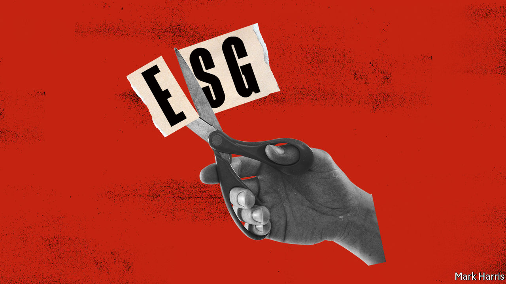

###### Sustainable investing

# ESG should be boiled down to one simple measure: emissions 

##### Three letters that won’t save the planet 

 

> Jul 21st 2022 

If you are the type of person who is loth to invest in firms that pollute the planet, mistreat workers and stuff their boards with cronies, you will no doubt be aware of one of the hottest trends in finance: environmental, social and governance (esg) investing. It is an attempt to make capitalism work better and deal with the grave threat posed by . It has ballooned in recent years; the titans of investment management claim that more than a third of their assets, or $35trn in total, are monitored through one esg lens or another. It is on the lips of bosses and officials everywhere.

You might hope that big things would come from this. You would be wrong. Sadly those three letters have morphed into shorthand for hype and controversy. Right-wing American politicians blame a “climate cartel” for soaring prices at the petrol pump. Whistleblowers accuse the industry of “” by deceiving its clients. Firms from Goldman Sachs to Deutsche Bank face regulatory probes. As our  this week concludes, although esg is often well-meaning it is deeply flawed. It risks setting conflicting goals for firms, fleecing savers and distracting from the vital task of tackling climate change. It is an unholy mess that needs to be ruthlessly streamlined. 

The term esg dates as far back as 2004. The idea is that investors should evaluate firms based not just on their commercial performance but also on their environmental and social record and their governance, typically using numerical scores. Several forces have thrust it into the mainstream. More people want to invest in a way that aligns with their concerns about global warming and injustice. More companies, including a sister firm of , offer esg analysis. With governments often gridlocked, many people feel business should solve society’s problems and serve all stakeholders, including suppliers and workers, not just shareholders. And then there is the self-interest of an asset-management industry never known to look a gift horse in the mouth: selling sustainability products allows it to charge more, easing a long blight of falling fees.

Unfortunately esg suffers from three fundamental problems. First, because it lumps together a dizzying array of objectives, it provides no coherent guide for investors and firms to make the trade-offs that are inevitable in any society. Elon Musk of Tesla is a corporate-governance nightmare, but by popularising electric cars he is helping tackle climate change. Closing down a coalmining firm is good for the climate but awful for its suppliers and workers. Is it really possible to build vast numbers of wind farms quickly without damaging local ecology? By suggesting that these conflicts do not exist or can be easily resolved, esg fosters delusion.

The industry’s second problem is that it is not being straight about incentives. It claims that good behaviour is more lucrative for firms and investors. In fact, if you can stand the stigma, it is often very profitable for a business to externalise costs, such as pollution, onto society rather than bear them directly. As a result the link between virtue and financial outperformance is suspect. Finally esg has a measurement problem: the various scoring systems have gaping inconsistencies and are easily gamed. Credit ratings have a 99% correlation across rating agencies. By contrast, esg ratings tally little more than half the time. Firms can improve their esg score by selling assets to a different owner who keeps running them just as before. 

As investors become wiser to such flim-flam, they are growing more sceptical. This, coupled with turmoil in financial markets, is slowing the influx of money into sustainable funds. It is surely time, then, for a rethink. The first step is to unbundle those three letters: e, s and g. The more targets there are to hit, the less chance of bullseye-ing any of them. Regarding s, in a dynamic, decentralised economy individual firms will make different decisions about their social conduct in the pursuit of long-run profits within the law. Tech firms may appeal to the values of young employees to retain them; firms in declining industries may have to lay people off. There is no one template. The art of management, or g, is too subtle to be captured by box-ticking. Britain’s listed firms have an elaborate governance code—and dismal performance. 

It is better to focus simply on the e. Yet even that is not precise enough. The environment is an all-encompassing term, including biodiversity, water scarcity and so on. By far the most significant danger is from emissions, particularly those generated by carbon-belching industries. Put simply, the e should stand not for environmental factors, but for emissions alone. Investors and regulators are already pushing to make disclosure by firms of their emissions more uniform and universal. The more standardised they are, the easier it will be to assess which companies are large carbon culprits—and which are doing most to reduce emissions. Fund managers and banks should be better able to track the carbon footprints of their portfolios and whether they shrink over time.

Unsustainable

Better information alone will help in the struggle against global warming. By revealing more accurately which firms pollute, it will help the public understand what really makes a difference to the climate. A growing number of altruistic consumers and investors may choose to favour clean firms even if it costs them financially. And even if they can get away with polluting today, many firms and investors expect that tighter regulation of carbon emissions will eventually come and want to measure their risks and adapt their business models. 

Make no mistake, though: tougher government action is essential now. We have long argued for much higher carbon prices that would harness the market to save the planet. Today pricing schemes cover 23% of global emissions, about double the level of five years ago. But far more needs to be done, . It is government action, combined with clear and consistent disclosure, that can save the planet, not an abbreviation that is in danger of standing for exaggerated, superficial guff. ■


